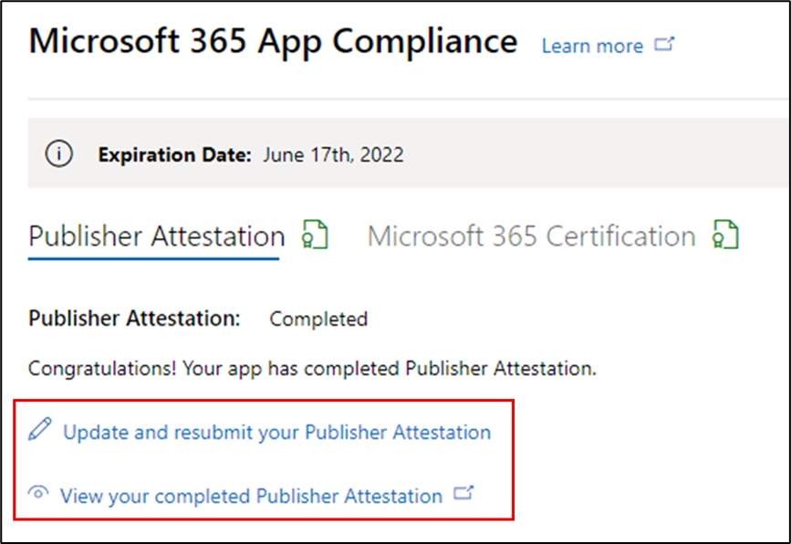

# Руководство для пользователей партнеров для Microsoft 365 приложения - SaaS

|Этап|Должность|
|---|---|
|Этап 1| Аттестация издателя|
|Этап 2| Сертификация Microsoft 365|

## 1. Обзор 

Этот документ выступает в качестве пошагового руководства для пользователей для наших партнеров, зарегистрированных для Microsoft 365 программы соответствия требованиям к приложениям с целью пройти Publisher аттестацию и сертификацию для своих приложений SaaS, хотя портал Центра партнеров.

## 2. Акронимы & определения
|Сокращение | Определение |
|----|----|
|[PC (Центр партнеров)](https://partner.microsoft.com/)|Портал для всех партнеров Майкрософт. Партнер входит в Центр партнеров и представляет анкету для самостоятельной оценки. Центр партнеров по [Microsoft 365 соответствия требованиям к приложениям](https://partner.microsoft.com/dashboard/home)|
|Независимый поставщик программного обеспечения | Независимый поставщик программного обеспечения. Партнер или разработчик |
|Источник приложения | Каталог приложений |
|Пример |[Теперь виртуальный агент](https://appsource.microsoft.com/product/office/WA104381816)|

## 3. Publisher процесса проверки

**Главная страница**. Это посадочная страница после входа партнера в Центр партнеров.

  
**Шаг 1** . Выбор предложений marketplace

  
**Шаг 2**. После выбора 'Marketplace Offers', переохав на "Коммерческий рынок".

Выберите приложение из списка, а в другой панели навигации всплывет параметр "Соответствие требованиям приложения".
  
**Шаг 3**. Выберите "Соответствие требованиям приложения"
  

  
**Шаг 4**. Заполните анкету самооценки для Publisher аттестации.

  
**ПРИМЕЧАНИЕ Если вы возвращались к обновлению или повторной отправке приложения, нажмите кнопку dropdown для "Выберите продукт", выберите приложение и нажмите кнопку "Клон".**

**Вы также можете использовать импорт и экспорт, чтобы завершить форму автономной работы и импортировать ее после завершения.**

 
**Шаг 5**. После завершения нажмите кнопку "Отправить", теперь оценка будет "В стадии рассмотрения".
 
  
  
**Утверждение и отклонение сценариев:**
  
О. Publisher отторжение проверки
- В случае отказа партнер может:
     - Просмотр отчета о сбое
          - Партнер будет уведомлен по электронной почте, и он может просматривать отчет о сбое в Центре партнеров
     - Обновление и повторное отправка анкеты самооценки.
        

Б.  Publisher проверки
- После утверждения партнер может:
     - Обновление и повторное тестирование
     - Просмотр завершенной Publisher проверки
     - Запуск процесса Microsoft 365 сертификации
        
        
  
 
  
**Утверждение Publisher: пример ссылки в AppSource для заверенных приложений издателя.**
  

   
## 4. Microsoft 365 процесса сертификации
  
Партнер может начать процесс сертификации, выбрав почтовый ящик и нажав кнопку "Отправить"
  
 
  
**Шаг 1** . Начальная отправка документов

Заполните все сведения, загрузите соответствующие документы и нажмите кнопку "Отправить"
  
 

  
При нажатии кнопки отправка исходного документа будет рассмотрена.

  
Аналитик запрашивает пересмотр, если исходные документы не являются достаточными или релевантны. Аналитик будет работать с партнером, чтобы помочь получить нужные документы для утверждения.

После утверждения аналитиком первоначальной отправки документа партнеру необходимо представить требования к контролю.
  
**Шаг 2**. Представление требований к контролю
  
Заполните все сведения, загрузите соответствующие документы и нажмите кнопку "Отправить"

  

 
При нажатии кнопки Отправка будет рассмотрена первоначальная отправка документа.

  
Аналитик запрашивает пересмотр в случае, если документы, необходимые для управления, не являются достаточными или релевантны. Аналитик будет работать с партнером, чтобы помочь получить нужные документы для утверждения.

  
 
 
В случае, если отправка не удовлетворяет стандартам утверждения, аналитик отклоняет отправку.
  
Партнер может работать с аналитиком для предоставления соответствующих сведений и документов.

  
После того как все стандарты безопасности будут выполнены, аналитик утвердит отправку и партнер будет Microsoft 365 сертифицирован.

  
**Утверждение после сертификации: пример Microsoft 365 сертификата в AppSource.** 

 
## 5. Microsoft 365 рабочего процесса обновления:
  
**Microsoft 365Publisher процесса аттестации и обновления сертификации:**  

Microsoft 365 программа соответствия требованиям к приложениям теперь предлагает ежегодный процесс обновления. В ходе этого процесса разработчики приложений могут обновить существующий Publisher и документы, необходимые для Microsoft 365 сертификации. 
 
**Преимущества:** 

- Сохраните значок сертификации в AppSource, Office Store, Teams Store и различных порталах администрирования, чтобы отличать ваше приложение от других. 
- Повышение доверия клиентов к использованию сертифицированного приложения. 
- Помощь ИТ-администраторам в принятии обоснованных решений с помощью обновленных сведений о сертификации.

Новый процесс обновления доступен в [Центре партнеров для](https://partner.microsoft.com/dashboard/home) обеспечения бесперебойного работы. Напоминание о возобновлении будет показано в Центре партнеров, начиная с 90 дней до истечения срока действия. Периодические напоминания также будут отправляться по электронной почте за 90, 60 и 30 дней до истечения срока действия. 
 
**Этап 1. Publisher проверки:**
  
Ответы на Publisher для проверки необходимо будет повторно. Когда заверение близит к 1-летней отметке, будет отправлено напоминание по электронной почте, поощряющее повторное повторное тестирование. 
 
**Шаг 1**. **Выберите Обновление** для обновления Publisher проверки.
  

  
**Шаг 2**. Просмотрите предыдущие ответы Publisher проверки и обновите последнюю информацию по мере необходимости. 
  
Отправка Publisher для обновления при готовности. Он будет рассмотрен аналитиком соответствия требованиям приложений M365.

  
**Publisher продления проверки утверждены:**
  

  
**Publisher истек срок проверки:**
  
Сведения о приложении должны быть обновлены до истечения срока действия, чтобы сохранить страницу Publisher проверки в документы Майкрософт. Вовремяе обновление также обеспечит продолжение работы и значки для приложения в различных витринах. 
 

**Примечание**. По истечении срока действия Publisher может быть запущен в любое время, щелкнув кнопку "Обновить".
 
**Этап 2. Microsoft 365 сертификации**
  
Сведения о сертификации приложения должны быть повторно перенаблюированы на ежегодной основе. Для этого потребуется переоценка элементов управления в области текущей среды. Когда сертификация близит к 1-летней отметке, будет отправлено уведомление по электронной почте с призывом к повторной отправке документов и доказательств.
 
 

**Сценарии утверждения и отказа от сертификации:**

**Сценарий 1.** 

Обновление сертификации началось и находится на рассмотрении.
 
 

Сценарий 1A: 

Отказ от продления сертификации: 
- Сертификация может быть отклонена, если: 
     - Приложение не имеет необходимых инструментов, процессов или конфигураций на месте и не сможет реализовать необходимые изменения в окне сертификации. 
     - Приложение имеет непогашенные уязвимости и не может быть исправлено в окне сертификации. 
 

Сценарий 1B: 

Утверждено продление сертификации

**Срок действия сертификации:**

Сведения о приложении необходимо обновлять до истечения срока действия, чтобы сохранить страницу сертификации приложения в документы Майкрософт. Вовремяе обновление также обеспечит продолжение работы и значки для приложения в AppSource и Team Store.

  
Примечание. По истечении срока действия Publisher проверки и сертификации можно начать в любое время, нажав кнопку "Обновить". 
