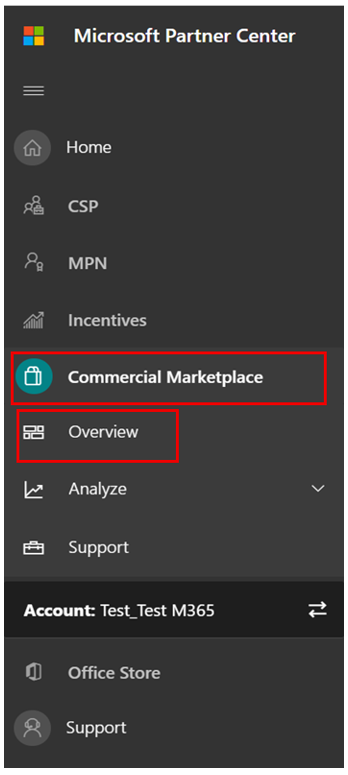

# Руководство для пользователей партнеров для Microsoft 365 приложения - SaaSPartner's User Guide for Microsoft 365 App Compliance Program - SaaS

|ЭтапPhase|НазваниеTitle|
|---|---|
|Этап 1Phase 1| Аттестация издателяPublisher Attestation|
|Этап 2Phase 2| Сертификация Microsoft 365Microsoft 365 Certification|

## 1. Обзор1. Overview 

Этот документ выступает в качестве пошагового руководства пользователя для наших партнеров, зарегистрированных для Microsoft 365 программы соответствия требованиям к приложениям с целью пройти Publisher аттестацию и сертификацию для своих приложений SaaS, хотя портал Центра партнеров.This document acts as a step-by-step user guide for our partners, enrolled for Microsoft 365 App Compliance program aiming to undergo Publisher Attestation and Certification for their SaaS apps, though the Partner Center portal.

## 2. Акронимы & определения2. Acronyms & Definitions
|СокращениеAcronym | ОпределениеDefinition |
|----|----|
|[PC (Центр партнеров)PC (Partner Center)](https://partner.microsoft.com/)|Портал для всех партнеров Майкрософт.A portal for all Microsoft partners. Партнер входит в Центр партнеров и представляет анкету для самостоятельной оценки.A partner logs in to Partner Center and submits self-assessment questionnaire. Центр партнеров по [Microsoft 365 соответствия требованиям к приложениям](https://partner.microsoft.com/dashboard/home)Partner Center for [Microsoft 365 App Compliance](https://partner.microsoft.com/dashboard/home)|
|Независимый поставщик программного обеспеченияISV | Независимый поставщик программного обеспечения.Independent Software Vendor a.k.a. Партнер или разработчикPartner or Developer |
|Источник приложенияApp Source | Каталог приложенийCatalog of apps |
|ПримерExample |[Теперь виртуальный агентNow virtual agent](https://appsource.microsoft.com/product/office/WA104381816)|

## 3. Publisher процесса проверки3. Publisher Attestation Workflow

**Главная страница.** Это посадочная страница после входа партнера в Центр партнеров.**Home Page**: This is the landing page once a partner logs in to Partner Center.

  
**Шаг 1:** слева от страницы на панели навигации:**Step 1** : On the left side of the page, on the navigation bar:

- Выбор коммерческого рынкаSelect Commercial Marketplace
- Выбор обзоровSelect Overview

  
При выборе "Обзор" партнер может увидеть список приложений, доступных для запуска Microsoft 365 соответствия требованиям.Upon selecting ‘Overview’, partner can see list of apps available to start the Microsoft 365 Compliance program.
  
**Шаг 2.** Выберите приложение из списка, чтобы начать процесс Publisher проверки.**Step 2**: Select an app from the list to begin the Publisher Attestation process.

При выборе приложения будет всплывающее другое панели навигации с параметром "Соответствие требованиям приложения".On selecting an app, another navigation bar will pop up with option ‘App Compliance’.
  
**Шаг 3.** Выберите "Соответствие требованиям приложения"**Step 3**: Select 'App Compliance’
  

  
**Шаг 4.** Заполните анкету самооценки для Publisher аттестации.**Step 4**: Fill out the self-assessment questionnaire for Publisher Attestation.

  
**ПРИМЕЧАНИЕ Если вы возвращались к обновлению или повторной отправке приложения, нажмите кнопку dropdown для "Выберите продукт", выберите приложение и нажмите кнопку "Клон".****NOTE If you are coming back to update/re-submit your application, click dropdown for ‘Choose the product’, select the app and click ‘Clone’.**

**Вы также можете использовать функцию импорт и экспорт, чтобы завершить форму автономной работы и импортировать ее после завершения.****You can also leverage the Import/Export feature to complete the form offline and import it once completed.**

 
**Шаг 5.** После завершения нажмите кнопку "Отправить", теперь оценка будет "В стадии рассмотрения".**Step 5**: Once completed, click on ‘Submit’, the assessment will now be ‘Under Review’.
 
   
  
**Утверждение и отклонение сценариев:****Approve/Reject Scenarios:**
  
О.A. Publisher Отказ от проверкиPublisher Attestation Rejection
- В случае отказа партнер может:In case of rejection, a partner can:
     - Просмотр отчета о сбоеView failure report
          - Партнер будет уведомлен по электронной почте, и он может просматривать отчет о сбое в Центре партнеровPartner will be notified via email, and they can view the failure report in Partner Center
     - Обновление и повторное отправка анкеты самооценки.Update and re-submit self-assessment questionnaire.
        

B.B.  Publisher Утверждение проверкиPublisher Attestation Approval
- После утверждения партнер может:Upon approval, the partner can:
     - Обновление и повторное тестированиеUpdate and resubmit attestation
     - Просмотр завершенной Publisher проверкиView completed Publisher Attestation
     - Запуск процесса Microsoft 365 сертификацииStart the Microsoft 365 Certification process
        
        
  
 
  
**Утверждение Publisher проверки: пример ссылки в AppSource для заверенных приложений издателя.****Post Publisher Attestation Approval: Example of link in AppSource for publisher attested apps.**
  

   
## 4. Microsoft 365 процесса сертификации4.   Microsoft 365 Certification Workflow
  
Партнер может начать процесс сертификации, выбрав почтовый ящик и нажав кнопку "Отправить"A partner can begin the Certification process by selecting the checkbox and clicking ‘Submit’
  
 
  
**Шаг 1.** Начальная отправка документов**Step 1** : Initial Document Submission

Заполните все сведения, загрузите соответствующие документы и нажмите кнопку "Отправить"Fill out all the details, upload relevant documents and click ‘Submit’
  
 
  

  
При нажатии кнопки отправка исходного документа будет рассмотрена.On clicking submit, the initial document submission will be under review.

  
Аналитик запрашивает пересмотр, если исходные документы не являются достаточными или релевантны.An analyst requests a revision in case the initial documents are not sufficient or relevant. Аналитик будет работать с партнером, чтобы помочь получить нужные документы для утверждения.The analyst will work with the partner to help get the right documents for approval.

После утверждения аналитиком первоначальной отправки документа партнеру необходимо представить требования к контролю.Once the analyst approves the initial document submission, the partner needs to submit the control requirements.
  
**Шаг 2.** Отправка требований к контролю**Step 2**: Control Requirement Submission
  
Заполните все сведения, загрузите соответствующие документы и нажмите кнопку "Отправить"Fill out all the details, upload relevant documents and Click ‘Submit’

  

 
При нажатии кнопки Отправка будет рассмотрена первоначальная отправка документа.On clicking Submit, the initial document submission will be under review.

  
Аналитик запрашивает пересмотр в случае, если документы, необходимые для управления, не являются достаточными или релевантны.An analyst requests a revision in case the control requirement documents are not sufficient or relevant. Аналитик будет работать с партнером, чтобы помочь получить нужные документы для утверждения.The analyst will work with the partner to help get the right documents for approval.

  
 
 
В случае, если отправка не удовлетворяет стандартам утверждения, аналитик отклоняет отправку.In case the submission does not satisfy the approval standards, the analyst will reject the submission.
  
Партнер может работать с аналитиком для предоставления соответствующих сведений и документов.The partner can work with the analyst to provide the relevant information and documents.

  
После того как все стандарты безопасности будут выполнены, аналитик утвердит отправку и партнер будет Microsoft 365 сертифицирован.Once all the security standards have been met, the analyst will approve the submission and the partner will be Microsoft 365 Certified.

  
**Утверждение после сертификации: пример Microsoft 365 сертификата в AppSource.****Post Certification Approval: Example of Microsoft 365 certification badge in AppSource.** 

 
## 5. Microsoft 365 обновления рабочего процесса:5.   Microsoft 365 Renewal Workflow:
  
**Microsoft 365Publisher процесса аттестации и обновления сертификации:****Microsoft 365 Publisher Attestation and Certification Renewal Workflow:**  

Microsoft 365 Программа соответствия требованиям приложений теперь предлагает ежегодный процесс обновления.Microsoft 365 App Compliance program now offers an annual renewal process. В ходе этого процесса разработчики приложений могут обновить существующий Publisher аттестации и документы, необходимые для Microsoft 365 сертификации.During this process, app developers can update their existing Publisher Attestation questionnaire and documents required for Microsoft 365 Certification. 
 
**Преимущества:****Benefits:** 

- Сохраните значок сертификации в AppSource, Office Store, Teams Store и различных порталах администрирования, чтобы отличать ваше приложение от других.Maintain your certification badge in AppSource, the Office Store, the Teams Store and various admin portals to differentiate your app from others. 
- Повышение доверия клиентов к использованию сертифицированного приложения.Increase customer confidence in using your certified app. 
- Помощь ИТ-администраторам в принятии обоснованных решений с помощью обновленных сведений о сертификации.Help IT admins make informed decisions with updated certification information.

Новый процесс обновления доступен в [Центре партнеров для](https://partner.microsoft.com/dashboard/home) обеспечения бесперебойного работы.The new renewal process is available in [Partner Center](https://partner.microsoft.com/dashboard/home) to provide a seamless experience. Напоминание о возобновлении будет показано в Центре партнеров, начиная с 90 дней до истечения срока действия.A renewal reminder will be shown in Partner Center starting 90 days before the expiration date. Периодические напоминания также будут отправляться по электронной почте за 90, 60 и 30 дней до истечения срока действия.Periodic reminders will also be sent via email at 90, 60 and 30 days before expiration. 
 
**Этап 1. Publisher проверки:****Phase 1: Publisher Attestation Renewal:**
  
Ответы на Publisher проверки приложения необходимо будет повторно повторно переподавлить на ежегодной основе.The app’s Publisher Attestation answers will need to be resubmitted on an annual basis. Когда заверение близит к 1-летней отметке, будет отправлено напоминание по электронной почте, поощряющее повторное повторное тестирование.When the attestation nears the 1-year mark, an email reminder will be sent encouraging a resubmission of the attestation. 
 
**Шаг 1.** **Выберите обновление** для обновления Publisher проверки.**Step 1**: Select **Renew** to renew the Publisher Attestation.
  

  
**Шаг 2.** Просмотрите предыдущие ответы Publisher проверки и обновив при необходимости последнюю информацию.**Step 2**: Review the previous Publisher Attestation answers and update with the latest information as needed. 
  
Отправка Publisher для обновления при готовности.Submit Publisher Attestation for renewal when ready. Он будет рассмотрен аналитиком соответствия требованиям приложений M365.It will be reviewed by an M365 App Compliance analyst.

  
**Publisher Продление проверки утверждено:****Publisher Attestation Renewal Approved:**
  

  
**Publisher Истек срок проверки:****Publisher Attestation Expired:**
  
Сведения о приложении должны быть обновлены до истечения срока действия, чтобы сохранить страницу Publisher проверки в документы Майкрософт. Вовремяе обновление также обеспечит продолжение работы и значки для приложения в различных витринах.The app’s information needs to be renewed before the expiration date to maintain the app’s Publisher Attestation page on the Microsoft docs. Timely renewal will also ensure continued badging and icons for the app in various storefronts. 
 

**Примечание.** По истечении срока действия Publisher проверки можно начать в любое время, нажав кнопку "Обновить".**Note**: Once expired, Publisher Attestation renewal process can be started anytime by clicking ‘Renew’.
 
**Этап 2: Microsoft 365 сертификации****Phase 2: Microsoft 365 Certification Renewal**
  
Сведения о сертификации приложения должны быть повторно перенаблюированы на ежегодной основе.The app’s certification information needs to be resubmitted on an annual basis. Для этого потребуется переоценка элементов управления в области текущей среды.This will require revalidation of the in-scope controls of your current environment. Когда сертификация близит к 1-летней отметке, будет отправлено уведомление по электронной почте с призывом к повторной отправке документов и доказательств.When the Certification nears 1-year mark an email notification will be sent encouraging a resubmission of the documents and evidence.
 
 

**Сценарии утверждения и отказа от сертификации:****Certification Renewal Approve/Reject Scenarios:**

**Сценарий 1.****Scenario 1:** 

Обновление сертификации началось и находится на рассмотрении.Certification renewal has started and is under review.
 
 

Сценарий 1A:Scenario 1A: 

Отказ от продления сертификации:Certification renewal rejection: 
- Сертификация может быть отклонена, если:Certification may be rejected if: 
     - Приложение не имеет необходимых инструментов, процессов или конфигураций на месте и не сможет реализовать необходимые изменения в окне сертификации.The app does not have the required tooling, processes, or configurations in place and will not be able to implement required changes within the certification window. 
     - Приложение имеет непогашенные уязвимости и не может быть исправлено в окне сертификации.The app has outstanding vulnerabilities in place and cannot be fixed within the certification window. 
 

Сценарий 1B:Scenario 1B: 

Утверждено продление сертификацииCertification renewal is approved

**Срок действия сертификации:****Certification Expiration:**

Сведения о приложении необходимо обновлять до истечения срока действия, чтобы сохранить страницу сертификации приложения в документы Майкрософт. Вовремяе обновление также обеспечит продолжение работы и значки для приложения в AppSource и Team Store.The app’s information needs to be renewed before the expiration date to maintain app’s Certification page on the Microsoft docs. Timely renewal will also ensure continued badging and icons for the app in AppSource and Team Store.

  
Примечание. По истечении срока действия Publisher аттестации и сертификации можно начать в любое время, нажав кнопку "Обновить".Note: Once expired, Publisher Attestation and Certification process can be started anytime by clicking ‘Renew’. 
