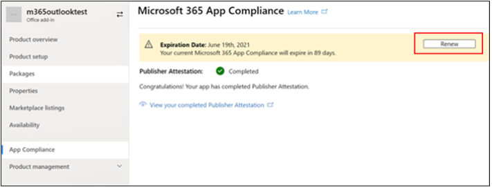

# Руководство для пользователей партнеров для Microsoft 365 программы соответствия требованиям приложений

|||
|---|---|
|Уровень 1| Аттестация издателя|
|Уровень 2| Сертификация Microsoft 365|

## 1. Обзор
Этот документ выступает в качестве пошагового руководства для пользователей для наших партнеров, зарегистрированных для Microsoft 365 программы соответствия требованиям к приложениям с целью пройти Publisher аттестацию и сертификацию на портале Центра партнеров.

## 2. Акронимы & определения
| | |
|---|----|
|Сокращение | Определение |
|PC (Центр партнеров)|Портал для всех партнеров Майкрософт. Партнер входит в Центр партнеров и Self-Assessment Вопросник https://partner.microsoft.com/|
|Независимый поставщик программного обеспечения|Независимый поставщик программного обеспечения A.k.a. Партнер или разработчик|
|Источник приложения| Каталог приложений (https://appsource.microsoft.com/)
||Пример: Теперь виртуальный агент (https://appsource.microsoft.com/en-us/product/office/WA104381816)|

## 3. Publisher процесса проверки

Главная страница. Это посадочная страница после входа партнера в Центр партнеров.

**Шаг 1.**   Слева от страницы в панели навигации:
1. Выбор Office магазина
1. Выбор обзоров

Выбрав "Обзор", партнер может увидеть список приложений, представленных через Центр партнеров и доступных для Microsoft 365 соответствия требованиям.

**Шаг 2.** Выберите приложение из списка, чтобы начать процесс Publisher проверки.

При выборе приложения будет всплывающее другое панели навигации с параметром "Соответствие требованиям приложения"

**Шаг 3.** Выберите "Соответствие требованиям приложения"

**Шаг 4.** Заполните Self-Assessment для Publisher проверки

**Примечание.** Если вы возвращались к обновлению или повторной отправке приложения, нажмите кнопку "Выберите продукт", выберите приложение и нажмите кнопку "клон".

 

Вы также можете использовать функцию импорт и экспорт, чтобы завершить форму автономной работы и импортировать ее после завершения. 

**Шаг 5.** После завершения нажмите кнопку "Отправить", теперь оценка будет "рассмотрена".

### Утверждение и отклонение сценариев:

**Отклонение Publisher проверки**

В случае отказа на данном этапе партнер может:
-   Просмотр отчета о сбое.
    - Партнер будет уведомлен в Центре партнеров и по электронной почте.
-   Обновление Self-Assessment ответов.
-   Повторное отправка самостоятельной оценки.

**Повторное представление Publisher проверки**

**Утверждение Publisher проверки C.Publisher**

-   После утверждения партнер может:
    - Обновление и повторное тестирование
    - Просмотр и совместное Publisher проверки
    - Запуск процесса сертификации M365

**Утверждение Publisher: пример ссылки в AppSource для заверенных приложений издателя**

## 4. Microsoft 365 процесса сертификации

Как только партнер нажимает кнопку "Отправить" и передает все документы и доказательства для проверки: 

### Microsoft 365 Сертификация — отправка

**Microsoft 365 сертификации — отклонено**

**Microsoft 365 Сертификация — утверждена**

**Утверждение сертификации после публикации: пример значка Microsoft 365 сертификации в AppSource**

## 5. Рабочий процесс для существующих isVs

Если вы уже имеете isV и хотите обновить Publisher проверку.

**Шаг 1.** Нажмите на ссылку "Обновление и повторное отправка Publisher проверки".

**Примечание.** Если вы возвращались к обновлению или повторной отправке приложения, нажмите кнопку "Выберите продукт", выберите приложение и нажмите кнопку "Импорт".

**Шаг 2.** Внести обновления в форму и нажмите кнопку Сохранить/Отправить.

После отправки оно будет рассмотрено.

## 6. Microsoft 365 Publisher процесса аттестации и обновления сертификации:

Microsoft 365 Программа соответствия требованиям приложений теперь предлагает ежегодный процесс обновления. В ходе этого процесса разработчики приложений могут обновить существующий Publisher аттестации и документы, необходимые для Microsoft 365 сертификации. 

**Преимущества:**

- Сохраните значок сертификации в AppSource и Team Store, чтобы отличать приложение от других. 
- Повышение доверия клиентов к использованию сертифицированного приложения. 
- Помощь ИТ-администраторам в принятии обоснованных решений с помощью обновленных сведений о сертификации. 

Новый процесс обновления доступен в [Центре партнеров для](https://partner.microsoft.com/en-us/dashboard/home) обеспечения бесперебойного работы. Напоминание о возобновлении будет показано в Центре партнеров, начиная с 90 дней до истечения срока действия. Периодические напоминания также будут отправляться по электронной почте за 90, 60 и 30 дней до истечения срока действия.

**Tier 1: Publisher проверки:** 

Ответы на Publisher проверки приложения необходимо будет повторно повторно переподавлить на ежегодной основе. Когда заверение близит к 1-летней отметке, будет отправлено напоминание по электронной почте, поощряющее повторное повторное тестирование. 

**Шаг 1.** **Выберите обновление** для обновления Publisher проверки. 

**Шаг 2.** Просмотрите предыдущие ответы Publisher проверки и обновив при необходимости последнюю информацию. Отправка Publisher для обновления при готовности. Она будет рассмотрена аналитиком соответствия требованиям приложений M365.

Publisher истек срок **проверки:** Сведения о приложении должны быть обновлены до истечения срока действия, чтобы сохранить страницу Publisher проверки в документы Майкрософт. Вовремяе обновление также обеспечит продолжение работы и значки для приложения в AppSource и Team Store.

Примечание. По истечении срока действия Publisher обновления может быть запущен в любое время, нажав кнопку "Обновить". 

**Tier 2: Microsoft 365 сертификации** 

Сведения о сертификации приложения должны быть повторно перенаблюированы на ежегодной основе. Для этого потребуется переоценка элементов управления в области текущей среды. Когда сертификация близит к 1-летней отметке, будет отправлено уведомление по электронной почте с призывом к повторной отправке документов и доказательств. 

**Сценарии утверждения и отказа от сертификации:**

**Сценарий 1.** 

Publisher Проверки завершены. Обновление сертификации началось и находится в стадии рассмотрения. 

**Сценарий 1A:**

Отказ от продления сертификации: сертификация может быть отклонена, если: 

 - Приложение не имеет необходимых инструментов, процессов или конфигураций на месте и не сможет реализовать необходимые изменения в окне сертификации. 
 - Приложение имеет непогашенные уязвимости и не может быть исправлено в окне сертификации. 

    
**Сценарий 1B:** 

Утверждено продление сертификации  

**Срок действия сертификации:**

Сведения о приложении необходимо обновлять до истечения срока действия, чтобы сохранить страницу сертификации приложения в документы Майкрософт. Вовремяе обновление также обеспечит продолжение работы и значки для приложения в AppSource и Team Store. 

    
**Примечание.** По истечении срока действия Publisher проверки и сертификации можно начать в любое время, нажав кнопку "Обновить". 

