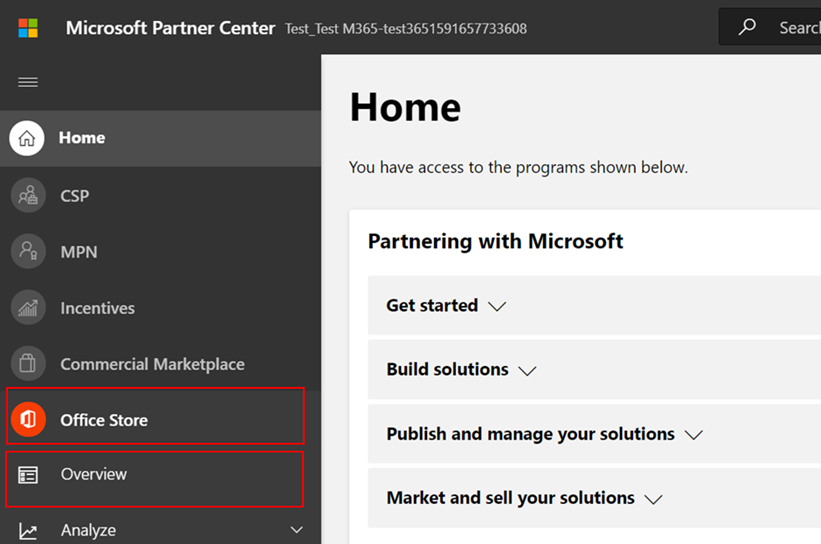

# Руководство по пользователю партнера для Программы соответствия требованиям к приложениям Microsoft 365

|||
|---|---|
|Уровень 1| Атестация издателя|
|Уровень 2| Сертификация Microsoft 365|

## 1. Обзор
Этот документ выступает в качестве пошагового руководства для пользователей для наших партнеров, зарегистрированных в Microsoft 365 Программа соответствия требованиям к приложениям с целью пройти аттестацию и сертификацию издателя, хотя портал Центра партнеров.

## 2. Акронимы & определения
| | |
|---|----|
|Сокращение | Определение |
|PC (Центр партнеров)|Портал для всех партнеров Майкрософт. Партнер входит в Центр партнеров и Self-Assessment Вопросник https://partner.microsoft.com/|
|Независимый поставщик программного обеспечения|Независимый поставщик программного обеспечения A.k.a. Партнер или разработчик|
|Источник приложения| Каталог приложений (https://appsource.microsoft.com/)
||Пример: Теперь виртуальный агент (https://appsource.microsoft.com/en-us/product/office/WA104381816)|

## 3. Рабочий процесс проверки издателя

Главная страница. Это посадочная страница после входа партнера в Центр партнеров.

**Шаг 1.**   Слева от страницы в панели навигации:
1. Выбор магазина Office
1. Выбор обзоров

При выборе "Обзор" партнер может увидеть список приложений, представленных через Центр партнеров и доступных для программы соответствия требованиям Microsoft 365.

**Шаг 2.** Выберите приложение из списка, чтобы начать процесс проверки издателя.

При выборе приложения будет всплывающее другое панели навигации с параметром "Соответствие требованиям приложения"

**Шаг 3.** Выберите "Соответствие требованиям приложения"

**Шаг 4.** Заполните анкету Self-Assessment для проверки издателя

**Примечание.** Если вы возвращались к обновлению или повторной отправке приложения, нажмите кнопку "Выберите продукт", выберите приложение и нажмите кнопку "клон".

 

Вы также можете использовать функцию Import/Export для завершения формы автономной работы и импорта после ее завершения. 

**Шаг 5.** После завершения нажмите кнопку "Отправить", теперь оценка будет "рассмотрена".

### Утверждение и отклонение сценариев:

**Отклонение проверки a.Publisher**

В случае отказа на данном этапе партнер может:
-   Просмотр отчета о сбое.
    - Партнер будет уведомлен в Центре партнеров и по электронной почте.
-   Обновление Self-Assessment ответов.
-   Повторное отправка самостоятельной оценки.

**B.Publisher Повторное представление проверки**

**Утверждение проверки проверки C.Publisher**

-   После утверждения партнер может:
    - Обновление и повторное тестирование
    - Просмотр и совместное тестирование завершенного издателя
    - Запуск процесса сертификации M365

**Утверждение проверки издателя после публикации: пример ссылки в AppSource для заверенных приложений издателя**

## 4. Рабочий процесс сертификации Microsoft 365

Как только партнер нажимает кнопку "Отправить" и передает все документы и доказательства для проверки: 

### Сертификация Microsoft 365 — отправлена

**Сертификация Microsoft 365 — отклонена**

**Сертификация Microsoft 365 — утверждена**

**Утверждение сертификации после публикации: пример значка сертификации Microsoft 365 в AppSource**

## 5. Рабочий процесс для существующих isVs

Если вы существующий isV и хотите обновить проверку издателя.

**Шаг 1.** Нажмите на ссылку "Обновление и повторное отправка проверки издателя".

**Примечание.** Если вы возвращались к обновлению или повторной отправке приложения, нажмите кнопку "Выберите продукт", выберите приложение и нажмите кнопку "Импорт".

**Шаг 2.** Внести обновления в форму и нажмите кнопку Сохранить/Отправить.

После отправки оно будет рассмотрено.

## 6. Рабочий процесс Microsoft 365 Re-Certification:

Когда приложение достигнет 1-летней годовщины сертификации, будут периодически напоминать о возобновлении сертификации.

**Тестирование издателя завершено. Сертификация InProgress.**

Утверждение/отклонение Secnario: A. Сертификация отклонена

B. Сертификация утверждена

Сценарий истечения срока действия: срок действия. Срок действия проверки издателя истек

B. Срок действия сертификации истек

