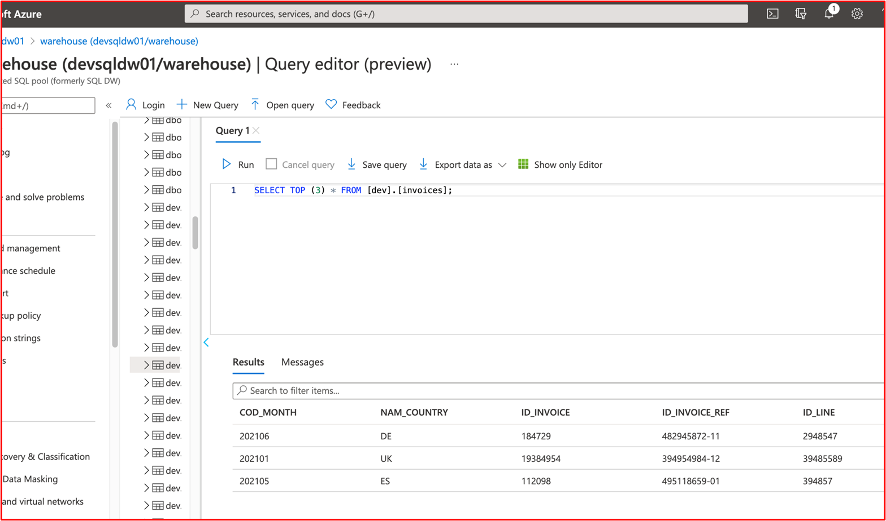
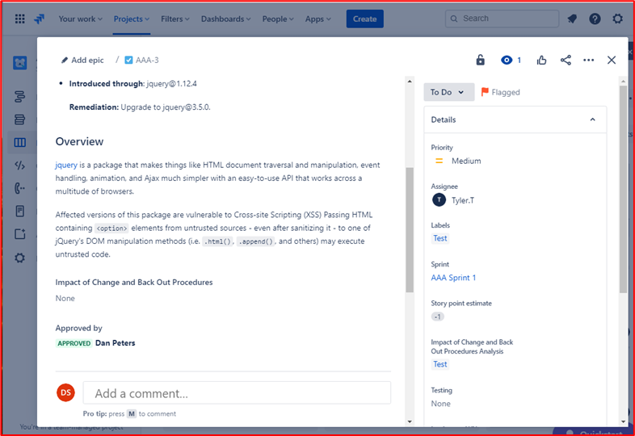
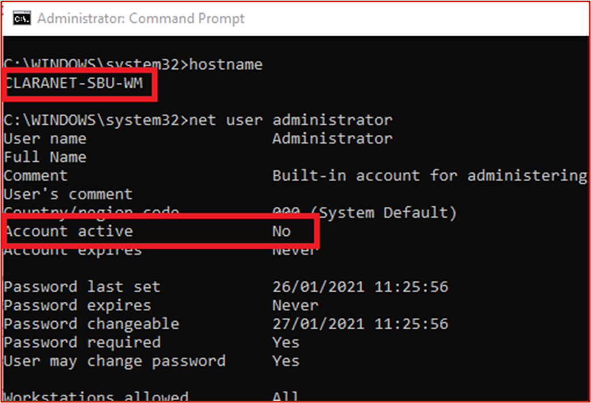
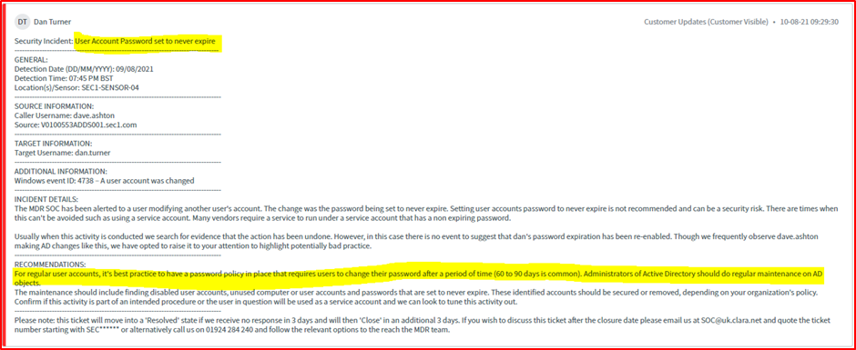
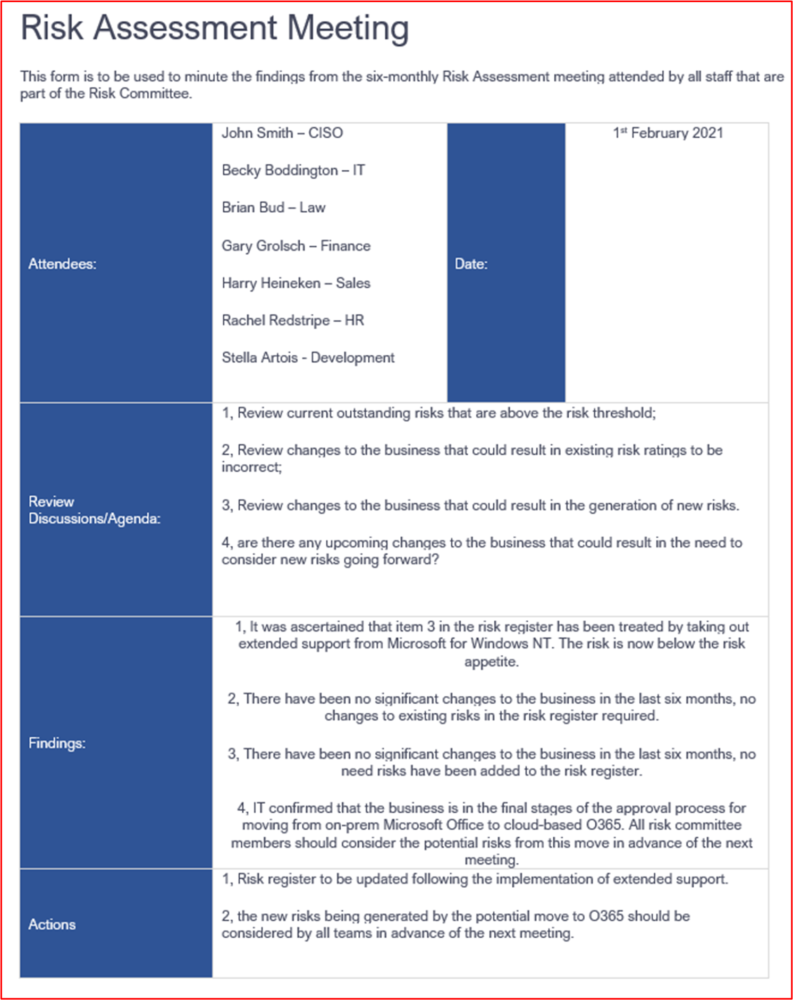
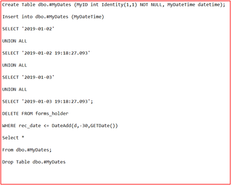

# Microsoft 365 сертификации — пример руководства по доказательствам

## Обзор

Это руководство было создано для предоставления isV-данным примеров типа доказательств и уровня подробных данных, необходимых для каждого из элементов управления сертификацией Microsoft 365 сертификации. Все примеры, представленные в этом документе, не являются единственными доказательствами, которые могут быть использованы для демонстрации того, что элементы управления выполнены, но действуют только в качестве руководства по типу необходимых доказательств. 

Обратите внимание: фактические интерфейсы, скриншоты и документация, используемые для удовлетворения требований, будут отличаться в зависимости от использования продукта, установки системы и внутренних процессов. Кроме того, обратите внимание, что в тех случаях, когда требуется документация по политике или процедуре, isV будет обязан отправлять документы ACTUAL, а не скриншоты, как может быть показано в некоторых примерах. 

В сертификации есть два раздела, которые требуют отправки:
1. [**Начальная отправка документов:**](../docs/initialdocumentsubguide.md) небольшой набор документов высокого уровня, необходимых для проверки вашей оценки.
1. **Представление доказательств:** полный набор доказательств, необходимых для каждого контроля в области для оценки сертификации. 

## Структура 

Этот документ напрямую сопопостает элементу управления, который будет представлен во время сертификации в центре партнеров. Инструкции, предоставляемые в этом документе, подробно описаны следующим образом:
- Домен безопасности. Три домена безопасности, в которые сгруппировали все элементы управления: безопасность приложений, оперативная безопасность и безопасность данных и конфиденциальность.
- Control(s): = Описание активности оценки — эти контрольные номера и связанные номера (No.) взяты непосредственно из Microsoft 365 списка сертификации.  
- Цель: = цель, по которой управление безопасностью включено в программу, и конкретный риск, который она направлена на смягчение.  Надеемся, что эта информация предоставит isVs с рассуждениями за контроль, чтобы лучше понять типы доказательств, которые должны быть собраны и что ISV должны обратить внимание и иметь осведомленность и понимание в подготовке своих доказательств.
- Примеры рекомендаций по доказательствам: = Предоставлено для руководства задачами сбора доказательств в таблице контрольных списков сертификации Microsoft 365, это позволяет isV четко видеть примеры типов доказательств, которые могут быть использованы аналитиком сертификации, который будет использовать его, чтобы сделать уверенное определение того, что контроль на месте и поддерживается , это ни в коем случае не является исчерпывающим по своему характеру.
- Пример доказательств. = В этом разделе представлены скриншоты и изображения потенциальных доказательств, полученных в отношении каждого из элементов управления в таблице контрольных списков сертификации Microsoft 365, в частности для доменов оперативной безопасности и безопасности данных и конфиденциальности (вкладки в таблицу). Обратите внимание, что любая информация с красными стрелками и ящиками в примерах поможет вам в дальнейшем понять требования, необходимые для любого контроля.

## Домен безопасности: безопасность приложений

**Control 1 — Control 16**:

Элементы управления доменной безопасностью приложений могут быть совмещены отчетом о проверке на проникновение, выданным в течение последних 12 месяцев, показывающим, что ваше приложение не имеет непогашенных уязвимостей. Единственным требуемым представлением является чистый отчет авторитетной независимой компании. 

## Домен безопасности: оперативная безопасность и безопасность разработки

Домен безопасности "Оперативная безопасность и безопасность разработки" предназначен для обеспечения того, чтобы isVs реализовали мощный набор методов смягчения последствий безопасности от множества угроз, с которыми сталкиваются субъекты угроз.  Это предназначено для защиты операционной среды и процессов разработки программного обеспечения для создания безопасных сред.

#### Защита от вредоносных программ — антивирус

**Управление No 1:** Предокавляй документацию по политике, которая управляет антивирусной практикой и процедурами.
- Цель этого управления состоит в том, чтобы оценить понимание isV проблем, с которыми они сталкиваются при рассмотрении угрозы от компьютерных вирусов. Устанавливая и используя отраслевые рекомендации по разработке антивирусной политики и процессов, isV предоставляет ресурс, адаптированный к возможности организации по снижению рисков, с которыми сталкивается вредоносное ПО, перечисляя рекомендации по обнаружению и ликвидации вирусов, а также дает доказательства того, что документированная политика предоставляет рекомендации по безопасности для организации и ее сотрудников. Документировать политику и процедуру развертывания расшифровок антивирусных программ, что обеспечивает последовательное развертывание и обслуживание этой технологии в снижении риска вредоносных программ для окружающей среды.

- Примеры рекомендаций по доказательствам. Предостерегайте копию политики антивирусного и антимагента с подробным подробным извеском о процессах и процедурах, реализованных в инфраструктуре для продвижения рекомендаций по антивирусу и вредоносным программам.
Пример доказательств

- Пример доказательств:

**Примечание:** На этом скриншоте показан документ политики и процесса, предполагается, что isVs поделиться фактической документацией о поддержке политики и процедуры, а не просто предоставить снимок экрана.

**Контроль No 2:** Предокавидное доказательство того, что антивирусное программное обеспечение работает во всех примерных компонентах системы.

- Намерение. Важно, чтобы антивирусная защита (AV) (или защита от вредоносных программ) в вашей среде была запущена для защиты от рисков кибербезопасности, которые вы можете или не можете знать о том, как увеличивается число потенциально опасных атак, как в области сложности, так и в цифрах. Развертывание AV для всех системных компонентов, поддерживаюющих его использование, поможет снизить некоторые риски, связанные с вводом антивирусных программ в окружающую среду. Чтобы потенциально обеспечить вектор атаки для субъекта угрозы, чтобы закрепиться в среде, требуется только одна конечная точка. Поэтому AV следует использовать в качестве одного из нескольких уровней защиты для защиты от этого типа угрозы.

- Пример рекомендаций по доказательствам. Чтобы доказать, что активный экземпляр AV запущен в оцениваемой среде. Предоделайте снимок экрана для каждого устройства в примере, который поддерживает использование антивирусного процесса, который показывает запущенный антивирусный процесс, активное антивирусное программное обеспечение, или если у вас есть централизованная консоль управления для антивируса, вы можете продемонстрировать его с этой консоли управления. При использовании консоли управления убедитесь в том, что на скриншоте показана связь и работа взятых устройств.

- Пример доказательства 1. Снимок экрана ниже взят из Центра безопасности Azure; он показывает, что расширение antimalware было развернуто в VM &quot;с именем MSPGPRODAZUR01&quot;.

- Пример доказательства 2

Снимок экрана ниже взят с Windows 10 устройств, показывая, &quot;что защита в режиме реального времени включена для хост-имени&quot; &quot;CLARANET-SBU-WM&quot;.

**Контроль No 3:** Предоставление наглядного подтверждения того, что антивирусные подписи являются самыми сегодняшними во всех средах (в течение 1 дня).

- Цель: ежедневно выявляются сотни тысяч новых вредоносных программ и потенциально нежелательных приложений (PUA). Чтобы обеспечить надлежащую защиту от недавно выпущенных вредоносных программ, подписи AV должны регулярно обновляться для учета недавно выпущенных вредоносных программ.

- Этот контроль существует для обеспечения того, чтобы isV учитывал безопасность среды и влияние, которое устаревшее AV может иметь для безопасности.

- Пример рекомендаций по доказательствам: предоставление файлов журналов антивирусного журнала с каждого пробного устройства, показывая, что обновления применяются ежедневно.

- Пример доказательства. На следующем скриншоте показано обновление Microsoft Defender по крайней мере ежедневно, &#39;event 2000, Защитник Windows&#39;, которое является обновлением. Показано имя хост-пользователя, которое показывает, &quot;что это было взято из системы в области CLARANET-SBU-WM&quot;.

**Примечание:** Представленные доказательства должны включать экспорт журналов для демонстрации ежедневных обновлений в течение более длительного периода времени. Некоторые антивирусные продукты будут создавать файлы журналов обновлений, поэтому эти файлы должны поставляться или экспортировать журналы из просмотра событий.

**Контроль No 4:** Предокавидное доказательство того, что антивирус настроен для выполнения сканирования в доступе или периодического сканирования во всех примерных компонентах системы.

**Примечание:** Если сканирование в доступе не включено, то необходимо alerting_ и _be ежедневное сканирование. 

- Цель. Цель этого контроля состоит в том, чтобы обеспечить быстрое идентифицирование вредоносных программ, чтобы свести к минимуму влияние, которое это может иметь для среды. Если сканирование в доступе осуществляется и в сочетании с автоматической блокировкой вредоносных программ, это поможет остановить вредоносные программы, известные антивирусным программным обеспечением. Если сканирование в доступе&#39;нежелательно из-за рисков ложных срабатывающих срабатывающих служб, необходимо внедрить подходящие ежедневные (или более) механизмы сканирования и оповещения, чтобы обеспечить вовремя ответ на вредоносные программы, чтобы минимизировать ущерб.

- Пример рекомендаций по доказательствам. Предоделайте  снимок экрана для каждого устройства в примере, поддерживаю котором поддерживается антивирус, показывая, что антивирус запущен на устройстве и настроен для сканирования в режиме реального **времени, или** предоставить скриншот, показывающий, что периодическое сканирование включено для ежедневного сканирования, настроено оповещение и последняя дата  сканирования для каждого устройства в примере.

- Пример доказательства. На следующем скриншоте показана &quot;возможность защиты в режиме реального времени для хоста CLARANET-SBU-WM&quot;.

**Управление No 5:** Предостережить демонстрацию того, что антивирус настроен для автоматической блокировки вредоносных программ или карантина, а также оповещения во всех примерных компонентах системы.

- Цель. Изощрение вредоносных программ постоянно развивается вместе с разной степенью разрушений, которые они могут принести. Цель этого контроля состоит в том, чтобы остановить выполнение вредоносных программ и, следовательно, не дать ему выполнять потенциально разрушительную полезной нагрузки, или если автоматическая блокировка не является вариантом, ограничение времени, когда вредоносные программы могут посеять хаос, предупредив и немедленно реагируя на потенциальную заражение вредоносными программами.

- Пример рекомендаций по доказательствам. Предостережите снимок экрана для каждого устройства в примере, поддерживаю котором поддерживается антивирус, показывая, что антивирус запущен на компьютере и настроен для автоматической блокировки вредоносных программ, оповещения или карантина и оповещения.

- Пример Доказательства 1. На &quot;следующем скриншоте показана настройка хоста CLARANET-SBU-WM&quot; с защитой в режиме реального времени для антивирусная программа в Microsoft Defender. Как говорится в параметре, это позволяет обнаружить и остановить установку или запуск вредоносных программ на устройстве.

**Управление No6:** Предокабельное подтверждение того, что приложения утверждены до развертывания.

- Намерение. С помощью управления приложениями организация будет утверждать каждое приложение или процесс, разрешенный для работы в операционной системе. Цель этого контроля состоит в том, чтобы обеспечить, чтобы процесс утверждения был на месте, чтобы разрешить, какие приложения/процессы могут запускаться.

- Примеры рекомендаций по доказательствам. Можно привести доказательства, показывающие, что процесс утверждения следует. Это может быть предоставлено с помощью подписанных документов, отслеживания в системах управления изменениями или с помощью Azure DevOps или JIRA для отслеживания этих запросов и авторизации.

- Пример доказательства. На следующем скриншоте показано утверждение руководства о том, что каждое приложение, разрешенное для работы в среде, следует процедуре утверждения. Это процесс на основе бумаги в Contoso, однако могут использоваться другие механизмы.

**Управление No 7:** Предоставление наглядного подтверждения того, что полный список утвержденных приложений с бизнес-обоснованием существует и поддерживается.

- Намерение. Важно, чтобы организации сохранили список всех утвержденных приложений, а также сведения о том, почему было утверждено приложение или процесс. Это поможет убедиться, что конфигурация остается текущей и может быть рассмотрена в базовом варианте, чтобы не настраивать несанкционированные приложения и процессы.

- Примеры рекомендаций по доказательствам: поставляем документированный список утвержденных приложений и процессов вместе с бизнес-обоснованием.

- Пример доказательства. На следующем скриншоте перечислены утвержденные приложения с бизнес-обоснованием.

**Примечание:** На этом скриншоте показан документ, ожидается, что isVs поделиться фактическим вспомогательным документом, а не просто предоставить снимок экрана.

**Управление No 8:** Предокавляйте сопроводивую документацию, в которую построит программное обеспечение управления приложениями, чтобы соответствовать определенным механизмам управления приложениями.

- Намерение. Конфигурация технологии управления приложениями должна быть задокументирована вместе с процессом, как поддерживать технологию, т. е. добавлять и удалять приложения/процессы. В рамках этой документации тип используемого механизма должен быть подробным для каждого приложения/процесса. Это будет перенастройка в следующий контроль, чтобы убедиться, что технология настроена как документированная.

- Примеры рекомендаций по доказательствам: предоставление вспомогательной документации с подробными данными о настройке управления приложениями и настройке каждого приложения/процесса в рамках технологии.

- Пример доказательства. На следующем скриншоте перечислены механизм управления, используемый для реализации управления приложениями. Вы можете видеть ниже, что 1 приложение использует элементы управления сертификатами, а другие — путь к файлу.

**Примечание:** На этом скриншоте показан документ, ожидается, что isVs поделиться фактическим вспомогательным документом, а не просто предоставить снимок экрана.

**Управление No 9:** Предокавляемые доказательства того, что управление приложениями настроено как документированное из всех примерных компонентов системы.

- Намерение. Цель этого заключается в проверке того, что управление приложениями настроено по образцу в документации.

- Пример рекомендаций по доказательствам. Предокажите  снимок экрана для каждого устройства в примере, чтобы показать, что на нем настроены и активированы элементы управления приложениями. Это должно показывать имена машин, группы, к которых они принадлежат, и политики управления приложениями, применяемые к этим группам и машинам.

- Пример доказательств. На следующем скриншоте показан объект групповой политики с включенной политикой ограничения программного обеспечения.

На следующем скриншоте показана конфигурация в соответствии с вышеуказанным управлением.

На следующем скриншоте показана среда M365 и компьютеры, включенные в область, применяемую к этому объекту GPO &#39;domain Computer Параметры&#39;.

На этом окончательном скриншоте показан &quot;сервер DBServer1&quot; , на который был сделан снимок экрана выше.

### Управление исправлениями — ранжирование рисков

Быстрая идентификация и устранение уязвимостей безопасности помогает свести к минимуму риски того, что субъект угрозы наносит ущерб среде или приложению. Управление исправлением разделено на два раздела: ранжирование рисков и исправление исправлений. Эти три средства управления охватывают определение уязвимостей безопасности и ранжирование их в зависимости от риска, который они представляют.

Эта группа управления безопасностью находится в области среды размещения Platform-as-a-Service (PaaS), так как библиотеки программного обеспечения и база кода сторонних приложений и надстройки должны быть исправлены в зависимости от ранжирования рисков.

**Контроль No 10:** Документация по политике поставок, которая определяет, как выявляются новые уязвимости безопасности и назначена оценка риска.

- Цель этого контроля состоит в том, чтобы иметь вспомогательную документацию, чтобы обеспечить быстрое идентифицирование уязвимостей безопасности, чтобы уменьшить возможности, которые субъекты угроз должны использовать для использования этих уязвимостей. Необходимо создать надежный механизм для выявления уязвимостей, охватывающих все компоненты системы, которые используются организациями; например, операционные системы (Windows Server, Ubuntu и т.д.), приложения (Tomcat, MS Exchange, SolarWinds и т. д.), зависимости от кода (AngularJS, jQuery и т.д.). Организациям необходимо не только обеспечить вовремя идентификацию уязвимостей в имении, но и соответственно ранжить все уязвимости, чтобы гарантировать, что исправление осуществляется в подходящие сроки, исходя из риска, который представляет уязвимость.

**Примечание** Даже если вы работаете в чисто платформе как среде службы, вы по-прежнему несете ответственность за выявление уязвимостей в базе кода, то есть сторонних библиотек.

- Примеры рекомендаций по доказательствам: предоставить документацию поддержки (а не скриншоты)

- Пример доказательства. На этом скриншоте показан фрагмент политики ранжирования рисков.

**Примечание:** На этом скриншоте показан документ политики и процесса, предполагается, что isvs поделиться фактической документацией по поддержке политики и процедуры, а не просто предоставить screenshot._

**Управление No 11:** Предокавидеть, как выявляются новые уязвимости безопасности.

- Цель этого управления состоит в том, чтобы убедиться в том, что процесс&#39;достаточно надежный, чтобы выявить новые уязвимости безопасности в среде. Это могут быть не только операционные системы; он может включать приложения, работающие в среде, и любые зависимостей кода.

- Пример рекомендаций по доказательствам. Доказательства могут быть предоставлены путем демонстрации подписок на списки рассылки, вручную проверки источников безопасности для вновь выпущенных уязвимостей (должны быть надлежащим образом отслеживаются с помощью timestamps действий, то есть с JIRA или Azure DevOps), инструменты, которые находят устарелое программное обеспечение (например, может быть Snyk при поиске устарели библиотеки программного обеспечения, или может быть Nessus с помощью проверки подлинности, которые идентифицируют  устарело программное обеспечение.).

**Примечание** При использовании Nessus это необходимо регулярно запускать для быстрого выявления уязвимостей. Мы рекомендуем по крайней мере еженедельно.

- Пример доказательства. На этом скриншоте показано, что группа рассылки используется для уведомления об уязвимостях безопасности.

**Контроль No 12:** Предокажи доказательства того, что всем уязвимостям назначена ранжирование риска после их идентифицирования.

- Намерение. Исправление должно основываться на риске, чем рискнее уязвимость, тем быстрее она должна быть исправлена. Ранжирование риска выявленных уязвимостей является неотъемлемой частью этого процесса. Цель этого контроля состоит в том, чтобы убедиться, что задокументирован процесс ранжирования риска, за которым следует следить, чтобы обеспечить подходящий ранжирование всех выявленных уязвимостей в зависимости от риска. Организации обычно используют рейтинг CVSS (Common Vulnerability Scoring System), предоставляемый поставщиками или исследователями по безопасности. Рекомендуется, чтобы если организация опиралась на CVSS, в процесс включен механизм повторного ранжирования, позволяющий организации изменять ранжирование на основе внутренней оценки риска. Иногда уязвимость может не быть приложением из-за способа развертывания приложения в среде. Например, может быть выпущена уязвимость Java, которая влияет на определенную библиотеку, которая не используется организацией.

- Примеры рекомендаций по доказательствам: предоставление доказательств с помощью скриншота или других средств, например DevOps/Jira, которые демонстрируют, что уязвимости проходят процесс ранжирования риска и присваиваются организацией соответствующего ранжирования риска.

- Пример доказательства. На этом скриншоте показан рейтинг риска, происходящий в столбце D, и повторное ранжирование в столбцах F и G, если организация выполнит оценку риска и определит, что риск может быть понижен. Доказательства повторной оценки риска должны быть предоставлены в качестве подтверждающих данных

### Управление исправлениями — исправление

Ниже приведены элементы управления исправлением для управления исправлениями. Чтобы поддерживать безопасную операционную среду, приложения и надстройки и вспомогательные системы должны быть исправлены. Необходимо усвоить подходящие временные рамки между идентификацией (или общедоступным выпуском) и исправлением, чтобы уменьшить возможность использования уязвимости субъектом угроз. Сертификация Microsoft 365 не предусматривает &#39;исправления&#39;, однако аналитики сертификации отклоняет временные рамки, которые не являются разумными.

Эта группа управления безопасностью находится в области среды размещения Platform-as-a-Service (PaaS), так как библиотеки программного обеспечения и база кода сторонних приложений и надстройки должны быть исправлены в зависимости от ранжирования рисков.

**Контроль No 13:** Предоставление документации по политике для исправления компонентов системы в области, включающих подходящие минимальные временные рамки исправления для критических, высокой и средней уязвимостей риска; и вывод из эксплуатации любых неподтверченных операционных систем и программного обеспечения.

- Намерение. Управление исправлениями требуется многими рамками соответствия требованиям безопасности, например PCI-DSS, ISO 27001, NIST (SP) 800-53. Важность правильного управления исправлениями не может быть подчеркнута, так как она может устранять проблемы с безопасностью и функциональными возможностями в программном обеспечении, микропрограммных программах и устранять уязвимости, что помогает сократить возможности для эксплуатации. Цель этого управления состоит в том, чтобы свести к минимуму окно возможностей, которые субъекту угрозы необходимо использовать уязвимости, которые могут существовать в среде в области.

- Примеры рекомендаций по доказательствам. Предоделение копии всех политик и процедур, подробно извечающих процесс управления исправлениями. Это должно включать раздел о минимальном окне исправлений и что неподтверченные операционные системы и программное обеспечение не должны использоваться в среде.

- Пример доказательства. Ниже приведен пример документа политики.

**Примечание:** На этом скриншоте показан документ политики и процесса, предполагается, что isvs поделиться фактической документацией по поддержке политики и процедуры, а не просто предоставить screenshot._

**Контроль No 14:** Предоставление демонстрационной демонстрации того, что все примерные компоненты системы исправлены.

**Примечание:** Включай любые библиотеки программного обеспечения и сторонних разработчиков.

- Предназначение. Исправление уязвимостей гарантирует, что различные модули, которые являются частью инфраструктуры информационных технологий (оборудование, программное обеспечение и службы), будут держаться в курсе и быть свободными от известных уязвимостей. Исправление должно быть выполнено как можно скорее, чтобы свести к минимуму вероятность инцидента с безопасностью между выпуском сведений об уязвимости и исправлением. Это еще более важно, если эксплуатация уязвимостей, как известно, находится в дикой природе.

- Примеры рекомендаций по доказательствам. Предоделайте  снимок экрана для каждого устройства в примере и поддерживающие компоненты программного обеспечения, показывающие, что патчи устанавливаются в соответствии с документированным процессом исправления.

- Пример доказательства. &quot;На следующем скриншоте показано, что компонент системы области CLARANET-SBU-WM&quot; Windows обновления в соответствии с политикой исправления.

**Примечание:** Исправление всех компонентов системы в области должно быть доказательством. Это включает в себя такие вещи, как; Обновления ОС, обновления приложений и компонентов (i.e__.,_ _Apache Tomcat, OpenSSL и т. д.), зависимости от программного обеспечения (например, JQuery, AngularJS_ и т. д.) и т.д.

**Контроль No 15:** Предоставление демонстрационной информации о том, что любые неподтверченные операционные системы и компоненты программного обеспечения не используются в среде.

- Намерение. Программное обеспечение, которое не поддерживается поставщиками, будет страдать от известных уязвимостей, которые не исправлены. Поэтому использование неподтверченных операционных систем и компонентов программного обеспечения не должно использоваться в производственных средах.

- Пример рекомендаций по доказательствам. Предоделайте  снимок экрана для каждого устройства в примере, демонстрируя версию операционной системы (в том числе имя сервера&#39;на скриншоте). В дополнение к этому, предокавказатель того, что компоненты программного обеспечения, работающие в среде, запускают поддерживаемые версии. Это может быть сделано путем предоставления вывода отчетов о проверке уязвимостей (включая проверку подлинности) и(или) средств проверки сторонних библиотек, таких как [Snyk](https://snyk.io/), [Trivy](https://github.com/aquasecurity/trivy) или [NPM Audit](https://docs.npmjs.com/cli/v7/commands/npm-audit). Если работает только в PaaS, только сторонние группы управления библиотеками должны быть охвачены исправлением.

- Пример доказательства. Ниже показано, что компонент THOR системы в области работает с программным обеспечением, которое поддерживается поставщиком, так как Nessus&#39;не помечены какие-либо проблемы.

**Примечание:** Полный отчет должен быть общим для аналитиков сертификации.

- Пример доказательства 2

На этом скриншоте показано&quot;, что компонент системы в области CLARANET-SBU-WM&quot; работает в поддерживаемой Windows версии.

- Пример Доказательства 3

Следующий снимок экрана — это вывод [Trivy](https://github.com/aquasecurity/trivy) , в котором полный отчет&#39;не перечислять неподтвердимые приложения.

**Примечание:** Полный отчет должен быть общим для аналитиков сертификации.

### Сканирование уязвимостей

Внедряя регулярные оценки уязвимости, организации могут обнаруживать слабые места и недостойности в среде, что может стать точкой входа для злоумышленника для компрометации среды. Сканирование уязвимости может помочь определить недостающие исправления или неправильное определение в среде. Регулярно проводя эти проверки, организация может обеспечить соответствующее исправление, чтобы свести к минимуму риск компромисса из-за проблем, которые обычно подбираются этими средствами сканирования уязвимости.

**Контроль No 16:** Предоставление отчетов о проверке уязвимостей для ежеквартов инфраструктуры и веб-приложений. Сканирование необходимо выполнять в отношении всего общественного следа (IP-адресов и URL-адресов) и внутренних диапазонов IP- адресов.

**Примечание:** Это **должно** включать полный охват среды.

- Цель: сканирование уязвимости ищет возможные недостатки в компьютерной системе, сетях и веб-приложениях организаций для выявления дыр, которые потенциально могут привести к нарушениям безопасности и воздействию конфиденциальных данных. Сканирование уязвимости часто требуется отраслевыми стандартами и государственными нормативными актами, например стандартом безопасности данных PCI DSS (Стандарт безопасности данных отрасли платежных карт).

- &quot; В отчете Метрики безопасности под названием [2020 Security Metrics Guide to PCI DSS Compliance](https://info.securitymetrics.com/pci-guide-2020)&quot; говорится, что &#39;в среднем потребовалось 166 дней с того времени, когда у организации были замечены уязвимости для злоумышленника для компрометации системы. После взлома злоумышленники имели доступ к конфиденциальным данным в среднем в течение 127 дней&#39; поэтому этот контроль направлен на выявление потенциальной слабости безопасности в среде в области.

- Пример рекомендаций по доказательствам: предоставление полного отчета о проверке (ы) для каждого квартала&#39;проверки уязвимости, которые были проведены за последние 12 месяцев. Отчеты должны четко указать целевые показатели для проверки того, что все общедоступные следы включены, и где это применимо, каждая внутренняя подсеть. Предоставление **всех** отчетов о проверке для **каждого** квартала.

- Пример доказательства. Примером может быть поставка отчетов о проверке из используемой сканирующей системы. Каждый&#39;отчеты о сканировании должны поставляться для проверки. Сканирование должно включать все компоненты системы сред таким образом; каждая внутренняя подсеть и каждый общедоступный IP-адрес и URL-адрес, доступные для среды.

**Контроль No 17:** Предокабельные доказательства того, что исправление уязвимостей, выявленных во время сканирования уязвимостей, исправлено в соответствии с вашими задокументированными временными рамками исправления.

- Цель. Неумение быстро выявлять, устранять и устранять уязвимости и неправильное определение может&#39;риск компрометации, что может привести к потенциальным утечкам данных. Правильное определение и исправление проблем рассматривается как важное значение для организации&#39;общей позиции безопасности и среды, которая в соответствии с лучшими практиками различных структур безопасности для; например, ISO 27001 и PCI DSS.

- Примеры рекомендаций по доказательствам. Предоставляем подходящие артефакты (например, скриншоты), показывающие, что образец обнаруженных уязвимостей при сканировании уязвимостей исправлен в соответствии с уже поставленными окнами исправления в Control 13 выше.

- Пример доказательства. На следующем скриншоте показано сканирование среды в области Nessus ( &quot;одна машина в этом примере с именем THOR&quot;), показывающая уязвимости 2 августа 2021 г.

На следующем скриншоте показано, что проблемы были устранены через 2 дня в окне исправления, определенном в политике исправления.

**Примечание:** Для этого контроля аналитикам сертификации необходимо просмотреть отчеты о проверке уязвимости и исправление за каждый квартал за последние 12 месяцев.

### Брандмауэры

Брандмауэры часто предоставляют границу безопасности между доверенными (внутренней сетью), ненадежными (Интернет) и полунадеяными (DMZ) средами. Как правило, это будет первая линия защиты в рамках стратегии безопасности организации, предназначенной для управления транспортными потоками для служб впадения и выхода, а также для блокировки нежелательного трафика. Эти устройства должны строго контролироваться, чтобы обеспечить их эффективную работу и не использовать неправильное устройство, которое может поставить среду под угрозу.

**Контроль No 18:** Предоставление документации по политике, которая регулирует методы и процедуры управления брандмауэром.

- Цель. Брандмауэры являются важной первой линией защиты в многоуровневой стратегии безопасности ,защищая среды от менее надежных сетевых зон. Брандмауэры, как правило, будут управлять потоками трафика на основе IP-адресов и протоколов/портов, &quot;&quot; более богатые функции брандмауэров также могут обеспечить дополнительные защитные слои приложений, проверяя трафик приложений для защиты от неправильного использования, уязвимостей и угроз на основе приложений, доступ к ним. Эти средства защиты не менее хороши, чем конфигурация брандмауэра, поэтому для обеспечения адекватной защиты внутренних активов необходимо использовать сильные политики брандмауэра и процедуры поддержки. Например, брандмауэр с правилом разрешить весь трафик из любого источника в любой пункт назначения просто действует как маршрутизатор.

- Пример рекомендаций по доказательствам: предоставить полную документацию по поддержке брандмауэра. В этом документе должны быть приведены все ниже точки и все дополнительные методы, применимые к вашей среде.

- Пример доказательства. Ниже приведен пример требуемого документа политики брандмауэра (это демонстрация и может быть не завершена).

**Контроль No 19:** Предопровержимы доказательства того, что все административные учетные данные по умолчанию изменены до установки в производственные среды.

- Намерение. Организации должны помнить о поставщике, предоставляемом по умолчанию административные учетные данные, настроенные во время настройки устройства или программного обеспечения. Учетные данные по умолчанию часто общедоступны для поставщиков и могут предоставить внешнему субъекту угроз возможность скомпрометировать среду. Например, простой поиск в Интернете для учетных данных iDrac по умолчанию (встроенный контроллер удаленного доступа Dell) будет выделен _корневой::calvin_ как имя пользователя по умолчанию и пароль. Это даст кому-то удаленный доступ к удаленному управлению сервером. Целью этого управления является обеспечение того, чтобы среды не были подвержены атаке с помощью учетных данных поставщика по умолчанию, которые не были изменены во время затвердения устройства или приложения.

- Примеры рекомендаций по доказательствам

- Это может быть подтверждено на сеансе screensharing, где аналитик сертификации может попытаться проверить подлинность на устройствах в области с помощью учетных данных по умолчанию.

- Пример доказательств

На приведенной ниже скриншоте показано, что аналитик сертификации увидит из недействительных имен пользователей и паролей брандмауэра WatchGuard.

**Управление No 20:** Предостерегать, что брандмауэры устанавливаются на границе среды в области и устанавливаются между сетью периметра (также известной как DMZ, демилитаризованная зона и экранная подсеть) и внутренними доверенными сетями.

- Намерение. Брандмауэры предоставляют возможность управления трафиком между различными сетевыми зонами разных уровней безопасности. Так как все среды подключены к Интернету, брандмауэры должны быть установлены на границе, то есть между Интернетом и средой в области. Кроме того, брандмауэры необходимо установить между менее надежными сетями DMZ (De-Militarized Zone) и внутренними доверенными сетями. DmZ обычно используются для обслуживания трафика из Интернета и поэтому являются объектом атаки. Реализация dmZ и использование брандмауэра для управления транспортными потоками, компромисс dmZ&#39;обязательно означает компромисс внутренних надежных сетей и корпоративных/клиентных данных. Необходимо обеспечить надлежащую регистрацию и оповещение, чтобы помочь организациям быстро найти компромисс, чтобы свести к минимуму возможность для субъекта угроз дальнейшего компрометации внутренних надежных сетей. Целью этого управления является обеспечение надлежащего контроля между доверенными и менее доверенными сетями.

- Пример рекомендаций по доказательствам. Доказательства должны предоставляться с помощью файлов конфигурации брандмауэра или скриншотов, демонстрирующих, что dmZ на месте. Это должно соответствовать предоставленным архитектурным схемам, демонстрируя различные сети, поддерживающие окружающую среду. Эти данные должны быть представлены на скриншоте сетевых интерфейсов брандмауэра в сочетании с сетевой схемой, уже предоставленной в рамках первоначальной отправки документов.

- Пример доказательства. Ниже показан снимок экрана брандмауэра WatchGuard, демонстрирующий два DMZ, один из них — для входящих служб (с именем DMZ), другой — для скачок (Бастианский хост).

**Контроль No 21:** Предостанавлив доказательства того, что весь общедоступный доступ прекращается в демилитаризованной зоне (DMZ).

- Цель. Общедоступные ресурсы открыты для множества атак. Как уже говорилось выше, целью DMZ является сегментация менее надежных сетей из надежных внутренних сетей, которые могут содержать конфиденциальные данные. DmZ считается менее надежным, так как существует большой риск того, что общедоступные хозяйки могут быть скомпрометированы внешними участниками угрозы. Общедоступный доступ всегда должен прекращаться в этих менее надежных сетях, которые надлежащим образом сегментироваться брандмауэром, чтобы защитить внутренние ресурсы и данные. Цель этого контроля состоит в том, чтобы все общедоступные доступы прекращались в этих менее надежных DMZ, как если бы ресурсы надежных внутренних сетей были общедоступными, компромисс этих ресурсов обеспечивает субъекту угрозы опору в сеть, где проводятся конфиденциальные данные.

- Примеры рекомендаций по доказательствам

- Доказательства этого могут быть конфигурациями брандмауэра, которые показывают входящие правила и где эти правила прекращаются, либо путем маршрутации общедоступных IP-адресов к ресурсам, либо путем предоставления NAT (Сетевой перевод адресов) входящий трафик.

- Пример доказательств

На приведенном ниже скриншоте приведены три входящих правила, каждое из которых показывает nat для подсетей 10.0.3.x и 10.0.4.x, которые являются подсетями DMZ.

**Контроль No 22:** Предостережимые доказательства того, что весь трафик, разрешенный через брандмауэр, проходит процедуру утверждения.

- Намерение. Поскольку брандмауэры являются защитным барьером между ненавязчивым трафиком и внутренними ресурсами, а также между сетями различных уровней доверия, брандмауэры должны быть надежно настроены и обеспечить, чтобы был включен только трафик, необходимый для бизнес-операций. Позволяя излишнему потоку трафика или чрезмерно допустимым потокам трафика, это может привести к недостатку защиты на границе этих различных сетевых зон. Благодаря созданию надежного процесса утверждения для всех изменений брандмауэра снижается риск введения правила, которое представляет значительный риск для среды. В отчете&#39;[2020](https://enterprise.verizon.com/en-gb/resources/reports/dbir/) &quot;года по расследованию нарушений данных Verizon подчеркивается, что ошибка&#39;s&quot;, которая включает неправильные образы, является единственным типом действий, который постоянно увеличивается из года в год.

- Пример рекомендаций по доказательствам. Доказательства могут быть в виде документации, показывающая авторизованный запрос на изменение брандмауэра, который может быть в минутах от собрания cab (Change Advisor Board) или системы управления изменениями, отслеживая все изменения.

- Пример доказательства. На следующем скриншоте показано, как запрашивается и авторизуется изменение правила брандмауэра с использованием бумажного процесса. Этого можно добиться с помощью DevOps Jira, например.

**Контроль No 23:** Предопределите явные доказательства того, что база правил брандмауэра настроена для того, чтобы отказаться от трафика, явно не определенного.

- Намерение. Большинство брандмауэров обработать правила в верхней части подхода, чтобы попытаться найти соответствие правил. Если правило совпадает, действие этого правила будет применено, и вся дальнейшая обработка правил остановится. Если не найдены правила совпадения, по умолчанию трафик будет отказано. Цель этого управления состоит в том, что если брандмауэр не&#39;по умолчанию отключать трафик, если не найдено правила совпадения, &quot;то база правил должна включать правило Deny All&quot; в конце списков всех  брандмауэров. Это необходимо для того, чтобы брандмауэр не&#39;по умолчанию разрешить состояние при обработке правил, тем самым позволяя трафику, который&#39;явно не определен.

- Примеры рекомендаций по доказательствам. Доказательства могут быть предоставлены путем настройки брандмауэра или с помощью скриншотов, &quot;показывающих все правила брандмауэра, показывающие правило Deny All&quot; в конце, или если брандмауэр снижает трафик, который&#39;не соответствует правилу по умолчанию, затем поставляют скриншот всех правил брандмауэра и ссылку на руководство по администрированию поставщика, подчеркивающие, что по умолчанию брандмауэр отпадет весь трафик, не совпадающий.

- Пример доказательства. Ниже показан снимок экрана базы правил брандмауэра WatchGuard, который показывает, что для разрешения всего трафика не настроены никакие правила. В конце не существует правила отказа, так как WatchGuard отпадет от трафика,&#39;не совпадает по умолчанию.

Следующая ссылка центра справки WatchGuard; [https://www.watchguard.com/help/docs/help-center/en-US/Content/en-US/Fireware/policies/policies\_about\_c.html](https://www.watchguard.com/help/docs/help-center/en-US/Content/en-US/Fireware/policies/policies_about_c.html) включает в себя следующие сведения:

**Управление No 24:** Предостережимые доказательства того, что брандмауэр поддерживает только надстройку криптографии во всех неконсоляционных административных интерфейсах.

- Цель. Для смягчения атак административного трафика между посредниками все неконсоляционные административные интерфейсы должны поддерживать только сильную криптографию. Основной целью этого управления является защита административных учетных данных, так как несоедарное подключение настроено. Кроме того, это также может помочь защититься от подслушивания в подключение, пытаясь переиграть административные функции для перенастройки устройства или в рамках разведки.

- Пример рекомендаций по доказательствам. Предостережим конфигурацию брандмауэра, если конфигурация обеспечивает криптографическую конфигурацию неконсоляционных административных интерфейсов (не все устройства будут включать это в качестве настраиваемых параметров). Если это&#39;в конфигурации, вы можете выдавать на устройство команды, чтобы отобразить то, что настроено для этих подключений. Некоторые поставщики могут публиковать эти сведения в статьях, поэтому это также может быть способом подтверждения этой информации. Наконец, может потребоваться запустить инструменты для вывода поддерживаемых шифрований.

- Пример. На приведенной ниже скриншоте показана [выходная часть SSLScan](https://github.com/rbsec/sslscan) в интерфейсе веб-администратора брандмауэра WatchGuard в TCP-порте 8080. Это показывает TLS 1.2 или выше с минимальным шифром шифрования AES-128bit.

**Примечание**. Брандмауэры WatchGuard также поддерживают административные функции с помощью SSH (TCP Port 4118) и Диспетчер системы WatchGuard (TCP Ports 4105 &amp; 4117). Необходимо также получить данные об этих несолейных административных интерфейсах.

**Контроль No 25:** Предостережим демонстрацию того, что вы выполняете проверки правил брандмауэра по крайней мере каждые 6 месяцев.

- Намерение. Со временем существует риск ползучести конфигурации в системных компонентах с среду в области. Это часто может привести к недостоверности или неправильной оценке, что может повысить риск компрометации среды. Ползучая конфигурация может быть введена по нескольким причинам, таким как временные изменения в устранении неполадок помощи, временные изменения для временных функциональных изменений, чтобы ввести быстрые исправления проблем, которые иногда могут быть чрезмерно допустимыми из-за давления внедрения быстрого решения. В качестве примера можно ввести правило временного брандмауэра &quot;, позволяя всем&quot; преодолеть срочную проблему. Цель этого контроля состоит в двух случаях, во-первых, чтобы определить, где имеются неправильные настройки, которые могут вводить ошибки, а во-вторых, чтобы помочь определить правила брандмауэра, которые больше не нужны и поэтому могут быть удалены, то есть если служба была удалена, но правило брандмауэра было оставлено позади.

- Примеры рекомендаций по доказательствам. Доказательства должны быть в состоянии продемонстрировать, что собрания по рассмотрению были. Это можно сделать, разделив протоколы собраний в обзоре брандмауэра и все дополнительные доказательства управления изменениями, которые показывают любые действия, принятые в ходе проверки. Убедитесь, что даты присутствуют по мере&#39;, чтобы увидеть как минимум два из этих собраний (например, каждые шесть месяцев)

- Пример доказательства. На следующем скриншоте показаны свидетельства проверки брандмауэра, которая произошла в январе 2021 г.

На следующем скриншоте показаны свидетельства проверки брандмауэра, которая состоится в июле 2021 г.

### Брандмауэры — WAF

Необязательно развертывать брандмауэр веб-приложения (WAF) в решении. Если используется WAF, это будет считаться дополнительными кредитами для матрицы скоринга в &#39;области&#39; безопасности. WaFs может проверять веб-трафик для фильтрации и мониторинга веб-трафика между Интернетом и опубликованными веб-приложениями для определения конкретных атак веб-приложений. Веб-приложения могут страдать от многих атак, которые специфичен для веб-приложений, таких как SQL Injection (SQLi), Cross Site Scripting (XSS), Cross Site Request Forgery (CSRF/XSRF) и т. д. И waFs предназначены для защиты от этих типов вредоносных полезной нагрузки, чтобы защитить веб-приложения от атак и потенциального компромисса.

**Контроль No 26:** Предостережим демонстрацию того, что брандмауэр Веб-приложения (WAF) настроен для активного мониторинга, оповещения и блокировки вредоносного трафика.

- Цель. Этот контроль установлен для подтверждения того, что WAF установлен для всех входящих веб-подключений и настроен на блокировку или предупреждение для вредоносного трафика. Чтобы обеспечить дополнительный уровень защиты для веб-трафика, ВАФ необходимо настроить для всех входящих веб-подключений, в противном случае внешние субъекты угроз могут обойти ВАФ, предназначенные для обеспечения этого дополнительного уровня защиты. Если WAF не&#39;активно блокировать вредоносный трафик, WAF должна быть в состоянии немедленно предупредить сотрудников, которые могут быстро реагировать на потенциальный вредоносный трафик, чтобы помочь сохранить безопасность среды и остановить атаки.

- Пример рекомендаций по доказательствам. Предостережить выход конфигурации из WAF, который выделяет входящие веб-подключения, которые обслуживаются, и что конфигурация активно блокирует вредоносный трафик или отслеживает и оповещает. Кроме того, скриншоты определенных параметров можно использовать для демонстрации того, что организация должна использовать этот контроль.

- Пример доказательства. На следующих скриншотах показана включена политика WAF шлюза приложений Contoso Production Azure и настроена для режима &#39;предотвращения&#39;, который будет активно отключать вредоносный трафик.

На приведенной ниже скриншоте показана конфигурация IP-адреса Frontend

**Примечание:** Доказательства должны демонстрировать все общедоступные ИП, используемые средой для обеспечения того, чтобы все точки регресса были охвачены, поэтому этот снимок экрана также включен.

На приведенной ниже скриншоте показаны входящие веб-подключения с помощью этого WAF.

На следующем скриншоте показана служба ContosoAppGWCoreRules\_\_, показывающая, что это для api.contoso.com службы.

**Контроль No 27:** Предокавляемые доказательства того, что WAF поддерживает разгрузку SSL.

- Намерение. Важна возможность настройки WAF для поддержки разгрузки SSL, в противном случае WAF не сможет проверять трафик HTTPS. Так как эти среды должны поддерживать трафик HTTPS, это является важной функцией WAF для обеспечения того, чтобы вредоносные полезной нагрузки в трафике HTTPS можно было идентифицировать и остановить.

- Пример рекомендаций по доказательствам: предоставление доказательств конфигурации с помощью экспорта конфигурации или скриншотов, которые показывают, что разгрузка SSL поддерживается и настраивается.

- Пример доказательства. В шлюзе приложений Azure конфигурация SSL-прослушиватель включена разгрузка SSL, см. в обзоре прекращения [TLS и окончания TLS](https://docs.microsoft.com/azure/application-gateway/ssl-overview) со страницей docs Microsoft Gateway application Gateway. На следующем скриншоте показан этот снимок, настроенный для шлюза приложений Contoso Production Azure.

**Контроль No 28:** "Предокабельные доказательства защиты WAF от некоторых или всех следующих классов уязвимостей в соответствии с базовым набором правил OWASP (3.0 или 3.1):
- проблемы с протоколом и кодией,
- впрыскивание загона, контрабанда запросов и разделение ответов,
- атаки обхода файлов и путей,
- удаленные атаки включения файлов (RFI),
- удаленные атаки выполнения кода,
- Атаки phP-injection,
- меж-сайт сценариев атак,
- SQL-инъекции,
- атаки сеанса-фиксации.

- Цель: необходимо настроить ВАФ для определения полезной нагрузки атаки для распространенных классов уязвимостей. Этот контроль позволяет обеспечить адекватное обнаружение классов уязвимости, используя базовый набор правил OWASP.

- Пример рекомендаций по доказательствам. Предоставление доказательств конфигурации с помощью экспорта конфигурации или скриншоты показывают, что большинство классов уязвимости, выявленных выше, охвачены сканированием.

- Пример доказательства. На приведенном ниже скриншоте показано, что политика WAF-шлюза приложений Contoso Production Azure настроена для проверки на основе набора основных правил OWASP Версии 3.2.

### Управление изменениями

Установленный и понятный процесс управления изменениями имеет важное значение для обеспечения того, чтобы все изменения прошли через структурированный процесс, который можно повторить. Благодаря тому, что все изменения проходят через структурированный процесс, организации могут обеспечить эффективное управление изменениями, проверку одноранговых данных и адекватную проверку перед их подписанием. Это не только помогает свести к минимуму риск отключений системы, но и позволяет свести к минимуму риск потенциальных инцидентов безопасности за счет внесения неправильных изменений.

**Контроль No 29:** Предоставление документации по политике, управляющей процессами управления изменениями.

- Цель. Чтобы поддерживать безопасную среду и безопасное приложение, необходимо установить надежный процесс управления изменениями, чтобы обеспечить, чтобы все изменения инфраструктуры и кода осуществлялись с помощью сильного надзора и определенных процессов. Это гарантирует, что изменения будут документированы, будут рассмотрены последствия для безопасности, продумано, какое влияние на безопасность будет иметь изменение и т.д. Цель состоит в том, чтобы убедиться, что процесс управления изменениями задокументирован, чтобы обеспечить безопасный и последовательный подход ко всем изменениям как в среде, так и в практике разработки приложений.

- Примеры рекомендаций по доказательствам. Политики и процедуры управления изменениями, зарегистрированные в документах, должны быть совместно с аналитиками сертификации.

- Пример. Ниже показана начало политики управления изменениями в примере. В рамках оценки просьба предоставить полные политики и процедуры.

**Примечание:** На этом скриншоте показан документ политики и процесса, предполагается, что isVs поделиться фактической документацией о поддержке политики и процедуры, а не просто предоставить снимок экрана.

**Контроль No 30:** Предоставление демонстрации того, что среды разработки и тестирования обеспечивают разделение обязанностей с производственной средой.

- Цель. Большинство&#39;среды разработки и тестирования настроены не так, как в производственных средах, и поэтому они менее безопасны. Кроме того, тестирование не должно проводиться в производственной среде, так как это может привести к проблеме безопасности или может отрицательно сказаться на доставке услуг для клиентов. Сохраняя отдельные среды, обеспечивающие разделение обязанностей, организации могут обеспечить внесение изменений в правильную среду, тем самым снижая риск ошибок путем внедрения изменений в производственные среды, когда они предназначались для среды разработки и тестирования.

- Примеры рекомендаций по доказательствам. Могут быть предоставлены скриншоты, демонстрируя различные среды, используемые для среды разработки и тестирования и производственных сред. Как правило, у вас будут разные люди или группы с доступом к каждой среде, или если это невозможно, среды будут использовать различные службы авторизации, чтобы убедиться, что пользователи не могут по ошибке войти в неправильная среда для применения изменений.

- Пример доказательств. На следующем скриншоте показана подписка Azure для среды TEST&#39;Contoso.

На следующем скриншоте показана отдельная подписка Azure для&#39;s &#39;PRODUCTION&#39; среде.

**Контроль No 31:** Предокавите демонстрацию того, что конфиденциальные производственные данные не используются в средах разработки или тестирования.

- Цель. Как уже говорилось выше, организации не будут внедрять меры безопасности среды разработки и тестирования с той же силой, что и производственная среда. Поэтому, используя конфиденциальные производственные данные в этих средах разработки и тестирования, вы увеличиваете риск компромисса и должны избегать использования живых и конфиденциальных данных в этих средах разработки и тестирования.

**Примечание:** Вы можете использовать живые данные в средах разработки и тестирования, предоставляя возможность включить разработку/тест в область оценки, чтобы можно было оценить безопасность с помощью элементов управления сертификацией Microsoft 365 сертификации.

- Примеры рекомендаций по доказательствам. Доказательства могут быть предоставлены путем совместного использования скриншотов вывода одного и того же SQL запроса в производственную базу данных (отредактировать любую конфиденциальную информацию) и базы данных разработки и тестирования. Выход одной команды должен производить различные наборы данных. В тех случаях, когда хранятся файлы, просмотр содержимого папок в обеих средах также должен демонстрировать различные наборы данных.

- Пример доказательства. На следующем скриншоте показаны 3 лучших записи (для представления доказательств, пожалуйста, укайте топ-20) из производственной базы данных.

На следующем скриншоте показан один и тот же запрос из базы данных разработки, в котором показаны различные записи.

Это показывает, что наборы данных отличаются.

**Контроль No 32:** Предокабельные доказательства того, что задокументированные запросы на изменение содержат влияние изменений, сведения о процедурах обратного и тестирования, которые необходимо проводить.

- Намерение. Цель этого управления состоит в том, чтобы убедиться, что мысль прошла в запрашиваемом изменении. Влияние изменения на безопасность системы и среды должно быть рассмотрено и четко документировано, любые процедуры обратного восстановления должны быть документированы для оказания помощи в восстановлении, если что-то пойдет не так, и, наконец, сведения о тестировании, необходимое для проверки успешного изменения также необходимо продумыть и задокументировать.

- Примеры рекомендаций по доказательствам. Доказательства могут быть предоставлены путем экспорта образца запросов на изменение, предоставления запросов на изменение на бумаге или предоставления скриншотов запросов на изменение, показывающих эти три подробные сведения, удерживаемые в запросе на изменение.

- Пример доказательства. На рисунке ниже показано, как назначена новая уязвимость для сценариев cross site (XSS) и документ для запроса изменений.

В билетах ниже покажут сведения, заданная или добавленная в билет на пути к разрешению.

 

В двух билетах ниже покажут влияние изменения в систему и любые процедуры, которые могут потребоваться в случае проблемы. Вы можете увидеть влияние изменений и отостановки процедур прошли через процесс утверждения и были утверждены для тестирования.

Слева от экрана можно увидеть, что тестирование изменений было утверждено, справа вы увидите, что изменения уже утверждены и протестированы.

На протяжении всего процесса обратите внимание, что лицо, которое делает эту работу, лицо, отчитывалось о нем, и лицо, одобряющий работу, которую нужно сделать, это разные люди.

В вышеуказанной карте показано, что изменения уже утверждены для реализации в производственную среду. В правом окне показано, что тест работал и был успешным и что изменения теперь реализованы в Prod Environment.

**Контроль No 33:** Предокабельное доказательство того, что запросы на изменение проходят процедуру авторизации и вывески.

- Намерение. Необходимо реализовать процесс, который запрещает вносить изменения без надлежащего разрешения и подписываться. Перед реализацией изменения необходимо авторизировать, а после завершения его следует отменить. Это гарантирует, что запросы на изменение были должным образом рассмотрены и кто-то из органов подписал это изменение.

- Примеры рекомендаций по доказательствам. Доказательства могут быть предоставлены путем экспорта образца запросов на изменение, предоставления запросов на изменение на бумаге или предоставления скриншотов запросов на изменение, показывающих, что изменение было разрешено до реализации, и что изменение было подписано после завершения.

- Пример доказательства. На приведенном ниже скриншоте показан пример билета Jira, показывающий, что изменение необходимо авторизировать перед реализацией и одобрением кем-либо, кроме разработчика или запросителям. Вы можете увидеть изменения, которые здесь утверждены кем-то с полномочиями. Справа был подписан DP после завершения.

В билете ниже вы можете увидеть, как изменение было подписано после завершения и показывает выполненную и закрытую работу.

### Безопасные разработки и развертывания программного обеспечения

Организации, участвующие в деятельности по разработке программного обеспечения, часто сталкиваются с конкурирующими приоритетами между давлением безопасности и TTM (Время на рынок), однако реализация связанных с безопасностью действий на протяжении жизненного цикла разработки программного обеспечения (SDLC) может не только сэкономить деньги, но и сэкономить время. Когда безопасность остается в качестве задумки, проблемы обычно выявляются только на тестовом этапе (DSLC), который часто может быть более трудоемким и дорогостоящим для исправления. Цель этого раздела безопасности состоит в том, чтобы обеспечить безопасные методы разработки программного обеспечения, чтобы снизить риск возникновения недостатков кодирования в разработанное программное обеспечение. Кроме того, в этом разделе будут включены некоторые элементы управления, которые помогают в безопасном развертывании программного обеспечения.

**Управление No 34:** Предоставление политик и процедур, поддерживаюющих безопасное разработку и развертывание программного обеспечения, в том числе рекомендации по безопасному кодировку передовой практики в отношении общих классов уязвимости, таких как OWASP Top 10 или SANS Top 25 CWE.

- Цель. Организации должны сделать все возможное для обеспечения безопасной разработки программного обеспечения и защиты от уязвимостей. Чтобы добиться этого, необходимо установить надежный жизненный цикл разработки безопасного программного обеспечения (SDLC) и надежные методы кодирования для продвижения безопасных методов кодирования и обеспечения разработки на протяжении всего процесса разработки программного обеспечения. Цель заключается в снижении числа и серьезности уязвимостей в программном обеспечении.

- Примеры рекомендаций по доказательствам. Поставляем документированную документацию по SDLC и/или документацию поддержки, которая демонстрирует, что используется безопасный жизненный цикл разработки и что всем разработчикам предоставляются рекомендации по продвижению наилучшей практики безопасного кодирования. Взгляните на [OWASP в SDLC](https://owasp.org/www-project-integration-standards/writeups/owasp_in_sdlc/) и модель зрелости программного обеспечения [OWASP](https://owaspsamm.org/model/) (SAMM).

- Пример доказательства. Ниже приводится выдержка из&#39;contoso s Secure Software Development Procedure, которая демонстрирует безопасные методы разработки и кодирования.

**Примечание:** На этих снимках экрана покажите защищенный документ разработки программного обеспечения, и ожидается, что isVs будут делиться фактической документацией поддержки, а не просто предоставить снимок экрана.

**Управление No 35:** Предостережим демонстрацию того, что изменения кода проходят проверку и авторизацию второго рецензента.

- Намерение. Цель этого управления состоит в том, чтобы выполнить проверку кода другим разработчиком, чтобы помочь выявить ошибки кодирования, которые могли бы ввести уязвимость в программном обеспечении. Необходимо установить авторизацию для проверки кода, проверки и т. д. перед развертыванием. Шаг авторизации может подтвердить правильность процессов, которые лежат в основе вышеуказанного SDLC.

- Примеры рекомендаций по доказательствам. Предосмотрим доказательства того, что код проходит одноранговую проверку и должен быть авторизирован, прежде чем он может применяться к производственной среде. Это доказательство может быть с помощью экспорта билетов на изменение, демонстрируя, что обзоры кода были проведены и изменения разрешены, или это может быть с помощью программного обеспечения для проверки кода, таких как Crucible ([https://www.atlassian.com/software/crucible](https://www.atlassian.com/software/crucible)).

- Пример доказательств

Ниже приведен билет, в который показаны изменения кода, которые проходят процедуру проверки и авторизации кем-то, кроме исходного разработчика. В нем показано, что назначенное назначение запрашивает проверку кода и назначается другому человеку для проверки кода.

На приведенной ниже картинке показано, что обзор кода был назначен другому разработчику, как показано в выделенной разделе на правой стороне изображения ниже. На левой стороне видно, что код был рассмотрен и &#39;КОД&#39; состояние рецензента кода.

Теперь билет должен получить одобрение менеджера, прежде чем изменения могут быть внесены в живые производственные системы.

 На рисунке выше показано, что рассмотренный код был утвержден для реализации в живых производственных системах.

 После того, как изменения кода были сделаны, окончательное задание отключается, как показано на изображении выше.

Обратите внимание, что в процессе участвуют три человека: первоначальный разработчик кода, рецензент кода и менеджер, которые должны дать утверждение и подписаться. Чтобы соответствовать критериям этого контроля, необходимо, чтобы ваши билеты последовали этому процессу. Не менее трех человек, участвующих в процессе управления изменениями для проверки кода.

**Контроль No 36:** Предокавите наглядное доказательство того, что разработчики ежегодно проходят обучение безопасной разработке программного обеспечения.

- Намерение. Для обеспечения безопасной разработки кода для всех языков программирования существуют лучшие практики и методы кодирования. Существуют внешние учебные курсы, предназначенные для обучения разработчиков различным типам классов уязвимостей программного обеспечения и методам кодирования, которые можно использовать для остановки внедрения этих уязвимостей в программное обеспечение. Цель этого управления состоит в том, чтобы научить эти методы всем разработчикам и убедиться, что эти методы не забыты, или новые методы будут изучаться путем проведения этого на ежегодной основе.

- Примеры рекомендаций по доказательствам: предоставление свидетельств с помощью сертификатов, если они осуществляются внешней учебной компанией, или путем предоставления скриншотов учебных дневников или других артефактов, которые показывают, что разработчики участвовали в обучении. Если это обучение осуществляется с помощью внутренних ресурсов, предокавказатель учебного материала.

- Пример доказательства. Ниже приведено сообщение, запрашивающие сотрудников из DevOps, которые будут зачислены в OWASP Top Ten Training Annual Training

Ниже показано, что обучение запрашивается с обоснованием и утверждением бизнеса. Далее следуют снимки экрана, сделанные из тренинга, и запись завершения, показывающая, что человек завершил годовое обучение.

**Контроль No 37:** Предоставление демонстрационной информации о том, что репозитории кода защищены многофакторной проверкой подлинности (MFA).

- Намерение. Если субъект угрозы может получить доступ к базе кода&#39;программного обеспечения, он может ввести уязвимости, backdoors или вредоносный код в базу кода и, следовательно, в приложение. Уже было несколько примеров этого, и, вероятно, самым распространенным из них является атака вымогателей NotPetya, которая, как сообщается, заражена в результате скомпрометированного обновления украинского налогового программного обеспечения M.E.Doc (см. в рублях [What is NotPetya](https://www.itpro.co.uk/malware/34381/what-is-notpetya)).

- Примеры рекомендаций по доказательствам. Предоделайте доказательства с помощью скриншотов из репозитории кода, включаемом всеми пользователями MFA.

- Пример доказательства. На следующем скриншоте показано, что MFA включен для всех 8 пользователей GitLab.

**Контроль No 38:** Предокабельные доказательства того, что для защиты репозиториев кода имеются элементы управления доступом.

- Цель. Чтобы ограничить доступ только отдельным пользователям, работающим над конкретными проектами, необходимо реализовать элементы управления доступом из предыдущего управления. Ограничив доступ, вы ограничиваете риск несанкционированных изменений и тем самым вводите небезопасные изменения кода. Для защиты репозитория кода следует использовать наименее привилегированный подход.

- Примеры рекомендаций по доказательствам. Предограничив скриншоты из репозитории кода о том, что доступ ограничен для лиц, необходимых, в том числе различных привилегий.

- Пример доказательства. На следующем скриншоте показаны участники &quot;проекта Customers&quot; в GitLab, который является клиентской службой Contoso&quot;&quot;. Как видно на скриншоте, для &quot;&quot; ограничения доступа к проекту у пользователей есть разные роли.

### Управление учетными записями

Методы безопасного управления учетной записью важны, так как учетные записи пользователей являются основой для доступа к информационным системам, системным средам и данным. Учетные записи пользователей должны быть надлежащим образом защищены в качестве компрометации учетных данных пользователя&#39;учетные данные могут не только закрепиться в среде и доступ к конфиденциальным данным, но и обеспечить административный контроль над всей средой или ключевыми системами, если&#39;учетные данные пользователя имеют административные привилегии.

**Контроль No 39:** Предоставление документации по политике, которая регулирует методы и процедуры управления учетной записью.

- Намерение. Учетные записи пользователей по-прежнему становятся объектом для субъектов угроз и часто являются источником компрометации данных. Настраивая чрезмерно разрешительные учетные записи, организации не только увеличивают пул &#39;привилегированных&#39; учетных записей, которые могут быть задейшены субъектом угроз для выполнения нарушения данных, но также могут повысить риск успешной эксплуатации уязвимости, для успешной эксплуатации которую потребуются определенные привилегии для успешного выполнения.

-  BeyondTrust &quot;каждый год создает отчет об&quot; уязвимостях Майкрософт, который анализирует уязвимости безопасности Майкрософт за предыдущий год, а также сведения о процентах этих уязвимостей, которые зависят от учетной записи пользователя с правами администратора. &quot; В недавнем блоге в новом отчете об уязвимостях Майкрософт обнаружено увеличение уязвимостей на [48% &amp;](https://www.beyondtrust.com/blog/entry/microsoft-vulnerabilities-report)&quot;г/г с. Как их можно уменьшить с помощью наименьших привилегий, 90% критических уязвимостей в Internet Explorer, 85% критических уязвимостей в Microsoft Edge и 100% критических уязвимостей в Microsoft Outlook были бы устранены путем удаления прав администратора. Чтобы обеспечить безопасное управление учетной записью, организациям необходимо обеспечить поддержку политик и процедур, которые способствуют распространению наилучшей практики безопасности, а затем для смягчения этих угроз.

- Примеры рекомендаций по доказательствам. Поставляем документированные политики и документы процедуры, которые охватывают методы управления учетной записью. Как минимум, затронутые темы должны совпадать с средствами управления в рамках Microsoft 365 сертификации.

- Пример доказательства. На следующем скриншоте показан пример политики управления учетной записью для Contoso.

**Примечание:** На этом скриншоте показан документ политики и процесса, предполагается, что isVs поделиться фактической документацией о поддержке политики и процедуры, а не просто предоставить снимок экрана.

**Управление No 40:** Предокавидное доказательство того, что учетные данные по умолчанию отключены, удалены или изменены в отдельных компонентах системы.

- Намерение. Хотя это становится менее популярным, по-прежнему существуют случаи, когда субъекты угроз могут использовать учетные данные пользователей по умолчанию и хорошо задокументированные для компрометации компонентов производственной системы. Популярным примером этого является dell iDRAC (интегрированный контроллер удаленного доступа Dell). Эта система может использоваться для удаленного управления сервером Dell Server, который может быть использован субъектом угроз для получения контроля над операционной системой&#39;Server. Учетные данные root::calvin по умолчанию документированы и часто могут использоваться участниками угроз для получения доступа к системам, используемым организациями. Цель этого управления состоит в том, чтобы эти учетные данные по умолчанию были отключены или удалены

- Примеры рекомендаций по доказательствам. Существуют различные способы сбора доказательств для поддержки этого контроля. Скриншоты настроенных пользователей во всех компонентах системы помогут, например, скриншоты файлов Linux /etc/shadow и /etc/passwd, которые помогут продемонстрировать, отключены ли учетные записи. Обратите внимание, что файл /etc/shadow будет необходим для демонстрации того, что учетные записи действительно отключены, отмечая, что хаш пароля начинается с недействительных символов, таких как &#39;!&#39; с указанием того, что пароль непригодный. Советом было бы отключить только несколько символов пароля имеет и отредактировать остальные. Другими вариантами будут сеансы screensharing, где оценчик мог вручную попробовать учетные данные по умолчанию, например в вышеуказанном обсуждении dell iDRAC, оценчик должен попытаться проверить подлинность всех интерфейсов Dell iDRAC с помощью учетных данных по умолчанию.

- Пример доказательства. На следующем скриншоте показаны учетные &quot;записи пользователей, настроенные для компонента системы в области CLARANET-SBU-WM&quot;. Показаны несколько учетных записей по умолчанию; Администратор, defaultAccount и Гость, однако, на следующих скриншотах покажите, что эти учетные записи отключены.

На следующем скриншоте показано, что учетная запись администратора отключена &quot;в компоненте системы в области CLARANET-SBU-WM&quot;.

На следующем скриншоте показана &quot;отключенная учетная запись гостевой учетной записи в компоненте системы в области КЛАРАНЕТ-SBU-WM&quot;.

На следующем скриншоте показано, что defaultAccount &quot;отключен в компоненте системы в области КЛАРАНЕТ-SBU-WM&quot;.

**Контроль No 41:** Предокабельные доказательства того, что создание, изменение и удаление учетной записи проходит через установленный процесс утверждения.

- Намерение. Цель состоит в том, чтобы обеспечить установленный процесс, чтобы все действия по управлению учетной записью были утверждены, чтобы обеспечить соблюдение привилегий учетной записи с соблюдением принципов наименьших привилегий и надлежащее рассмотрение и отслеживание действий по управлению учетными записьми.

- Примеры рекомендаций по доказательствам. Как правило, доказательства в виде билетов на запросы на изменение, запросы ITSM (управление службами ИТ) или документы, показывающие запросы на создания, изменения или удаления учетных записей, прошли процедуру утверждения.

- Пример доказательства. На представленных ниже изображениях покажите создание учетной записи для новой команды DevOps, которая должна иметь параметр RBAC на основе разрешений среды производства без доступа к среде разработчиков и стандартного не привилегированного доступа ко всему остальному.

Создание учетной записи прошло процедуру утверждения и регистрации после создания учетной записи и закрытия билета.

**Управление No 42:** Предокавидите демонстрацию того, что процесс отключения или удаления учетных записей, не используемых в течение 3 месяцев.

- Намерение. Неактивные учетные записи иногда могут быть скомпрометированы либо из-за того, что они нацелены на атаки грубой силы, которые не могут быть помечены, так как пользователь не будет пытаться войти в учетные записи, или путем нарушения базы данных паролей, когда пароль пользователя&#39;был повторно использовать и доступен в сбросе имени пользователя или пароля в Интернете. Неиспользованые учетные записи должны быть отключены или удалены, чтобы уменьшить поверхность атаки, для выполнения действий по компрометации учетных записей должен выполняться субъект угрозы. Эти учетные записи могут быть вызваны тем, что процесс отпусков не осуществляется должным образом, сотрудником, который находится в длительной болезни, или сотрудником, который находится в отпуске по беременности и родам и отцовствам. Реализуя квартальный процесс идентификации этих учетных записей, организации могут свести к минимуму поверхность атаки.

- Пример рекомендаций по доказательствам. Доказательства должны быть двукратной. Во-первых, экспорт экрана &quot;&quot; или файла с последним логотипом всех учетных записей пользователей в среде в области. Это могут быть локальные учетные записи, а также учетные записи в централизованной службе каталогов, например AAD (Azure Active Directory). Это продемонстрирует, что учетные записи старше 3 месяцев не включены. Во-вторых, доказательства процесса ежеквартальную проверку, которая может быть документальным свидетельством задачи, завершаемой в билетах ADO (Azure DevOps) или JIRA, или с помощью бумажных записей, которые должны быть подписаны.

- Пример доказательства. На этом первом скриншоте показан выход сценария, который выполняется ежеквартно для просмотра последнего атрибута логотипа для пользователей в AAD.

Как видно на скриншоте выше, два пользователя показывают, что они не вошли в систему в течение некоторого времени. На следующих двух скриншотах покажите, что эти два пользователя отключены.

**Контроль No 43:** Предоставление демонстрационной информации о том, что для защиты учетных данных пользователей имеется сильная политика паролей или другие подходящие меры по смягчению последствий.  В качестве минимального руководства следует использовать следующее:
- Минимальная длина пароля 8 символов
- Порог блокировки учетной записи не более 10 попыток
- История паролей не менее 5 паролей
- Применение надежных паролей

- Цель. Как уже говорило, учетные данные пользователей часто становятся объектом атаки со стороны участников угроз, пытающихся получить доступ к&#39;среде. Цель политики надежных паролей состоит в том, чтобы попытаться заставить пользователей выбирать надежные пароли, чтобы снизить вероятность того, что субъекты угрозы смогут их грубо заставить. Цель добавления или других подходящих смягчений заключается в том, чтобы признать, что организации могут реализовать другие меры безопасности, чтобы защитить учетные данные пользователей на основе таких отраслевых разработок, как [специальная публикация NIST 800-63B](https://pages.nist.gov/800-63-3/sp800-63b.html)&quot;.&quot;&quot; &quot;

- Примеры рекомендаций по доказательствам. &quot;Доказательства, свидетельствуют о сильной политике паролей, которые могут быть представлены в виде скриншота объекта групповой политики организации или политики учетной записи местной политики безопасности à Политики&quot; &quot;паролей и политики учетной записи à&quot; Параметры политики блокировки учетных записей. Данные зависят от используемых технологий; т. е. для Linux это может быть файл config config /etc/pam.d/common-password, для BitBucket раздел &quot;&quot; Политики проверки подлинности в портале администрирования ([https://support.atlassian.com/security-and-access-policies/docs/manage-your-password-policy/](https://support.atlassian.com/security-and-access-policies/docs/manage-your-password-policy/)) и т.д.

- Пример доказательства. В &quot;&quot; &quot;представленных ниже доказательствах показана политика паролей, настроенная в рамках политики локальной безопасности локального компонента системы CLARANET-SBU-WM.&quot;

На скриншоте ниже показаны параметры блокировки учетной записи брандмауэра WatchGuard.

Ниже приведен пример минимальной длины passphrase для брандмауэра WatchGaurd.

**Управление No 44:** Предоставление демонстрации того, что уникальные учетные записи пользователей выданы всем пользователям.

- Цель. Целью этого контроля является подотчетность. Выдавая пользователям собственные уникальные учетные записи пользователей, пользователи будут подотчетны за свои действия, так как пользовательская активность может отслеживаться для отдельного пользователя.

- Пример рекомендаций по доказательствам. Доказательства будут представлены с помощью скриншотов, показывающих настроенные учетные записи пользователей в компонентах системы, которые могут включать серверы, репозитории кода, платформы управления облаками, Active Directory, Брандмауэры и т. д.

- Пример доказательства. На следующем скриншоте показаны учетные &quot;записи пользователей, настроенные для компонента системы в области CLARANET-SBU-WM&quot;.

На следующем скриншоте показано, что учетная запись администратора отключена &quot;в компоненте системы в области CLARANET-SBU-WM&quot;.

На следующем скриншоте показана &quot;отключенная учетная запись гостевой учетной записи в компоненте системы в области КЛАРАНЕТ-SBU-WM&quot;.

На следующем скриншоте показано, что defaultAccount &quot;отключен в компоненте системы в области КЛАРАНЕТ-SBU-WM&quot;.

**Контроль No 45:** Предоказательное доказательство того, что в среде следуют принципы наименьших привилегий.

- Намерение. Пользователям должны предоставляться только привилегии, необходимые для выполнения функции задания. Это необходимо для того, чтобы ограничить риск намеренного или непреднамеренного доступа к данным, которые&#39;или при выполнении вредоносного действия. Следуя этому принципу, он также уменьшает потенциальную поверхность атаки (например, привилегированные учетные записи), которые могут быть нацелены на злоумышленника с вредоносными угрозами.

- Примеры рекомендаций по доказательствам. Большинство организаций будут использовать группы для назначения привилегий на основе групп в организации. Доказательствами могут быть скриншоты, на которых показаны различные привилегированные группы и только учетные записи пользователей из групп, которые требуют этих привилегий. Обычно это поддерживается вспомогательными политиками и процессами, определяющими каждую из определенных групп с требуемой привилегией, а бизнес-обоснование и иерархия членов группы для проверки членства в группе настроены правильно.

- Например: в Azure группа Владельцев должна быть очень ограниченной, поэтому она должна быть документирована и должна иметь ограниченное число людей, назначенных этой группе. Другим примером может быть ограниченное число сотрудников с возможностью внесения изменений в код, группа может быть настроена с этой привилегией с сотрудниками, которые считаются нужными для этого разрешения. Это должно быть задокументировано, чтобы аналитик сертификации перекрестил ссылку на документ с настроенными группами и т.д.

- Пример доказательства. На следующем скриншоте показано, что среда настроена с помощью групп, назначаемых в соответствии с функцией задания.

На следующем скриншоте показано, что пользователи распределяются между группами в зависимости от их функции работы.

**Контроль No 46:** Предокавказательное доказательство того, что существует процесс обеспечения безопасности или ужесточить учетные записи службы и за этим процессом следует.

- Намерение. Учетные записи служб часто становятся объектом для субъектов угроз, так как они часто настроены с повышенными привилегиями. Эти учетные записи могут не следовать стандартным политикам паролей, так как срок действия паролей учетных записей службы часто нарушает функции. Поэтому они могут быть настроены с помощью слабых паролей или паролей, которые повторно будут использоваться в организации. Еще одна потенциальная проблема, особенно в Windows среде, может быть в том, что операционная система кэшет пароля. Это может быть большой проблемой, если либо: учетная запись службы настроена в службе каталогов, так как эта учетная запись может использоваться для доступа к нескольким системам с уровнем настраиваемых привилегий, или учетная запись службы локализована, вероятность того, что одна и та же учетная запись /пароль будет использоваться во многих системах в среде. Вышеперечисленные проблемы могут привести к доступу субъекта угрозы к дополнительным системам в среде и к дальнейшему повышению уровня привилегий и/или поперек. Таким образом, цель состоит в том, чтобы убедиться, что учетные записи служб надлежащим образом закалены и защищены, чтобы защитить их от хозяйского субъекта угрозы или путем ограничения риска в том, что одна из этих учетных записей службы будет скомпрометирована.

- Примеры рекомендаций по доказательствам. В Интернете существует множество руководств, которые помогут затвердеть учетные записи служб. Доказательства могут быть в виде скриншотов, которые показывают, как организация реализовала безопасное затвердение учетной записи. Несколько примеров (ожидается, что будет использоваться несколько методов) включает в себя:
- Ограничение учетных записей набором компьютеров в Active Directory,
- Настройка учетной записи таким образом, чтобы интерактивный&#39;не разрешен,
- Установка чрезвычайно сложного пароля,
- Для Active Directory включить учетную запись &quot;является конфиденциальной и не может быть делегирован флаг&quot; . Эти методы обсуждаются в &quot; следующей статье [Segmentation и Shared Active Directory для среды данных cardholder](https://pciramblings.com/2019/12/13/segmentation-and-shared-active-directory-of-a-cardholder-data-environment/)&quot;.

- Пример. Существует несколько способов затвердеть учетную запись службы, которая будет зависеть от каждой отдельной среды. Механизмы, подходящие для вашей среды, которые используются, будут задокументированы в документе политики и процедуры управления учетными данными ранее, что поможет просмотреть эти данные. Ниже приведены некоторые из механизмов, которые могут быть использованы:

На следующем &quot;\_скриншоте показано, &#39;учетная запись является конфиденциальной и подключается к делегированию&#39; параметр выбран в учетной записи службы Prod SQL Service Account&quot;.

На следующем &quot;\_скриншоте показано, что учетная запись службы Prod SQL учетная&quot; запись службы заблокирована до SQL Server и может войти только на этот сервер.

На следующем скриншоте показано&quot;\_, что учетная запись службы Prod SQL учетная запись службы&quot; разрешена только для логотипа службы.

**Контроль No 47:** Предоставление демонстрационных данных о том, что MFA настроена для всех подключений к удаленному доступу и для всех неконсоляционных административных интерфейсов.

Термины, определяемые как:
- **Удаленный** доступ . Как правило, это относится к технологиям, используемым для доступа к поддерживающей среде. Например, VPN IPSec удаленного доступа, SSL VPN или Jumpbox/Bastian Host.
- **Неконсоляционные административные интерфейсы** — как правило, это относится к сетевым административным подключениям к системным компонентам. Это может быть удаленный рабочий стол, SSH или веб-интерфейс.

- Намерение. Цель этого контроля заключается в том, чтобы обеспечить смягчение последствий от грубого принуждения привилегированных учетных записей и учетных записей с безопасным доступом в окружающую среду. Обеспечивая многофакторную проверку подлинности (MFA), скомпрометированную пароль по-прежнему следует защищать от успешного входа, так как механизм MFA по-прежнему должен быть защищен. Это позволяет гарантировать, что все действия по доступу и администрированию осуществляются только уполномоченными и доверенными сотрудниками.

- Пример рекомендаций по доказательствам. Доказательства должны показать, что MFA включен во всех технологиях, которые соответствуют вышеуказанным категориям. Это может быть скриншот, показывающий, что MFA включен на уровне системы. По уровню системы нам нужны доказательства того, что она включена для всех пользователей, а не только пример учетной записи с включенной MFA. В тех случаях, когда технология отключается от решения MFA, нам необходимы доказательства, чтобы продемонстрировать, что она включена и используется. Под этим подразумевается; если технология настроена для проверки подлинности Radius, которая указывает на поставщика MFA, необходимо также подтвердить, что сервер Radius Server, на который он указывает, является решением MFA и что учетные записи настроены для его использования.

- Пример Доказательства 1. На следующих скриншотах показаны области проверки подлинности, настроенные в Pulse Secure, которая используется для удаленного доступа в среду. Проверка подлинности отключается службой Duo SaaS для поддержки MFA.

На этом &quot;скриншоте показано, что включен дополнительный сервер проверки подлинности, указывающий на Duo-LDAP&quot; для &#39;Duo - Route&#39; проверки подлинности.

На этом финальном скриншоте показана конфигурация сервера проверки подлинности Duo-LDAP, которая показывает, что это указывает на службу Duo SaaS для MFA.

Пример Доказательства 2. На следующих скриншотах покажите, что все пользователи Azure имеют доступ к MFA.

**Примечание:** Вам потребуется предоставить доказательства для всех подключений, не подключенных к консоли, чтобы продемонстрировать, что MFA включен для них. Например, если вы передаете RDP или SSH на серверы или другие компоненты системы (например, брандмауэры).

**Управление No 48:** Предоставление демонстрационных доказательств того, что сильное шифрование настроено для всех подключений к удаленному доступу и для всех неконсоляционных административных интерфейсов, включая доступ к любым репозиториям кода и интерфейсам управления облаками.

Термины, определяемые как:
- **Репозитории** кода — база кода приложения должна быть защищена от вредоносных изменений, которые могут вводить вредоносные программы в приложение. MFA необходимо настроить в репозитории кода.
- **Интерфейсы облачного** управления — в тех случаях, когда в среде поставщика облачных служб (CSP) находится часть или вся среда, здесь включен административный интерфейс для управления облаками.

- Цель. Цель этого контроля состоит в том, чтобы обеспечить, чтобы весь административный трафик был шифруем, чтобы защититься от атак человека в центре.

- Примеры рекомендаций по доказательствам. Доказательства могут быть предоставлены скриншотами, на которых показаны параметры шифрования для технологий удаленного доступа, интерфейсов RDP, SSH и веб-администрирования. Для интерфейсов веб-администратора можно использовать сканер Qualys SSL Labs (если общедоступный, то есть интерфейсы управления облаками, репозитории кода SaaS или VPN-подключения SSL).

- Пример доказательства. В представленных ниже доказательствах показан уровень шифрования RDP &quot;на веб-сервере Webserver01&quot; , настроенный с &#39;высокого уровня&quot;. Как показано в тексте справки, для этого используется мощное 128-битное шифрование (это самый высокий уровень для microsoft Windows RDP.

Ниже приведены данные о том, что транспортная безопасность RDP настроена на использование TLS 1.0 &quot;в Webserver01&quot; (что является самым высоким для Windows Server).

**Управление No 49:** Предоставление демонстрационной информации о том, что MFA используется для защиты портала администрирования, который используется для управления и поддержания записей всех записей службы имен общего домена (DNS).

- Намерение. Если злоумышленник может получить доступ к записям общедоступных DNS, существует риск того, что он сможет изменить URL-адреса, используемые приложением, или если файл манифеста будет указать на введение вредоносного кода или на прямой пользовательский трафик в конечную точку под контролем субъектов. Это может привести к потере данных пользователей или заражению вредоносных программ и программ-вымогателей в пользовательской базе приложения.

- Примеры рекомендаций по доказательствам: предоставление доказательств, демонстрируя, что административные порталы государственных DNS защищены MFA. Даже если общедоступные DNS находятся на серверах в среде в области (например, управление и управление организацией), может по-прежнему иметься портал администрирования, где было зарегистрировано имя домена, и DNS Records &#39;Managed&#39;, чтобы указать DNS Servers на собственную инфраструктуру. В этом случае следует включить MFA в административном интерфейсе регистратора домена, если можно изменить записи DNS доменов. Необходимо сделать снимок экрана, показывающий, что административный интерфейс включен для MFA на уровне системы (то есть для всех привилегированных учетных записей).

- Пример доказательства. На следующем скриншоте покажите, contoso.com DNS управляется в Microsoft Azure корпорации Contoso.

**Примечание:** IP-адреса являются частными адресами RFC 1918 и не являются общедоступными. Это только для демонстрационных целей.

На следующих скриншотах покажите, что все пользователи Azure имеют включенную службу MFA.

### Обнаружение и предотвращение вторжений (необязательно)

Системы обнаружения и предотвращения вторжений (IDPS) на шлюзе могут обеспечить дополнительный уровень защиты от множества интернет-угроз и внутренних угроз. Эти системы могут помочь предотвратить успешное внедрение этих угроз и могут обеспечить важные возможности оповещения для оповещения организаций о попытках добиться компромисса, чтобы позволить организациям реализовать дополнительные стратегии защиты для дальнейшей защиты среды от этих активных угроз.

**Этот раздел является дополнительным кредитом и поэтому необязателен. Это не является требованием, однако, если вы выполните его, ваша оценка покажет более полную картину среды, а также элементов управления и стандартов, которые вы вложили.**

**Управление No 50:** Предоставление демонстрационной информации о том, что системы обнаружения и предотвращения вторжений (IDPS) развернуты по периметру среды в области.

- Намерение. Хотя в некоторых источниках инсайдерские угрозы описываются как превышающие угрозы со стороны внешних субъектов угроз, внутренние угрозы также включают халатность, при этом количество человеческих ошибок увеличивается в процентах год от года. Целью установки IDPS по периметру среды(ы) является то, что внешние угрозы часто могут обнаруживаться с помощью механизмов IDPS из-за характера и методов, используемых этими типами угроз.

- Примеры рекомендаций по доказательствам. Необходимо предоставлять доказательства, которые показывают, что IDPS установлен по периметру, это может быть непосредственно на брандмауэре при запуске брандмауэра NextGen или может быть развертыванием датчиков IDPS, настроенных на портах переключения зеркал, чтобы убедиться, что весь трафик будет виден развернутными датчиками. Если используются датчики IDPS, могут потребоваться дополнительные доказательства, чтобы продемонстрировать, что датчики могут видеть все потоки внешнего трафика.

- Пример доказательства. На приведенной ниже скриншоте показана функция IDPS, включенная в брандмауэре WatchGuard.

Дополнительный скриншот ниже показывает, что IDPS включен по всем правилам в брандмауэре WatchGuard&#39;s config.

**Управление No 51:** Предоставление наглядного подтверждения того, что подписи IDPS хранятся в текущем (в течение 24 часов).

- Намерение. Существует несколько режимов работы для IDPS, наиболее распространенным из них является использование подписей для идентификации трафика атаки. По мере развития атак и выявлений новых уязвимостей важно, чтобы подписи IDPS были в курсе, чтобы обеспечить надлежащую защиту. Целью этого управления является обеспечение сохранения IDPS.

- Пример рекомендаций по доказательствам. Доказательства, скорее всего, будут с помощью скриншота, показывающий, что IDPS настроен для обновления подписей по крайней мере ежедневно и с указанием последнего обновления.

- Пример доказательства. Хотя этот скриншот&#39;показывает, что подписи IDPS были обновлены в течение последних 24 часов, он показывает, что установлена последняя версия, которая была с неделю назад (доказательства, собранные в _18__th_ _мая_). Это в сочетании со следующим скриншотом показывает, что подписи будут работать в течение 24 часов.

**Управление No 52:** Предоставление демонстрационных доказательств того, что IDPS настроен для поддержки TLS-проверки всего входящих веб-трафика.

- Цель. Так как IDPS зависит от подписей, она должна иметь возможность проверять все потоки трафика, чтобы определить трафик атаки. Трафик TLS шифруется, поэтому IDPS не сможет должным образом проверять трафик. Это имеет решающее значение для трафика HTTPS, так как существует множество угроз, распространенных для веб-служб. Цель этого контроля состоит в том, чтобы обеспечить проверку зашифрованных потоков трафика для IDPS.

- Пример рекомендаций по доказательствам. Доказательства должны предоставляться с помощью скриншотов, демонстрирующих, что зашифрованный трафик TLS также проверяется решением IDPS.

- Пример доказательства. На этом скриншоте показаны правила HTTPS брандмауэра

На следующем скриншоте показано, что IDPS включен в этих правилах.

На следующем &quot;&quot; скриншоте показано, как действие прокси применяется к правилу &#39;InboundBotTraffic\_\_&#39;, которое используется для включаемой проверки контента.

На следующем скриншоте показана включена проверка контента.

**Управление No 53:** Предокавидное доказательство того, что IDPS настроен для мониторинга всех входящие потоки трафика.

- Намерение. Как уже обсуждалось, важно, чтобы все входящие потоки трафика отслеживались IDPS, чтобы определить любую форму трафика атаки.

- Примеры рекомендаций по доказательствам. Необходимо предоставлять доказательства с помощью скриншотов, чтобы продемонстрировать, что все входящие потоки трафика отслеживаются. Это может быть брандмауэр NextGen, показывающий, что все входящие правила включены для IDPS, или это может быть путем использования датчиков IDPS и демонстрации того, что весь трафик настроен для достижения датчика IDPS.

- Пример доказательства. На этом скриншоте показано, что IDPS настроен во всех правилах (политик&#39;WatchGuard Firewall).

**Управление No 54:** Предограничим демонстрационные данные о том, что IDPS настроен для мониторинга всех потоков исходящие потоки трафика.

- Намерение. Как уже обсуждалось, важно, чтобы все потоки исходящие потоки трафика отслеживались ВПЛ, чтобы определить любую форму трафика атаки. Некоторые системы IDPS также могут выявлять потенциальные внутренние нарушения, отслеживая весь исходящие потоки. Это можно сделать путем определения трафика, предназначенного для &#39;командных и&#39; конечных точек.

- Пример рекомендаций по доказательствам. Необходимо предоставлять доказательства с помощью скриншотов, чтобы продемонстрировать, что все исходящие потоки трафика отслеживаются. Это может быть брандмауэр NextGen, показывающий, что все исходящая правила включены для IDPS, или это может быть путем использования датчиков IDPS и демонстрации того, что весь трафик настроен для достижения датчика IDPS.

- Пример доказательства. На этом скриншоте показано, что IDPS настроен во всех правилах (политик&#39;WatchGuard Firewall).

- Пример Доказательства 2. Azure предлагает IDPS через сторонние приложения. В приведенной ниже примере захвата пакетов Netwatcher используется для захвата пакетов и используется вместе с Suricata, которая является Open-Source IDS.

Объединяя захват пакетов, предоставляемый сетевыми средствами IDS с открытым исходным кодом, такими как Suricata, можно выполнить обнаружение сетевого вторжения для широкого спектра угроз. На рисунке ниже показан интерфейс Suricata.

Подписи используются для запуска оповещений, которые можно легко установить и обновить. На рисунке ниже показан снимок некоторых подписей.

На приведенном ниже изображении показано, как отслеживать IDPS, настроенное сторонним программным обеспечением Netwatcher и Suricata с помощью Sentinel SIEM/SOAR.

- Пример Доказательства 3. На рисунке ниже показано, как добавить подпись переопределения вторжений или правило обхода для обнаружения вторжений. Использование CLI

На рисунке ниже показано, как перечислить все конфигурации обнаружения вторжений с помощью CLI

- Пример Доказательства 4. Недавно Azure начала предлагать IDPS с именем Брандмауэр Azure Premium, который позволит конфигурацию TLS, Threat Intelligence, IDPS через политики, однако обратите внимание, что для разгрузки входящий трафик SSL необходимо по-прежнему использовать входные двери или шлюзы приложений, так как Брандмауэр Azure Premium не поддерживает IDPS на входящие подключения SSL.

В приведенном ниже примере параметры премиум по умолчанию были использованы для настройки правил политики и проверки TLS, режима IDPS, сведения об угрозах включены вместе с защитой Vnet.

### Журнал событий безопасности

Ведение журнала событий безопасности является неотъемлемой частью&#39;программы безопасности. Адекватная ведение журнала событий безопасности в сочетании с настроенными процессами оповещения и проверки помогают организациям выявлять нарушения или попытки нарушений, которые могут быть использованы организацией для повышения стратегий безопасности и защиты. Кроме того, адекватная лесозаготовка будет иметь важное значение для возможностей реагирования на инциденты организаций, которые могут использовать другие действия, такие как возможность точно определить, какие&#39;данные были скомпрометированы, период компрометации, предоставление подробных отчетов по анализу правительственным учреждениям и т. д.

**Управление No 55:** Предоставление документации по политикам для наилучших методов и процедур, регулирующих ведение журнала событий безопасности.

- Намерение. Ведение журнала событий безопасности является важной функцией любой&#39;программы безопасности. Политики и процедуры должны быть на месте, чтобы обеспечить ясность и согласованность, чтобы помочь организациям реализовать элементы управления лесозаготовками в соответствии с рекомендуемой практикой поставщика и отрасли. Это поможет обеспечить потребление соответствующих и подробных журналов, которые не только полезны при определении потенциальных или фактических событий безопасности, но и помогут действию реагирования на инциденты определить степень нарушения безопасности.

- Пример рекомендаций по доказательствам: предоставить организациям документированные документы политики и процедуры, охватывающие рекомендации по журналу событий безопасности.

- Пример доказательства. Ниже приведена выдержка из политики ведения журнала/процедуры.

**Примечание:** На этом скриншоте показан документ политики и процесса, предполагается, что isVs поделиться фактической документацией о поддержке политики и процедуры, а не просто предоставить снимок экрана.

**Контроль No 56:** Предоставление демонстрационной информации, которая показывает, что ведение журнала событий безопасности настроено во всех примерных компонентах системы для входа в журнал следующих событий:
- Доступ пользователей к системным компонентам и приложению
- Все действия, принятые привилегированным пользователем
- Недопустимые попытки логического доступа
- Создание или изменение привилегированной учетной записи
- Фальсификация журнала событий
- Отключение средств безопасности, таких как антивирусное программное обеспечение или ведение журнала событий
- Журналы антивирусных программ, такие как обновления, обнаружение вредоносных программ и сбои сканирования
- События IDPS и WAF, если настроены

- Цель. Для выявления попыток и фактических нарушений важно собрать соответствующие журналы событий безопасности всеми системами, входив в среду. Цель этого контроля состоит в том, чтобы обеспечить учет правильных типов событий безопасности, которые могут затем использовать процессы проверки и оповещения, чтобы помочь определить эти события и реагировать на них.

- Примеры рекомендаций по доказательствам. Доказательства в качестве скриншотов или параметров конфигурации должны предоставляться на всех примерных устройствах и любых системных компонентах релевантности, чтобы продемонстрировать настройку ведения журнала, чтобы обеспечить гарантии того, что эти типы событий безопасности будут захвачены.

- Пример Доказательства 1. На следующем скриншоте &quot;показаны параметры конфигурации одного из примерных устройств, называемых VICTIM1-WINDOWS&quot;. В настройках покажут различные параметры аудита, включенные в &#39;локальной политики безопасности  локальных политик  аудита&#39; параметров.

На следующем скриншоте показано событие &quot;, в котором пользователь очищает журнал событий с одного из примерных устройств VICTIM1-WINDOWS&quot;.

На этом окончательном скриншоте показано, как сообщение журнала появляется в центре решения ведения журнала.

**Примечание**. Скриншоты требуются во всех примерных компонентах системы и  **должны** быть подтверждены все события безопасности, которые описаны выше.

**Контроль No 57:** Предокабельные доказательства того, что зарегистрированные события безопасности содержат следующие минимальные сведения:
- Пользователь
- Тип события
- дата и время;
- Показатели успешности или сбоя
- Метка, которая идентифицирует пораженную систему

- Намерение. События, зарегистрированные в журнале, должны предоставлять достаточно информации, чтобы определить, был ли трафик атаки успешным, какие сведения были доступны, на какой уровень, кто несет ответственность, откуда он возник и т.д.

- Примеры рекомендаций по доказательствам. В доказательствах должны быть показаны образцы журналов из всех системных компонентов, показывающих эти типы событий безопасности. Журналы должны включать все перечисленные выше сведения.

- Пример доказательства. На следующем скриншоте показаны сведения из событий безопасности в Windows &quot;просмотра событий из компонента системы SEGSVR02&quot;.

**Примечание**. Скриншоты требуются во всех примерных компонентах системы **и должны** быть подтверждены все события безопасности, подробные в элементе управления выше. Вполне вероятно, что данные, собранные для вышеуказанного контроля, также удовлетворят этот контроль, предоставив соответствующие сведения о лесозаготовке.

**Управление No 58:** Предоставление демонстрационной информации о том, что все примерные компоненты системы синхронизированы во времени с одинаковыми первичными и вторичными серверами.

- Намерение. Критически важным компонентом ведения журнала является обеспечение синхронизации журналов во всех системах системных часов. Это важно, когда необходимо расследование для отслеживания нарушения компрометации и/или данных. Отслеживание событий с помощью различных систем может стать практически невозможным, если журналы имеют разную степень отпечаток времени, так как важные журналы могут быть пропущены, и это будет трудно отслеживать.

- Пример рекомендаций по доказательствам. В идеале следует поддерживать топологию синхронизации времени, которая показывает, как синхронизируется время по имени. Затем доказательства могут быть предоставлены с помощью скриншотов параметров синхронизации времени в примерных компонентах системы. Это должно показать, что все время синхронизации на том же основном (или если на месте вторичный) сервер.

- Пример доказательства. На этой схеме показана используемая топология синхронизации времени.

На следующем скриншоте показан watchGuard, настроенный как NTP Server, и указывает на time.windows.com,&#39;источник времени.

&quot;На этом финальном скриншоте показан компонент системы в области, кларанет-SBU-WM&quot; настроен для NTP, чтобы указать на основной сервер, который является брандмауэром WatchGuard (10.0.1.1).

**Контроль No 59:** Предокапитать демонстрацию того, что общедоступные системы, стоящие перед лицом, используются, что журналы событий безопасности отправляются в централизованное решение ведения журнала, не входя в сеть периметра.

- Намерение. Цель этого управления состоит в том, чтобы обеспечить логическое или физическое разделение между DMZ и конечной точкой ведения журнала. При том, что dmZ является общедоступным, он подвергается воздействию внешних субъектов угрозы и, следовательно, подвергается большему риску, чем другие компоненты в среде. Если компонент DMZ будет скомпрометирован, целостность данных ведения журнала должна быть сохранена, чтобы не только остановить субъект угрозы от фальсификации журналов, чтобы скрыть компромисс, но и для оказания помощи в любой судебно-медицинской работе, которая может потребоваться. Ведение журнала в системах за пределами DMZ должно помочь защитить их от вредоносных действий и попыток взлома.

- Примеры рекомендаций по доказательствам. Доказательства должны предоставляться с помощью скриншотов или параметров конфигурации, демонстрирующих, что журналы настроены на немедленное (или близкое к немедленному) отправление в централизованное решение ведения журнала, которое находится за пределами DMZ. Мы ищем практически немедленную доставку журналов, так как чем дольше журналы будут отправлены в централизованное решение ведения журнала, тем больше времени потребуется субъекту лечения для изменения локальных журналов до отправки.

- Пример доказательства. В системах DMZ Contoso используется NXLog для доставки файлов журналов. На следующем скриншоте показан &#39;nxlog&#39; &quot;службы, запущенной на комбо DMZ DESKTOP-7S65PN&quot; , который используется для управления всеми серверами DMZ.

На следующем скриншоте показан экстракт из файла nxlog.conf, показывающий, что назначение — это внутренний сборщик журналов в подсети приложения 10.0.1.250, который используется для отгрузки в AlienVault.

Следующий URL-адрес для NXLog ([https://nxlog.co/documentation/nxlog-user-guide/modes.html](https://nxlog.co/documentation/nxlog-user-guide/modes.html)) показывает, что доставка журнала в режиме реального времени с помощью следующего экстракта:

**Управление No 60:** Предокажите явное доказательство того, что централизованное решение ведения журнала защищено от несанкционированного фальсификации данных ведения журнала.

- Намерение. Хотя между устройствами ведения журнала и централизованным решением ведения журнала часто существует логическое и физическое разделение, по-прежнему существует риск того, что кто-то может попытаться подделыть журналы, чтобы скрыть свою деятельность. Цель этого контроля состоит в том, чтобы обеспечить надлежащие механизмы авторизации, чтобы ограничить число пользователей, которые могут выполнять административные действия в отношении централизованного решения ведения журнала.

- Примеры рекомендаций по доказательствам. Доказательства обычно могут быть с помощью скриншотов, показывающих конфигурацию авторизации и проверки подлинности централизованного решения ведения журнала, демонстрируя, что пользователи ограничены теми, которые необходимы для их роли/функции.

- Пример доказательства. В soc contoso, переданном на аутсорсинг, используется AlienVault в качестве централизованного инструмента SIEM. AlienVault была выкуплена ATT&amp; в 2018 г. и теперь переходит в USM Anywhere. На следующей веб-странице ([https://cybersecurity.att.com/documentation/usm-anywhere/deployment-guide/admin/usm-anywhere-data-security.htm](https://cybersecurity.att.com/documentation/usm-anywhere/deployment-guide/admin/usm-anywhere-data-security.htm)) обсуждается, как USM Anywhere защищает данные от несанкционированных фальсификаций. В следующей ссылке ([https://cybersecurity.att.com/documentation/usm-appliance/raw-logs/raw-log-management.htm](https://cybersecurity.att.com/documentation/usm-appliance/raw-logs/raw-log-management.htm)) подчеркивается, как продукт USM Anywhere также обеспечивает целостность архивных журналов.

**Примечание:** Если SIEM является внутренним, необходимо будет доказать, что доступ к данным ведения журнала ограничен выбранным числом пользователей в зависимости от их рабочих задач и что сама платформа защищена от фальсификации (большинство решений будут создавать это в функциональные возможности решения ведения журнала).

**Контроль No 61:** Предоказательное доказательство того, что сразу же доступны данные журнала событий безопасности в течение не менее 30 дней, при этом журналы событий безопасности сохраняются в течение 90 дней.

- Намерение. Иногда существует разница во времени между компромиссом или событием безопасности и идентифицируемой организацией. Цель этого контроля состоит в том, чтобы обеспечить организации доступ к историческим данным событий, чтобы помочь с реагированием на инцидент и любой судебно-медицинской экспертизы, которые могут потребоваться.

- Пример рекомендаций по доказательствам. Как правило, данные отображаются с помощью централизованного решения ведения журнала&#39;параметры конфигурации, показывающие, как долго хранятся данные. Данные журнала событий безопасности в течение 30 дней должны быть немедленно доступны в решении, однако если данные архивироваться, это должно продемонстрировать, что 90days стоит доступны. Это может быть отображение архивных папок с датами экспортируемой информации.

- Пример Доказательства 1. На следующих скриншотах показано, что журналы 30days доступны в AlienVault.

**Примечание**. Так как это общедоступный документ, серийный номер брандмауэра был отредактировали, однако мы не&#39;, чтобы поддерживать отредактируемые скриншоты, если он не содержит личные сведения.

На следующем скриншоте показано, что журналы доступны, показывая извлечение журнала, возвращаясь через 5 месяцев.

**Примечание**. Так как это общедоступный документ, общедоступные IP-адреса были отредактировали, однако мы не&#39;, чтобы поддерживать какие-либо отредактируемые скриншоты, если он не содержит личные сведения.

- Пример Доказательства 2. На следующем скриншоте показано, что события журнала хранятся в течение 30 дней, доступных в прямом эфире, и 90 дней в холодном хранилище в Azure.

### Reviewing (Security Event Logging Data)

Просмотр журналов безопасности является важной функцией, помогая организациям определять события безопасности, которые могут свидетельствовать о нарушении безопасности или разведывательных действиях, которые могут свидетельствовать о будущем. Это можно сделать либо с помощью ручного процесса на ежедневной основе, либо с помощью решения SIEM (Security Information and Event Management), которое помогает анализировать журналы аудита, искать корреляции и аномалии, которые можно пометить для ручной проверки.

**Контроль No 62:** Предоставление документации по политике, которая регулирует процедуры и процедуры проверки журналов.

- Цель. В отчете IBM &quot; под названием Cost [of a data breach Report 2020](https://www.ibm.com/security/digital-assets/cost-data-breach-report/#/)&quot; подчеркивается, что среднее время выявления и хранения нарушения данных может занять 280 дней, это больше, если нарушение является вредоносным субъектом угрозы, который сообщается как 315days. При средней стоимости нарушения данных, который, как сообщается, составляет миллионы долларов, крайне важно, чтобы этот жизненный цикл нарушения данных был сокращен, чтобы не только минимизировать окно экспозиции к данным, но и сократить сроки, которые субъекту угрозы необходимо изолировать данные из среды. Сокращая это окно, организации могут снизить общую стоимость нарушения данных.

- Реализуя надежный процесс проверки и оповещения, организации гораздо лучше оснащены для выявления нарушений гораздо раньше в жизненном цикле нарушения данных, чтобы свести к минимуму его влияние на организацию. Кроме того, сильный процесс может помочь выявить попытки нарушения, что позволит организациям усилить защитные механизмы безопасности для смягчения этой повышенной угрозы, чтобы еще больше снизить шансы на компромисс в ходе кампании атаки.

- Примеры рекомендаций по доказательствам: предоставить организациям документированные документы политики и процедуры, охватывающие рекомендации по обзору журналов.

- Пример. Ниже приведена выдержка из политики и процедуры проверки журналов.

**Примечание:** На этом скриншоте показан документ политики и процесса, предполагается, что isVs поделиться фактической документацией о поддержке политики и процедуры, а не просто предоставить снимок экрана.

**Контроль No 63:** Предокабельное доказательство того, что журналы ежедневно проверяются с помощью человеческого или автоматического инструмента для выявления потенциальных событий безопасности.

- Цель этого управления состоит в том, чтобы обеспечить ежедневные обзоры журналов. Это важно для выявления любых аномалий, которые могут не быть подхожими скриптами и запросами оповещения, настроенными для предоставления оповещений о событиях безопасности.

- Пример рекомендаций по доказательствам. Доказательства обычно предоставляются с помощью экрана или скринсейра, демонстрируя, что ведутся обзоры журналов. Это могут быть формы, которые завершались каждый день, или через билет JIRA или DevOps с соответствующими комментариями, которые будут размещены, чтобы показать, что это осуществляется ежедневно. Например, еженедельный билет JIRA &quot;может быть создан 26 июня 2021&quot; года, каждый день кто-то публикует результаты ежедневного обзора журнала. Если помечены какие-либо аномалии, это может быть задокументировано в этом же билете, чтобы продемонстрировать следующий контроль всех в одном JIRA.

- Если используется автоматизированное средство, можно предоставить доказательства экрана, чтобы продемонстрировать настроенную автоматизацию и предоставить дополнительные доказательства, чтобы показать, что автоматизация запущена, а кто-то просматривает автоматический выход.

- Пример доказательства: Contoso использует стороннего поставщика soC, Кибербезопасность Кларанет, для корреляции журналов и обзоров. AlienVault используется поставщиком SOC, который может предоставлять автоматический анализ журналов для аномальных журналов и событий с цепочками, которые могут выделить потенциальное событие безопасности. На следующих трех скриншотах покажут правила корреляции в AlienVault.

Этот первый снимок экрана определяет, где пользователь был добавлен в &#39;администраторов домена&#39; группы.

Следующий снимок экрана определяет, где после нескольких неудачных попыток логона последует успешный вход, который может выделить успешную атаку грубой силы.

На этом окончательном скриншоте определяется место изменения политики паролей, поэтому срок действия паролей&#39;истекает.

На следующем скриншоте показано, что билет автоматически повышается в инструменте SOC&#39;serviceNow, инициирует правило выше.

**Контроль No 64:** Предокабельные доказательства того, что возможные события и аномалии безопасности исследованы и исправлены.

- Намерение. Цель состоит в том, чтобы все аномалии, выявленные в ходе ежедневного процесса проверки журналов, были исследованы, а также проведено соответствующее исправление или действие. Обычно для этого потребуется триаджный процесс, чтобы определить, требуются ли аномалии действий, а затем может потребоваться вызвать процесс реагирования на инциденты.

- Пример рекомендаций по доказательствам. Доказательства должны предоставляться с помощью скриншота, который показывает, что за аномалиями, выявленным в рамках ежедневного обзора журнала, следует следовать. Как уже говорилось выше, это может быть через билеты JIRA с указанием аномалии, помеченной, а затем подробными данными о том, какие действия были осуществлены после этого. Это может побудить к повышению определенного билета JIRA для отслеживания всех действий, которые осуществляются, или его можно просто задокументировать в ежедневном билете на просмотр журнала. Если требуется действие по реагированию на инцидент, это должно быть задокументировано в рамках процесса реагирования на инцидент, и для этого должны быть предоставлены доказательства.

- Пример доказательств. В следующем примере экрана показано предупреждение о безопасности, отслеживаемая в ServiceNow службой безопасности ВРЦ кибербезопасности Claranet (Managed Detection and Response).

На следующем скриншоте показано подтверждение того, что это решение было разрешено Дэвидом Эштоном @ Contoso с помощью обновления на клиентском портале ServiceNow.

### Оповещение о событиях безопасности

Необходимо немедленно расследовать критически важные события безопасности, чтобы свести к минимуму влияние на данные и оперативную среду. Оповещение помогает сразу же выделить потенциальные нарушения безопасности сотрудникам, чтобы обеспечить оперативное реагирование, чтобы организация как можно быстрее совмещала событие безопасности. Обеспечивая эффективную работу оповещений, организации могут минимизировать последствия нарушения безопасности, тем самым уменьшая вероятность серьезного нарушения, которое может нанести ущерб бренду организации и навязать финансовые потери за счет штрафов и репутационных повреждений.

**Контроль No 65:** Предоставление документации по политике, которая регулирует процедуры и процедуры оповещений о событиях безопасности.

- Намерение. Оповещение следует использовать для ключевых событий безопасности, которые требуют немедленного ответа от организации, так как существует вероятность того, что событие будет свидетельствовать о нарушении среды и/или нарушении данных. Следует задокументировать процесс оповещения, чтобы убедиться, что он осуществляется последовательно и повторяемо. Мы надеемся, что это поможет сократить сроки &quot;жизненного цикла нарушения данных&quot; .

- Примеры рекомендаций по доказательствам: предоставить организациям документированные документы политики и процедуры, охватывающие события безопасности, оповещающие о рекомендациях.

- Пример. Ниже приведен выдержка из политики/процедуры оповещения о событиях безопасности. В поддержку оценки необходимо предоставить полные документы политики и процедуры.

**Примечание:** На этом скриншоте показан документ политики и процесса, предполагается, что isVs поделиться фактической документацией о поддержке политики и процедуры, а не просто предоставить снимок экрана.

**Контроль No 66:** Предостанавлив доказательства того, что оповещения срабатывает для немедленных действий по следующим типам событий безопасности:
- Создание или изменение привилегированной учетной записи
- События с вирусами или вредоносными программами
- Фальсификация журнала событий
- События IDPS или WAF, если настроены

- Цель. Выше список некоторых типов событий безопасности, которые могли бы выделить событие безопасности произошло, которые могут указать на нарушение среды и / или утечки данных.

- Примеры рекомендаций по доказательствам. Доказательства должны предоставляться с помощью скриншотов конфигурации оповещений и подтверждения полученных оповещений. Скриншоты конфигурации должны показывать логику, которая запускает оповещения и как отправляются оповещения. Оповещения можно отправлять с помощью SMS, электронной почты, Teams каналов, каналов Slack и т.д. ...

- Пример: Contoso использует сторонний SOC, предоставляемый [кибербезопасность Claranet](https://www.claranet.co.uk/services/cybersecurity/managed-detection-and-response). В следующем примере показано, что оповещение в AlienVault, использующемом soC, настроено для отправки оповещений члену команды SOC Дэну Тернеру из Claranet Cyber Security.

На следующем скриншоте показано оповещение, полученное Дэном.

**Управление No 67:** Предокабельные доказательства, показывающие, что сотрудники всегда доступны в течение всего дня и каждый день для реагирования на оповещения о безопасности.

- Намерение. Важно, чтобы оповещений о безопасности как можно быстрее удалось ограничить воздействие на окружающую среду и/или данные. Персонал всегда должен быть доступен для реагирования на оповещения и обеспечения критически важных следственных действий, если обнаружено нарушение. Чем быстрее начнется этот процесс, тем быстрее будет содержаться инцидент безопасности для защиты данных или ограничения воздействия нарушения.

- Примеры рекомендаций по доказательствам. Должны быть предоставлены доказательства, которые демонстрируют, что сотрудники доступны круглосуточно для реагирования на оповещения о безопасности. Это может быть с помощью роты по вызову.

- Пример доказательства. На следующем скриншоте показана позывная rota для Contoso за декабрь 2020 г. Команда службы безопасности кибербезопасности Кларанет будет оповещать членов дежурной группы Contoso.

### Управление рисками информационной безопасности

Управление рисками информационной безопасности является важной деятельностью, которую все организации должны выполнять по крайней мере ежегодно. Организации должны понимать свои угрозы и риски для эффективного смягчения этих угроз. Без эффективного управления рисками организации могут внедрять передовую практику безопасности в областях, которые они считают важными, и поэтому вкладывают ресурсы, время и деньги в эти области, когда другие угрозы являются более вероятными и поэтому должны быть смягчаемы. Эффективное управление рисками поможет организациям сосредоточиться на рисках, которые представляют наиболее серьезную угрозу для бизнеса. Это должно осуществляться ежегодно, так как ландшафт безопасности постоянно меняется, и поэтому угрозы и риски могут изменяться сверхурочно. Хороший пример этого можно увидеть с помощью COVID-19, в результате которого произошло массовое увеличение числа фишинговых атак и массовое (и быстрое) выкатыва удаленной работы для сотен или тысяч рабочих.

**Контроль No 68:** Предоставление наглядного подтверждения того, что установлен формальный процесс управления рисками в области информационной безопасности.

- Цель. Как мы уже говорили выше, надежный процесс управления рисками информационной безопасности имеет важное значение, чтобы помочь организациям эффективно управлять рисками. Это поможет организациям планировать эффективные меры по смягчению последствий угроз для окружающей среды.

**Важно, чтобы оценка риска включала риски информационной безопасности, а не только общие &quot;бизнес-риски&quot; .**

- Примеры рекомендаций по доказательствам. Следует вставлять официально задокументированный процесс управления оценкой рисков.

- Пример доказательства. Ниже приводится снимок экрана части процесса оценки&#39;contoso.

**Примечание:** На этом скриншоте показан документ политики и процесса, предполагается, что isVs поделиться фактической документацией о поддержке политики и процедуры, а не просто предоставить снимок экрана.

**Контроль No 69:** Предокабельные доказательства того, что формальная оценка риска проводится ежегодно, как минимум.

- Намерение. Угрозы безопасности постоянно изменяются в зависимости от изменений среды, изменений предлагаемых служб, внешних влияний, эволюции ландшафта угроз безопасности и т. д. Организации должны проходить этот процесс по крайней мере ежегодно. Рекомендуется, чтобы этот процесс также выполнялся при значительных изменениях, так как угрозы могут изменяться.

- Пример рекомендаций по доказательствам. Доказательства могут быть путем отслеживания версий или от дат. Должны быть предоставлены доказательства, которые показывают результаты оценки рисков информационной безопасности  и даты, не относясь к самому процессу оценки рисков информационной безопасности.

- Пример доказательства. На этом скриншоте показано собрание по оценке рисков, запланированное каждые шесть месяцев.

На этих двух скриншотах покажут протокол собрания из двух собраний по оценке рисков.

**Управление No 70:** Предокабельные доказательства того, что оценка риска информационной безопасности включает угрозы, уязвимости или эквивалент.

- Намерение. Оценки рисков информационной безопасности должны проводиться в отношении угроз, связанных с окружающей средой и данными, а также возможных уязвимостей, которые могут присутствовать. Это поможет организациям определить множество угроз и уязвимостей, которые могут представлять значительный риск.

- Примеры рекомендаций по доказательствам. Доказательства должны предоставляться не только путем уже предоставленного процесса оценки рисков информационной безопасности, но и результатов оценки риска (с помощью регистра рисков и плана обработки рисков), который должен включать риски и уязвимости.

- Пример доказательства. На следующем скриншоте показан регистр рисков, в котором показаны угрозы и уязвимости.

**Примечание:** Вместо экрана экрана следует предоставить полную документацию по оценке рисков.

**Управление No 71:** Предокабельное доказательство того, что оценка риска информационной безопасности включает в себя матрицу риска вероятности или эквивалент.

- Намерение. Оценки рисков информационной безопасности должны документировать оценки влияния и вероятности. Эти матрицы обычно используются для определения значения риска, которое может использоваться организацией для определения приоритетов в области обработки рисков, чтобы уменьшить значение риска.

- Примеры рекомендаций по доказательствам. Доказательства должны предоставляться не только путем уже поставленного процесса оценки рисков информационной безопасности, но и результатов оценки риска (с помощью регистра рисков и плана обработки рисков), которые должны включать оценки влияния и вероятности.

- Пример доказательства. На следующем скриншоте показан регистр риска, который демонстрирует влияние и вероятность.

**Примечание:** Полный список assessment_ _document__ation следует предоставлять вместо экрана экрана.

**Управление No 72:** Предокабельные доказательства того, что оценка риска информационной безопасности включает регистр рисков и план лечения.

- Цель. Организации должны эффективно управлять рисками. Это необходимо правильно отслеживать, чтобы предоставить запись одного из четырех применяемых методов обработки риска. Процедуры риска:

- **Avoid/Terminate** . Бизнес может определить, что затраты на решение риска больше, чем доход, полученный от службы. Поэтому бизнес может прекратить выполнение службы.
- **Transfer/Share** . Бизнес может перенести риск на сторонную сторону, переехав обработку на сторонную.
- **Accept/Tolerate/Retain** . Бизнес может решить, что риск допустим. Это в значительной степени зависит от аппетита бизнеса к риску и может варьироваться в зависимости от организации.
- **Treat/Mitigate/Modify** . Бизнес решает реализовать средства управления смягчением, чтобы снизить риск до приемлемого уровня.

- Цель этого контроля состоит в том, чтобы получить гарантию того, что организация выполняет оценку рисков и действует на этом соответственно.

- Примеры рекомендаций по доказательствам. План обработки риска или регистр риска (или что-то эквивалентное) следует предоставлять, чтобы продемонстрировать, что процесс оценки рисков осуществляется надлежащим образом.

- Пример. Ниже приведен регистр рисков для Contoso.

**Примечание:** Вместо экрана экрана следует предоставить полную документацию по оценке рисков.

На следующем скриншоте демонстрируется план лечения риска.

### Реагирование на инциденты безопасности

Реагирование на инциденты безопасности важно для всех организаций, так как это может сократить время, затраченное организацией на сдерживание инцидента с безопасностью, и ограничить уровень воздействия эксфильтрации данных в организации. Разработать комплексный и подробный план реагирования на инциденты безопасности, это воздействие можно значительно сократить со времени идентификации до времени сдерживания.

В отчете IBM &quot; под названием [Cost of a data breach Report 2020](https://www.ibm.com/security/digital-assets/cost-data-breach-report/#/)&quot; подчеркивается, что в среднем время, необходимое для сдерживания нарушения, составляет 73 дня. Кроме того, в том же отчете указывается, что самым большим средством экономии средств для организаций, которые пострадали от нарушения, была готовность к реагированию на инциденты, обеспечивающая в среднем экономию в размере $2 000 000.

Организации должны следовать лучшим практикам для обеспечения соответствия требованиям безопасности с помощью стандартных отраслевых рамок, таких как ISO 27001, NIST, SOC 2, PCI DSS и т.д.

**Контроль No 73:** Предоставление плана реагирования на инциденты безопасности (IRP).

- Намерение. Как уже обсуждалось, цель этого контроля состоит в том, чтобы потребовать официально задокументированный план реагирования на инциденты. Это поможет эффективнее управлять реагированием на инциденты безопасности, что в конечном счете может ограничить потерю данных в организациях и снизить затраты на компромисс.

- Примеры рекомендаций по доказательствам. Предодайте полную версию плана или процедуры реагирования на инциденты. Это должно включать документированный процесс связи, который охватывается в следующем контроле.

- Пример доказательства. На приведенной ниже скриншоте показана&#39;contoso s incident response plan. В рамках представления доказательств необходимо предоставить весь план реагирования на инциденты.

**Примечание:** На этом скриншоте показан документ политики и процесса, предполагается, что isVs поделиться фактической документацией о поддержке политики и процедуры, а не просто предоставить снимок экрана.

**Контроль No 74:** Предосмотрим веские доказательства того, что IRP безопасности включает документированный процесс связи для обеспечения уведомления ключевым заинтересованным сторонам, таким как бренды платежей и эквайеры, регулирующие органы, надзорные органы, директора и клиенты.

- Намерение: у организаций могут быть обязательства по уведомлению о нарушении на основе страны или страны, в которые они работают (например, Общее положение о защите данных; GDPR) или на основе предлагаемых функциональных возможностей (например, PCI DSS при обработке данных оплаты). Невыполнение вовремя уведомлений может иметь серьезные последствия, поэтому для обеспечения выполнения обязательств по уведомлению планы реагирования на инциденты должны включать процесс коммуникации, включая общение со всеми заинтересованными сторонами, процессы коммуникации со средствами массовой информации и тех, кто может и не может говорить со средствами массовой информации.

- Примеры рекомендаций по доказательствам. Предокавь полную версию плана или процедуры реагирования на инциденты, которая должна включать раздел, охватывающий процесс коммуникации.

- Пример доказательства. На следующем скриншоте показана выписка из плана реагирования на инциденты, показывающая процесс связи

**Контроль No 75:** Предоказательное доказательство того, что все члены группы реагирования на инциденты завершили ежегодную подготовку или упражнение сверху таблицы.

- Намерение. Как уже говорилось ранее, чем дольше организация может содержать компромисс, тем больше риск эксфильтрации данных, что может привести к большему объему exfiltrated данных и общей стоимости компромисса. Важно, чтобы&#39;группы реагирования на инциденты были оборудованы для своевременного реагирования на инциденты безопасности. Благодаря регулярной подготовке и выполнению упражнений на столе это обеспечивает команде возможность быстро и эффективно обрабатывать инциденты безопасности.

- Данная рекомендация должна выполнять как обучение реагированию на внутренние инциденты для группы реагирования  на инциденты, так и регулярные упражнения на столе, которые должны быть увязана с оценкой риска информационной безопасности, чтобы определить наиболее вероятные инциденты безопасности. Таким образом, команда быстро узнает, какие действия необходимо предпринять для сдерживания и расследования наиболее вероятных инцидентов безопасности.

- Пример рекомендаций по доказательствам. Должны быть предоставлены доказательства, которые демонстрируют, что обучение было выполнено с помощью совместного использования обучающего контента, а также записи, показывающие, кто присутствовал (который должен включать всю команду реагирования на инциденты). Кроме того, или, а также записи, показывающие, что упражнение на столе было выполнено. Все это должно быть завершено в течение 12 месяцев с того времени, когда будут представлены доказательства.

- Пример доказательства: Contoso выполнила упражнение на столе реагирования на инциденты с помощью внешней компании безопасности под названием Кларанет Кибер Безопасность. Ниже приведен пример отчета, сгенерированного в рамках консультации.

**Примечание:** Полный отчет должен быть общим. Это упражнение также может быть выполнено внутри страны, так как Microsoft 365 для этого не существует требования, необходимого для сторонних компаний.

**Контроль No 76:** Предокажите явное доказательство того, что IRP безопасности обновляется на основе извлеченных уроков или организационных изменений.

- Намерение. Со временем план реагирования на инциденты (IRP) должен развиваться на основе организационных изменений или на основе уроков, полученных при принятии IRP. Изменения в операционной среде могут потребовать изменений в IRP по мере изменения угроз или изменения нормативных требований. Кроме того, по мере осуществления упражнений на столе и фактических ответов на инциденты безопасности это может часто определять области IRP, которые можно улучшить. Это необходимо встраить в план, и целью этого управления является обеспечение того, чтобы этот процесс был включен в IRP.

- Примеры рекомендаций по доказательствам. Об этом часто свидетельствует анализ результатов инцидентов с безопасностью или упражнений на столе, в которых извлеченные уроки были идентифицированы и привели к обновлению IRP. IRP должен поддерживать изменение, которое должно также ссылаться на изменения, которые были реализованы на основе извлеченных уроков или организационных изменений.

- Пример доказательства. Следующие скриншоты из предоставленной IRP, которая включает раздел об обновлении IRP на основе извлеченных уроков и/или изменений организации.

Журнал изменений IRP показывает обновление, выполненное на задней части упражнения на столе, выполненного в июле 2021 г.

## Домен безопасности: безопасность обработки данных и конфиденциальность

Этот домен безопасности включен, чтобы обеспечить надлежащую защиту любых данных, потребляемых в M365, как при транзите, так и в покое. Этот домен также обеспечивает, чтобы проблемы конфиденциальности потребителей (субъектов данных) были выполнены isv, в соответствии с Общим регулированием защиты данных (GDPR), которое касается конфиденциальности граждан ЕС.

### Данные в транзите

Из-за требований к подключению разработанных приложений и надстройок M365 связь будет происходить через общедоступные сети, а именно в Интернете. По этой причине данные в пути должны быть надежно защищены. В этом разделе описывается защита передачи данных через Интернет.

**Контроль No 1:** Предокавказательное доказательство того, что конфигурация TLS соответствует требованиям шифрования в требованиях конфигурации профилей [TLS или превышает их](../docs/certification-submission-guide.md#appendix-a).

- Намерение. Цель этого управления состоит в том, чтобы обеспечить безопасную передачу данных M365, потребляемых вашей организацией. Конфигурация профилей TLS определяет особые требования TLS, которые помогут обеспечить безопасность трафика от атак,..

- Пример рекомендаций по доказательствам. Самый простой способ проверить это — запустить средство [тестирования SSL Server Qualys](https://www.ssllabs.com/ssltest/) для всех веб-слушателей, включая все, которые работают в нестандартных портах.

- Не забудьте укажите параметр &quot;"Не показывать результаты&quot; на досках", который не будет добавлять URL-адрес на веб-сайт.

- Вы также можете предоставить доказательства для демонстрации отдельных проверок в требованиях конфигурации профилей TLS. Параметры конфигурации можно использовать, а также скрипты и программные средства, чтобы предоставить доказательства некоторых из определенных параметров, т.е. отключено Сжатие TLS.

- Пример доказательства. На приведенной ниже скриншоте показаны результаты для www.clara.net:443 [веб-слушателя](http://www.clara.net:443/) .

**Примечание**. Аналитики сертификации проверят полный выпуск, чтобы подтвердить, что все требования к конфигурации профилей TLS выполнены (пожалуйста, учтите скриншоты полного вывода сканирования). Depending_ _данных_ _what, аналитики могут выполнить собственное сканирование Qualys.

- Пример Доказательства 2. На следующем скриншоте показано, что TLS 1.2 настроен на хранилище.

**Примечание:** Только этот снимок экрана не сможет удовлетворить это требование.

- Пример Доказательства 3. На следующих скриншотах покажите, что TLS V1.3 включен только на сервере.

В этом примере для отключения или включания протокола используются клавиши реестра, которые регулируют значения следующим образом:

Двоичный: 0 — от 1 — на

Hexadecimal: 0x00000000 - off 0xffffffff - на

**Обратите внимание** . - Не используйте эту методологию, если вы ее не понимаете, так как мы (Microsoft) не несем ответственности за использование или использование этого примера или любые последствия его использования для систем. Здесь просто иллюстрируется другой способ показать, включен или отключен TLS.

**Примечание**. Только эти снимки экрана не смогут удовлетворить это требование.

**Контроль No 2:** Предостережим демонстрацию того, что сжатие TLS отключено во всех общедоступных службах, обрабатывающих веб-запросы.

- Намерение. Существует определенная уязвимость TLS, CRIME ([CVE-2012-4929](https://nvd.nist.gov/vuln/detail/CVE-2012-4929)), которая влияет на Сжатие TLS. По этой причине отраслевые рекомендации должны отключить эту функцию.

- Примеры рекомендаций по доказательствам. Это может быть доказательством с помощью средства Qualys SSL Labs.

- Пример доказательства. На следующем скриншоте показано это с помощью средства Qualys SSL Labs.

**Контроль No 3:** Предокавидное доказательство того, что строгое транспортное обеспечение TLS HTTP включено и настроено >= 15552000 на всех сайтах.

- Цель: HTTP Strict Transport Security (HSTS) — это механизм безопасности, предназначенный для защиты веб-сайтов от атак человека в середине путем принудительного подключения TLS с помощью поля заголовки ответов HTTPS &quot;с именем Strict-Transport-Security&quot;.

- Примеры рекомендаций по доказательствам. Это может быть доказательством с помощью средства Qualys SSL Labs или других инструментов и надстройок веб-браузера.

- Пример доказательства. На следующем скриншоте показано, как это сделать с помощью надстройки веб-браузера &#39;http header Spy&#39; для [веб-www.microsoft.com веб-сайта](https://www.microsoft.com/) .

### Данные в rest

Если данные, потребляемые с Microsoft 365 платформы, хранятся в isV-центрах, данные должны быть надежно защищены. В этом разделе охватываются требования к защите данных, хранимых в базах данных и хранилищах файлов.

**Контроль No 4:** Предоставление демонстрационной информации о том, что данные в покое шифруются с помощью требований профилей шифрования, используя алгоритмы шифрования, такие как AES, Blowfish, TDES и шифрование ключевых размеров 128-битных и 256-битных.

- Намерение. Некоторые более старые алгоритмы шифрования, как известно, содержат некоторые слабые стороны криптографии, что повышает вероятность того, что субъект угрозы сможет расшифровать данные без знания ключа. По этой причине цель этого управления состоит в том, чтобы обеспечить, чтобы только принятые в отрасли алгоритмы шифрования использовались для защиты хранимые данные M365.

- Примеры рекомендаций по доказательствам. Доказательства могут предоставляться с помощью скриншотов, показывающих шифрование, занятое для защиты данных M365 в базах данных и других хранилищах. Данные должны демонстрировать, что конфигурация шифрования соответствует требованиям конфигурации профилей шифрования Microsoft 365 сертификации.

- Пример доказательства. На следующем скриншоте показано, что TDE (прозрачное шифрование данных) включена в базе данных Contoso. На втором скриншоте показана страница Microsoft doc &#39;Прозрачное шифрование данных для [База данных SQL, SQL управляемых экземпляров и Azure Synapse Analytics](https://docs.microsoft.com/azure/azure-sql/database/transparent-data-encryption-tde-overview?view=sql-server-ver15&amp;tabs=azure-portal)&#39; с указанием того, что шифрование AES 256 используется для Azure TDE.

- Пример Доказательства 2. На следующем скриншоте показано, служба хранилища Azure с шифрованием для blobs и файлов. На следующем скриншоте показана страница microsoft docs &quot;[служба хранилища Azure](https://docs.microsoft.com/azure/storage/common/storage-service-encryption)&quot; шифрование данных в служба хранилища Azure для шифрования.

**Управление No 5:** Предоставление демонстрационной информации о том, что функция хэша или проверка подлинности сообщений (HMAC-SHA1) используется только для защиты данных в остальных системах с требованиями профилей шифрования.

- Намерение. Как и в алгоритмах шифрования, некоторые функции и алгоритмы проверки подлинности сообщений основаны на алгоритмах с криптографическими недостатками. Цель этого контроля состоит в том, чтобы обеспечить защиту данных M365 с помощью мощных функций hash, если в качестве механизма защиты данных используется хашинг. Если это не используется средой и/или приложением, необходимо предоставлять доказательства, которые могут подтвердить это.

- Пример рекомендаций по доказательствам. Доказательства могут быть в виде скриншотов, показывающих фрагменты кода, в котором работает функция хашинга.

- Пример доказательства. Contoso использует функции хашинга в своем приложении. На приведенной ниже скриншоте показано, что SHA256 используется в качестве части функции хашинга.

**Управление No 6:** Предоставление инвентаризации всех хранимых данных, включая расположение хранилища и шифрование, используемую для защиты данных.

- Цель. Для правильной защиты данных организациям необходимо знать, какие данные потребляются в их среде и системах и где хранятся данные. После полного понимания и документированной работы организации смогут не только реализовать адекватную защиту данных, но и консолидировать данные в тех случаях, когда они находятся, чтобы обеспечить более эффективную реализацию защиты. Кроме того, когда данные консолидируются до максимально возможного количества мест, гораздо проще реализовать адекватную RBAC (управление доступом на основе ролей), чтобы ограничить доступ к как можно меньшему объему сотрудников.

- Примеры рекомендаций по доказательствам. Доказательства должны предоставляться путем документа или экспорта из внутренней системы, то есть SharePoint или confluence, с подробным извещать все потребляемые данные, все места хранения и уровень реализации шифрования.

- Пример доказательства. На следующем скриншоте показан пример того, как может выглядеть документ с типами данных.

### Хранение и реализация данных

Если isVs потребляют и хранят данные M365, это будет под угрозой компрометации данных, если субъект угрозы будет скомпрометировать среду ISV. Чтобы свести к минимуму этот риск, организации должны хранить данные, необходимые для служб доставки, &quot;&quot; а не данные, которые могут быть нужны в будущем. Кроме того, данные должны храниться только до тех пор, пока это необходимо для предоставления служб, для которые были захвачены данные. Хранение данных должно определяться и общаться с пользователями. После превышения установленного периода хранения данные должны быть надежно удалены, чтобы данные не реконструировать или восстановить.

**Управление No 7:** Предоставление наглядного подтверждения того, что официально установлен утвержденный и задокументированный период хранения данных.

- Цель. Политика хранения данных, задокументированная и с последующим сохранением, важна не только для выполнения некоторых юридических обязательств, например законодательства о конфиденциальности данных, таких как, например, Общего правила защиты данных (GDPR ЕС) и Закона о защите данных (UK DPA 2018), но и для ограничения рисков для организаций. Понимая требования к данным организаций и время выполнения бизнесом своих функций, организации могут убедиться, что данные будут надлежащим образом утилизированы по истечении срока их полезности. Сокращая объемы хранимой информации, организации сокращают объем данных, которые будут выставлены в случае компрометации данных. Это ограничит общее влияние.

- &quot;&quot;Часто организации будут хранить данные просто потому, что&#39;хорошо иметь на случай, однако, если организации&#39;не нужны данные для выполнения своей службы или бизнес-функции, то данные не должны храниться, так как это увеличивает риски организации излишне.

- Примеры рекомендаций по доказательствам: предоставить полную политику хранения данных, в которой четко указана, как долго должны храниться данные (должны охватывать все типы данных), чтобы бизнес-компания выполняла свои бизнес-функции.

- Пример. На приведенной ниже скриншоте показана&#39;contoso&#39;хранения данных.

**Примечание:** На этом скриншоте показан документ политики и процесса, предполагается, что isVs поделиться фактической документацией о поддержке политики и процедуры, а не просто предоставить снимок экрана.

**Управление No 8:** Предопределять демонстрацию данных, которые сохраняют данные, совпадающие с определенным периодом хранения.

- Цель этого управления состоит в том, чтобы просто проверить, что определенные периоды хранения данных выполнены. Как уже обсуждалось, организации могут иметь юридические обязательства для выполнения этого, но также путем хранения данных, которые необходимы и до тех пор, как это необходимо, помогает снизить риск для организации в случае нарушения данных.

- Пример рекомендаций по доказательствам: предоставление доказательств экрана (или с помощью screenshare), показывающих, что хранимые данные (во всех различных расположениях данных, т.е. базах данных, файлах, архивах и т.д.)&#39;не превышают установленную политику хранения данных. Примерами могут быть снимки экрана записей баз данных с полем дат, которые ищутся в старейшем порядке записи, и/или расположения хранения файлов с указанием периодов времени хранения.

**Примечание:** Любые персональные и конфиденциальные данные клиента должны быть отредактировали на скриншоте.

- Пример доказательства. В следующих доказательствах показан SQL запрос, показывающий содержимое таблицы баз данных, заказаное в порядке возрастания на поле &#39;DATETRANSACTION\_&#39;, чтобы показать самые старые записи в базе данных. Эти данные должны быть двухмесячные,&#39;не превышает определенный период хранения.

**Примечание:** Это тестовая база данных, поэтому в&#39;не так много исторических данных.

**Управление No 9:** Предокавидите демонстрацию того, что процессы безопасного удаления данных после периода хранения.

- Намерение. Цель этого контроля состоит в том, чтобы механизм, используемый для удаления данных, которые превышают период хранения, делал это безопасно. Удаленные данные иногда можно восстановить; поэтому процесс удаления должен быть достаточно надежным, чтобы обеспечить невозможное восстановление данных после удаления.

- Пример рекомендаций по доказательствам. Если процесс удаления выполняется программным образом, предоделайте снимок экрана сценария, который используется для этого. Если&#39;выполняется по расписанию, предоформи снимок экрана с указанием расписания. Например, сценарий удаления файлов в файле может быть настроен как задание CRON, снимите снимок задания CRON с указанием расписания и сценария, который выполняется, и предоформите сценарий с указанием используемой команды.

- Пример Доказательства 1. Это простой сценарий, который можно использовать для удаления всех записей данных, сохраненных на основе даты -WHERE DateAdd составляет -30 дней, что очищает все сохраненные записи старше 30 дней после выбранной даты хранения данных. Обратите внимание, что нам потребуется сценарий, а также доказательства запуска задания и результатов.

- Пример доказательства 2. Ниже приведена информация из плана хранения данных Contoso в диспетчере 7 . Здесь показаны процедуры, используемые для уничтожения данных.

**Примечание:** На этом скриншоте показан документ политики и процесса, предполагается, что isVs поделиться фактической документацией о поддержке политики и процедуры, а не просто предоставить снимок экрана.

- Пример Доказательства 3. В этом примере была создана книга runbook и соответствующее расписание в Azure для безопасного удаления записей с датой окончания, созданной через 30 дней после истечения политики хранения записей данных. Эта задача будет работать каждый месяц в последний день месяца.

В окне ниже показано, как runbook был отредактирован для поиска записей и удаляет команды, не похожие на сценарий. Обратите внимание, что полный URL-адрес и имя пользователя должны быть в виду для этих снимков экрана, и для&#39;isV будет необходимо показать снимок экрана перед подсчетом записей удаления и снимок экрана после записи удаления. Эти скриншоты являются чисто примерами различных способов, к которым можно подойти.

### Управление доступом к данным

Доступ к данным должен ограничиваться как можно меньшем числом людей, чтобы снизить вероятность вредоносного или случайного скомпрометации данных. Доступ к данным и ключам шифрования должен быть ограничен пользователями с законной бизнес-потребностью в доступе для выполнения своей роли работы. Это должно быть хорошо задокументировано и должен быть реализован хорошо налаженный процесс запроса доступа. Доступ к данным и ключам шифрования должен следовать принципу наименьших привилегий.

**Контроль No 10:** Предоставление списка всех лиц с доступом к данным или ключам шифрования, включая обоснование бизнеса.

- Намерение. Организации должны ограничить доступ к данным и ключам шифрования как можно меньшему объему сотрудников. Цель этого контроля состоит в том, чтобы обеспечить доступ сотрудников к данным и/или ключам шифрования только для сотрудников с четкой бизнес-потребностью в этом доступе.

- Примеры рекомендаций по доказательствам: документация или скриншоты внутренних систем, которые документировать всех сотрудников с доступом к данным и/или ключам шифрования, а также обоснование бизнес-обоснования того, почему эти люди имеют доступ, должны быть предоставлены. Этот список будет использоваться аналитиком сертификации для выборки пользователей для следующих элементов управления.

- Пример доказательства: в следующем документе показан документированный список пользователей с доступом к данным и бизнес-обоснованием.

**Управление No 11:** Предоставление демонстрационной информации о том, что выборки лиц, которые имеют доступ к данным или ключам шифрования, были официально утверждены, подробные сведения о привилегиях, необходимых для их функции работы.

- Намерение. Процесс предоставления доступа к данным и/или ключам шифрования должен включать утверждение, гарантирующее, что отдельные&#39;доступа необходимы для их функции работы. Это гарантирует, что сотрудники, не имея подлинной причины для доступа,&#39;не получают ненужный доступ.

- Примеры рекомендаций по доказательствам. Как правило, данные, предоставленные для предыдущего управления, могут помочь поддерживать этот контроль. Если нет&#39;официального утверждения предоставленной документации, то доказательства могут состоять из запроса на изменение, который будет поднят и утвержден для доступа в таком инструменте, как Azure DevOps или Jira.

- Пример доказательства. В этом наборе изображений показаны билеты Jira, созданные и утвержденные для вышеуказанного списка в Control 10 для предоставления или отказа в доступе к конфиденциальным данным и/или ключам шифрования.

Это изображение демонстрирует, что в Jira создан запрос на то, чтобы получить разрешение Sam Daily для ключей шифрования в среде backend систем. Это делается в качестве следующего шага для управления 10 выше, где было получены письменные разрешения.

Это показывает, что запрос на передачу доступа Sam Daily был одобрен Джоном Смитом человеком из управления, который можно увидеть в 10-й области управления. (Обратите внимание, что утверждение должно быть от кого-то с достаточными полномочиями, чтобы разрешить запрос на изменение, он не может быть другим разработчиком).

Выше показан рабочий процесс в Jira для этого процесса примечание, что ничто не может быть добавлено как Сделано, если он был через процесс утверждения, который автоматизирован, следовательно, не может быть пройден.

На Project выше показано, что для Sam Daily&#39;доступ к ключам шифрования. Ниже приведена неописуемая работа sam Daily&#39;утверждения запроса и назначенного для работы лица.

Для удовлетворения требований этого управления необходимо показать все эти скриншоты или аналогичные с объяснением, чтобы продемонстрировать, что вы выполнили требование управления.

- Пример Доказательства 2. В приведеном ниже примере для пользователя в производственную DB запрашиваются разрешения администратора и разрешения на полный контроль. Запрос отправлен на утверждение, как видно справа от изображения, и он утвержден, как вы можете видеть слева.

Выше вы можете увидеть, что доступ был утвержден и подписан как сделано.

**Контроль No 12:** Предокабельные доказательства того, что выборки лиц, которые имеют доступ к данным или ключам шифрования, имеют только привилегии, включенные в утверждение.

- Намерение. Цель этого контроля заключается в том, чтобы подтвердить, что доступ к ключу шифрования и/или данным шифрования настраивается по задокументированному.

- Пример рекомендаций по доказательствам. Доказательства могут быть предоставлены с помощью скриншота, в котором показаны привилегии доступа к данным и/или ключа шифрования, предоставленные выборке. Данные должны охватывать все расположения данных.

- Пример доказательства. &quot;На этом скриншоте показаны разрешения, предоставленные пользователю Джону&quot; Смиту, которые будут пересечены в отношении запроса на утверждение этого же пользователя в качестве доказательств для предыдущего управления.

**Контроль No 13:** Укай список всех третьих лиц, с помощью данных клиентов.

- Намерение. Если третьи стороны используются для хранения или обработки данных M365, эти объекты могут представлять значительный риск. Организациям следует разработать хороший процесс должной осмотрительности и управления сторонними организациями, чтобы обеспечить безопасное хранение и обработку данных этими третьими сторонами и обеспечить, чтобы они выполнили все юридические обязательства, которые они могут иметь, например в качестве обработчика данных в GDPR.

- Организации должны вести список всех третьих лиц, с которыми они делятся данными с некоторыми или всеми следующими:

- какие службы (ы) предоставляется,
- общие данные,
- почему общие данные,
- ключевые контактные данные (т.е. первичный контакт, контакт с уведомлением о нарушении, DPO и т.д.),
- продление или истечение срока действия контракта
- обязательства по юридическим и нормативным требованиям (например, GDPR, HIPPA, PCI DSS, FedRamp и т.д.)

- Пример рекомендаций по доказательствам: документация по поставке, в которой подробно указаны **все третьи стороны** , с которыми совместно делятся данные M365.

**Примечание:** Если третьи лица не используются, это должно быть подтверждено в письменной форме (электронной почте) членом старшей группы руководства.

- Пример Доказательства 1

- Пример Доказательства 2. На этом скриншоте показан пример электронной почты члена группы высшего руководства, подтверждающий, что для обработки данных M365 не используются третьи лица.

**Контроль No 14:** Предокавидное доказательство того, что все сторонние клиентские данные имеют соглашения о совместном использовании.

- Намерение. Если данные M365 совместно с третьими сторонами, важно, чтобы данные обрабатывались надлежащим образом и безопасно. Соглашения о совместном использовании данных должны быть на месте, чтобы обеспечить, чтобы третьи стороны обрабатывали данные только по мере необходимости и понимали свои обязательства по безопасности. Безопасность организаций так же сильна, как и самое слабое звено. Целью этого контроля является обеспечение того, чтобы третьи стороны не стали слабым звеном организации.

- Примеры рекомендаций по доказательствам: совместное использование соглашений о совместном использовании данных с третьими сторонами.

- Пример доказательства. На следующем скриншоте показан упрощенный пример соглашения о совместном использовании данных.

**Примечание:** Полное соглашение должно быть общим, а не скриншотом.

### GDPR

Большинство организаций будут обрабатывать данные, которые потенциально являются&#39;(субъектами данных). При обработке **данных любого** субъекта данных организации должны будут соответствовать Общему правилу защиты данных (GDPR). Это относится как к контроллерам данных (вы непосредственно захватываете эти данные), так и к обработчикам данных (эти данные обрабатываются от имени контроллера данных). Хотя этот раздел&#39;не охватывает все регулирование, он обращается к некоторым ключевым элементам GDPR, чтобы помочь получить некоторую уверенность в том, что организация серьезно относится к GDPR.

**Контроль No 15:** Предоформить документированный процесс запроса на доступ к субъектам (SAR) и предоставить доказательства, демонстрирующие, что субъекты данных могут повышать saRs.

- Цель. GDPR включает конкретные обязательства, которые должны выполняться организациями, обрабатывающие субъекты данных&#39; данных. Обязанность организаций по управлению запросами доступа к субъектам (SARs) включена в статью 12, которая в соответствии со статьей 12.3 предоставляет диспетчеру данных один месяц с момента получения sar для ответа на запрос. При необходимости продление разрешено еще на два месяца. Даже если ваша организация выполняет функции обработчика данных, это по-прежнему необходимо для того, чтобы помочь вашим клиентам (контроллеру данных) выполнять свои обязательства по САУ.

- Примеры рекомендаций по доказательствам: предоставить документированный процесс обработки САУ.

- Пример. В следующем примере показан документированный процесс обработки САУ.

**Примечание:** На этом скриншоте показан документ политики и процесса, предполагается, что isVs поделиться фактической документацией о поддержке политики и процедуры, а не просто предоставить снимок экрана.

**Контроль No 16:** Предокавидьте демонстрацию того, что вы можете идентифицировать все расположения данных субъектов данных при ответе на sar.

- Цель этого контроля состоит в том, чтобы убедиться, что организация имеет надежный механизм для идентификации всех субъектов данных&#39; данных. Это может быть ручной процесс, так как все хранилища данных хорошо документированы, или для обеспечения того, чтобы все данные находились в рамках процесса saRs, можно использовать другие средства.

- Примеры рекомендаций по доказательствам. Доказательства могут предоставляться путем создания списка всех местоположений данных и документированной процедуры поиска всех местоположений данных для поиска данных. Это включает в себя все необходимые команды для поиска данных, то есть, если SQL расположения включены, то конкретные SQL будут подробно описаны для обеспечения правильного поиска данных.

- Пример доказательства. Следующий снимок экрана — фрагмент из вышеуказанной процедуры sar&#39;, которая показывает, как будут найдены данные.

На четырех опубликованных ниже изображениях покажите, как расположения данных ISV, в которых запрашивались запросы, а затем служба хранилища исследователя, используемых для сверки до файлов или blob, которые необходимо удалить из хранилища, чтобы соответствовать запросу saRs.

Этот запрос подтверждает используемую учетную запись хранилища. Вы можете запрашивать и удалять хранилища, blobs и/ или файлы с помощью resource Graph Explorer (Kusto) или PowerShell (см. ниже).

На приведенной выше картинке показаны данные, найденные в контейнере blob для клиента, который необходимо удалить, а ниже показаны действия по удаляемой или мягкой удаляемой информации в blob.

**Контроль No 17:** Укажете ссылку на уведомление о конфиденциальности, которое должно содержать все необходимые элементы следующим образом:

- Сведения о компаниях (имя, адрес и т.д.).
- Сведения о типах обрабатываемых персональных данных.
- Сведения о законности обработки персональных данных.
- Сведения о&#39;прав:
  - - Право на информацию,
  - - Право доступа субъекта данных,
  - - Право на стирание,
  - - Право на ограничение обработки,
  - - Право на переносимость данных,
  - - Право на объект,
  - - Права в отношении автоматизированного принятия решений, включая профилирование.
- Сведения о том, как долго будут храниться персональные данные.

- Цель. Статья 13 GDPR содержит конкретные сведения, которые должны предоставляться субъектам данных во время получения персональных данных. Целью этого контроля является обеспечение того, чтобы уведомление о конфиденциальности данных организаций предоставляет субъектам данных некоторые ключевые сведения, включенные в статью 13.

- Примеры рекомендаций по доказательствам. Обычно это предоставляется путем подачи уведомления о конфиденциальности данных. Аналитики сертификации проверят это, чтобы убедиться, что вся информация, представленная в области управления, включена в уведомление о конфиденциальности данных.

- Пример доказательств

На изображениях уведомления о конфиденциальности выше и рядом покажите пример политики конфиденциальности в Интернете со статьей 13 GDPR.

Ниже приведена политика защиты данных, которую можно использовать в сочетании с уведомлением о конфиденциальности, показанным ранее.

На вышеуказанном изображении Azure показано, как Azure была настроена для соответствия требованиям GDPR для данных, хранимых в задней среде. Политика (которая может быть настраиваемой или построена из _Azure Blueprints_) позволяет isV обеспечить правильное хранение данных клиента&#39;s и их доступность только по набору метрик и оповещений, установленных для обеспечения соответствия требованиям и будет показывать не совместимые данные или доступ пользователей на панели мониторинга диспетчера соответствия требованиям.

Книги

Murdoch D. (2018) Blue Team Handbook: Incident Response Edition: A condensed field guide for the Cyber Security Incident Responder. 2nd Edition, Publisher: CreateSpace Independent Publishing Platform.

Ссылки

- Отчеты о киберпреступлении при мошенничестве действий доступны по: [https://www.actionfraud.police.uk/](https://www.actionfraud.police.uk/) (Доступ к 08/02/21).
- ЕС. (2021) Контрольный список GDPR для контроллеров данных, доступных по: [https://gdpr.eu/checklist/](https://gdpr.eu/checklist/) (Доступ к 01/02/21).
- Microsoft. (2018) Журнал событий (Windows установщик) Доступен по: docs.microsoft.com/en-us/windows/win32/msi/event-logging (Доступно: 23/12/20).
- Положительные технологии. (2020) Как подойти к безопасной разработке программного обеспечения, доступной по: [https://www.ptsecurity.com/ww-en/analytics/knowledge-base/how-to-approach-secure-software-development/](https://www.ptsecurity.com/ww-en/analytics/knowledge-base/how-to-approach-secure-software-development/)(Доступ: 21/12/20).
- Регламент (ЕС) 2016/679 Европарламента и Совета от 27 апреля 2016 г. о защите естественных лиц в отношении обработки персональных данных и свободного перемещения таких данных, и отмена Директивы 95/46/EC (Общее регулирование защиты данных) (Текст с релевантнстью EEA) (2016 г.) Доступна по ссылке: [https://www.legislation.gov.uk/eur/2016/679/contents](https://www.legislation.gov.uk/eur/2016/679/contents) (Accessed: 11/01/2021).
- Метрики безопасности. (2020) Руководство по метрикам безопасности для соответствия требованиям PCI DSS. Доступно по : [https://info.securitymetrics.com/pci-guide-2020](https://info.securitymetrics.com/pci-guide-2020)(Доступ: 01/06/21).
- Williams J. OWASP Risk Ranking Available at: [https://owasp.org/www-community/OWASP\_Risk\_Rating\_Methodology](https://owasp.org/www-community/OWASP_Risk_Rating_Methodology) (Accessed: 08/12/20).
- Qualys. (2014) SSL Labs: New Grades for Trust (T) and Mismatch (M) Issues Available at: [https://blog.qualys.com/product-tech/2014/06/17/ssl-labs-new-grades-for-trust-t-and-mismatch-m-issues](https://blog.qualys.com/product-tech/2014/06/17/ssl-labs-new-grades-for-trust-t-and-mismatch-m-issues) (Accessed: 29/01/21).
- NIST SP800-61r2: Руководство по обработке инцидентов компьютерной безопасности доступно по:[https://csrc.nist.gov/publications/detail/sp/800-61/rev-2/final](https://csrc.nist.gov/publications/detail/sp/800-61/rev-2/final) (Доступ к 24/01/21).

**Изображения, сделанные из документов Майкрософт**

- [https://www.sans.org/information-security-policy/](https://www.sans.org/information-security-policy/)(Доступ к 18.02.21).
- [https://docs.microsoft.com/cloud-app-security/anomaly-detection-policy](https://docs.microsoft.com/cloud-app-security/anomaly-detection-policy)(Доступ к 16/02/21).
- [https://docs.microsoft.com/azure/azure-monitor/alerts/alerts-overview](https://docs.microsoft.com/azure/azure-monitor/alerts/alerts-overview) (Доступ к 17/02/21).
- [https://docs.microsoft.com/cloud-app-security/anomaly-detection-policy](https://docs.microsoft.com/cloud-app-security/anomaly-detection-policy) (Доступ к 22.02.21).
- [https://docs.microsoft.com/azure/security-center/security-center-managing-and-responding-alerts](https://docs.microsoft.com/azure/security-center/security-center-managing-and-responding-alerts) (Доступ к 24.02.21).
- [https://docs.microsoft.com/azure/security-center/security-center-managing-and-responding-alerts](https://docs.microsoft.com/azure/security-center/security-center-managing-and-responding-alerts) (Доступ к 24.02.21).
- [https://microsoft.github.io/AzureTipsAndTricks/blog/tip272.html](https://microsoft.github.io/AzureTipsAndTricks/blog/tip272.html)
- [https://docs.microsoft.com/azure/information-protection/what-is-information-protection](https://docs.microsoft.com/azure/information-protection/what-is-information-protection)
- [https://docs.microsoft.com/azure/azure-sql/database/transparent-data-encryption-tde-overview?tabs=azure-portal](https://docs.microsoft.com/azure/azure-sql/database/transparent-data-encryption-tde-overview?tabs=azure-portal)
- [https://docs.microsoft.com/azure/governance/policy/assign-policy-portal](https://docs.microsoft.com/azure/governance/policy/assign-policy-portal)
- [https://docs.microsoft.com/azure/azure-sql/database/threat-detection-configure](https://docs.microsoft.com/azure/azure-sql/database/threat-detection-configure)
