# Microsoft 365 сертификации — пример руководства по свидетельству

## Обзор

Это руководство было создано для предоставления независимых поставщиков программного обеспечения с примерами типа свидетельства и уровня подробных сведений, необходимых для каждого Microsoft 365 сертификации. Все примеры, представленные в этом документе, не являются единственным свидетельством, которое можно использовать для демонстрации того, что элементы управления выполняются, но действуют только в качестве рекомендации для требуемого типа свидетельства. 

Обратите внимание: фактические интерфейсы, снимки экрана и документация, используемые для удовлетворения требований, зависят от использования продукта, настройки системы и внутренних процессов. Кроме того, обратите внимание, что если требуется документация по политикам или процедурам, независимый поставщик программного обеспечения должен будет отправлять документы ACTUAL, а не снимки экрана, как показано в некоторых примерах. 

Существует два раздела сертификации, которые требуют отправки:
1. [**Начальная отправка документов:**](../docs/initialdocumentsubguide.md) небольшой набор документов высокого уровня, необходимых для определения области оценки.
1. **Отправка свидетельства:** полный набор свидетельств, необходимых для каждого элемента управления в области для оценки сертификации. 

## Структура 

Этот документ сопоставляется непосредственно с элементами управления, которые будут представлены во время сертификации в Центре партнеров. Инструкции, приведенные в этом документе, подробно описаны ниже.
- Домен безопасности: три домена безопасности, в которые сгруппируются все элементы управления: application Security, Operational Security, Data Security and Privacy.
- Элементы управления: = Описание действия оценки . Эти элементы управления и связанный номер (Нет) взяты непосредственно из контрольного Microsoft 365 сертификации.  
- Намерение: = цель, по которой элемент управления безопасностью включен в программу, и конкретный риск, который он направлен на устранение.  Мы надеемся, что эти сведения предоставьте независимым независимым поставщикам программного обеспечения причину, которая поможет лучше понять типы свидетельства, которые необходимо собрать, и на что независимые поставщики программного обеспечения должны обратить внимание, а также иметь понимание и понимание о создании своих свидетельств.
- Пример рекомендаций по свидетельству: = Предоставлено, чтобы помочь в руководстве по задачам сбора свидетельств в электронной таблице контрольного списка сертификации Microsoft 365, это позволяет независимому поставщику программного обеспечения четко видеть примеры типа свидетельства, которые могут использоваться аналитиком сертификации, который будет использовать его для уверенности в том, что элемент управления установлен и поддерживается— он не является исчерпывающим по своей природе.
- Пример свидетельства: = в этом разделе приведены примеры снимков экрана и изображений потенциальных свидетельств, собранных для каждого элемента управления в электронной таблице контрольного списка сертификации Microsoft 365, в частности для рабочих доменов безопасности и безопасности данных и конфиденциальности (вкладки в электронной таблице). Обратите внимание, что все сведения с красными стрелками и прямоугольниями в примерах помогут вам лучше понять требования, необходимые для соответствия любому элементу управления.

## Домен безопасности: безопасность приложений

**Элемент управления 1 — элемент управления 16**:

Элементы управления доменом Application Security можно использовать в отчете о тестах на проникновение, выданном за последние 12 месяцев, в котором показано, что у приложения нет незавершенных уязвимостей. Единственным необходимым запросом является чистый отчет от надежных независимых компаний. 

## Домен безопасности: операционная безопасность и безопасная разработка

Домен безопасности "Оперативная безопасность и безопасная разработка" предназначен для того, чтобы независимые поставщики программного обеспечения реализовали надежный набор методов защиты от множества угроз, с которыми сталкиваются субъекты угроз.  Он предназначен для защиты операционной среды и процессов разработки программного обеспечения для создания безопасных сред.

#### Защита от вредоносных программ — антивирусная программа

**Элемент управления No 1:** Предоставьте документацию по политике, которая управляет методиками и процедурами защиты от вирусов.
- Намерение. Цель этого элемента управления — оценить представление независимых поставщиков программного обеспечения о проблемах, с которыми он сталкиваются при рассмотрении угрозы компьютерных вирусов. Устанавливая и используя отраслевые рекомендации по разработке антивирусной политики и процессов, независимый поставщик программного обеспечения предоставляет ресурс, адаптированный к возможности своей организации по снижению рисков, с которыми сталкиваются вредоносные программы, перечисляя рекомендации по обнаружению и устранению вирусов, а также предоставляет свидетельство того, что документированная политика предоставляет рекомендации по безопасности для организации и ее сотрудников. Документирование политики и процедуры развертывания независимых поставщиков программного обеспечения для защиты от вредоносных программ обеспечивает согласованное развертывание и обслуживание этой технологии в снижении риска вредоносных программ в среде.

- Примеры рекомендаций по свидетельствам. Предоставьте копию политики антивирусной или антивредоносной программы, включающее процессы и процедуры, реализованные в инфраструктуре для повышения уровня рекомендаций по антивирусной программе и вредоносным программам.
Пример свидетельства

- Пример свидетельства:

**Примечание:** На этом снимке экрана показан документ политики или процесса. Независимые поставщики программного обеспечения должны предоставить фактическую вспомогательную документацию по политике или процедуре, а не просто предоставить снимок экрана.

**Элемент управления No 2.** Предоставьте свидетельство того, что антивирусное программное обеспечение выполняется во всех образцах системных компонентов.

- Намерение. Важно, чтобы антивирусная программа (AV) (или защита от вредоносных программ) была запущена в вашей среде, чтобы защититься от рисков кибербезопасности, которые могут быть или не знать о том, что потенциально вредоносные атаки увеличиваются как в сложности, так и в числах. Развертывание av для всех системных компонентов, поддерживающих его использование, поможет снизить некоторые риски, связанные с вредоносными программами, которые вводятся в среду. Чтобы потенциально предоставить вектор атаки субъекту угрозы, чтобы закрепиться в среде, требуется только одна конечная точка. Таким образом, av следует использовать в качестве одного из нескольких уровней защиты для защиты от угроз этого типа.

- Пример рекомендаций по свидетельствам. Чтобы подтвердить, что в оцениваемой среде запущен активный экземпляр av. Предоставьте снимок экрана для каждого устройства в примере, который поддерживает использование антивирусной программы, которое показывает, что антивирусный процесс запущен, антивирусное программное обеспечение активно или если у вас есть централизованная консоль управления для защиты от вирусов, вы можете продемонстрировать его из этой консоли управления. При использовании консоли управления убедитесь, что на снимке экрана показано, что выборка устройств подключена и работает.

- Пример свидетельства 1. Приведенный ниже снимок экрана взят из Центр безопасности Azure; &quot;он показывает, что на виртуальной машине MSPGPRODAZUR01&quot; развернуто расширение антивредоносного ПО.

- Пример свидетельства 2

На приведенном ниже снимке экрана показана Windows 10 устройствах, на котором показано, &quot;&quot; &quot;что включена защита в режиме реального времени для имени узла ИНСТРУКЦИЯ-SBU-WM.&quot;

**Элемент управления No 3:** Предоставьте демонстрацию того, что антивирусные подписи актуальны во всех средах (в течение 1 дня).

- Намерение: сотни тысяч новых вредоносных программ и потенциально нежелательных приложений (PUA) идентифицируются каждый день. Чтобы обеспечить надлежащую защиту от недавно выпущенных вредоносных программ, подписи AV необходимо регулярно обновлять с учетом недавно выпущенных вредоносных программ.

- Этот элемент управления используется для того, чтобы независимый поставщик программного обеспечения у учитывать безопасность среды и влияние устаревшей антивирусной программы на безопасность.

- Пример рекомендаций по свидетельствам. Предоставьте файлы журналов антивирусной программы с каждого выборки устройства, показывающие, что обновления применяются ежедневно.

- Пример свидетельства: на следующем снимке экрана показано обновление Microsoft Defender по крайней мере ежедневно, &#39;событие 2000 Защитник Windows&#39;, которое является обновлением. Отобразится имя узла, показывающее, &quot;что это было взято из системы ВМ ВМ в области ДЕЙСТВИЯ.&quot;

**Примечание:** Предоставленное свидетельство должно включать экспорт журналов для отображения ежедневных обновлений в течение более длительного периода времени. Некоторые антивирусные продукты будут создавать файлы журналов обновлений, поэтому эти файлы должны быть предоставлены или экспортированы из Просмотр событий.

**Элемент управления No 4.** Предоставьте демонстрацию того, что антивирусная программа настроена для выполнения проверки доступа или периодического сканирования во всех примерах системных компонентов.

**Примечание:** Если проверка при доступе не включена, необходимо выполнить как минимум ежедневное alerting_ **и** _be проверку.

- Намерение. Цель этого элемента управления — обеспечить быстрое обнаружение вредоносных программ, чтобы свести к минимуму влияние этого на среду. Если проверка доступа выполняется и связана с автоматической блокировкой вредоносных программ, это поможет остановить заражение вредоносными программами, известными антивирусной программой. Если проверка при доступе&#39;нежелательно из-за рисков ложноположительных результатов, вызывающих сбои службы, необходимо реализовать подходящие механизмы ежедневного (или нескольких) сканирования и оповещений, чтобы обеспечить быстрое реагирование на заражение вредоносными программами, чтобы свести к минимуму ущерб.

- Пример рекомендаций по свидетельству. Предоставьте  снимок экрана для каждого устройства в примере, который поддерживает антивирус, показывающий, что антивирус запущен на устройстве и настроен для проверки в режиме реального **времени, ИЛИ** предоставьте снимок экрана, показывающий, что периодическое сканирование включено для ежедневного сканирования, настроено оповещение и  дата последнего сканирования для каждого устройства в примере.

- Пример свидетельства. На следующем снимке экрана показана &quot;включенная защита в режиме реального времени для узла, ИНСТРУКЦИЯ-SBU-WM&quot;.

**Элемент управления No 5.** Предоставьте демонстрацию того, что антивирусная программа настроена для автоматического блокирования вредоносных программ или карантина и оповещений во всех примерах системных компонентов.

- Намерение. Сложность вредоносных программ постоянно развивается наряду с различными степенями защиты, которые они могут использовать. Цель этого элемента управления — остановить выполнение вредоносных программ и, следовательно, остановить его выполнение потенциально опасных полезных данных или, если автоматическая блокировка не является вариантом, ограничение времени, в который вредоносная программа может вызвать угрозу, оповещение и немедленное реагирование на потенциальное заражение вредоносными программами.

- Пример рекомендаций по свидетельству. Предоставьте  снимок экрана для каждого устройства в примере, который поддерживает антивирусную программу, и показано, что антивирус запущен на компьютере и настроен для автоматического блокирования вредоносных программ, оповещений или помещения в карантин и оповещения.

- Пример свидетельства 1. &quot;На следующем снимке экрана показано, что на узле СЛВМ-SBU-WM&quot; включена защита в режиме реального времени для антивирусная программа в Microsoft Defender. Как указано в параметре, это позволяет найти и запретить установку или запуск вредоносных программ на устройстве.

**Элемент управления No.6:** Предоставьте демонстрацию свидетельства того, что приложения утверждены перед развертыванием.

- Намерение. При управлении приложениями организация утвердит каждое приложение или процесс, который может выполняться в операционной системе. Цель этого элемента управления — убедиться, что процесс утверждения выполняется для авторизации приложений или процессов, которые могут выполняться.

- Пример рекомендаций по свидетельству. Можно указать свидетельство, показывающее, что выполняется процесс утверждения. Это может быть предоставлено с помощью подписанных документов, отслеживания в системах управления изменениями или с помощью Azure DevOps или JIRA для отслеживания этих запросов и авторизации.

- Пример свидетельства. На следующем снимке экрана показано утверждение управления, которое каждое приложение, разрешенное для запуска в среде, следует процессу утверждения. Это процесс на основе бумаги в Компании Contoso, однако могут использоваться и другие механизмы.

**Элемент управления No.7:** Предоставьте наглядное свидетельство того, что полный список утвержденных приложений с бизнес-обоснованием существует и поддерживается.

- Намерение. Организации должны вести список всех утвержденных приложений, а также сведения о том, почему приложение или процесс утверждены. Это поможет убедиться, что конфигурация остается актуальной и может проверяться на соответствие базовым показателям, чтобы убедиться, что несанкционированные приложения и процессы не настроены.

- Пример рекомендаций по свидетельству: укажите документированный список утвержденных приложений и процессов вместе с бизнес-обоснованием.

- Пример свидетельства. На следующем снимке экрана перечислены утвержденные приложения с бизнес-обоснованием.

**Примечание:** На этом снимке экрана показан документ, в котором независимые поставщики программного обеспечения должны предоставить общий доступ к фактическому вспомогательном документу, а не просто предоставить снимок экрана.

**Элемент управления No.8:** Предоставьте вспомогательную документацию с подробными сведениями о том, что программное обеспечение для управления приложениями настроено в соответствии с конкретными механизмами управления приложениями.

- Намерение. Конфигурация технологии управления приложениями должна быть задокументирована вместе с процессом обслуживания технологии, т. е. добавлением и удалением приложений и процессов. В рамках этой документации тип используемого механизма должен быть подробно описан для каждого приложения или процесса. Это приведет к следующему элементу управления, чтобы убедиться, что технология настроена, как описано в документации.

- Примеры рекомендаций по свидетельству. Предоставьте вспомогательную документацию, в которой подробно описано, как было настроено управление приложениями и как было настроено каждое приложение или процесс в рамках технологии.

- Пример свидетельства. На следующем снимке экрана показан механизм управления, используемый для реализации элемента управления приложения. Ниже показано, что 1 приложение использует элементы управления сертификатами, а другие — путь к файлу.

**Примечание:** На этом снимке экрана показан документ, в котором независимые поставщики программного обеспечения должны предоставить общий доступ к фактическому вспомогательном документу, а не просто предоставить снимок экрана.

**Элемент управления No 9:** Предоставьте наглядное свидетельство того, что управление приложениями настроено как описано во всех примерах системных компонентов.

- Намерение. Цель этого — проверить, настроен ли элемент управления приложениями в примере согласно документации.

- Пример рекомендаций по свидетельству. Предоставьте  снимок экрана для каждого устройства в примере, чтобы показать, что на нем настроены и активированы элементы управления приложениями. Здесь должны отображаться имена компьютеров, группы, к которой они принадлежат, и политики управления приложениями, применяемые к этим группам и компьютерам.

- Пример свидетельства. На следующем снимке экрана показан групповая политика с включенными политиками ограниченного использования программного обеспечения.

На следующем снимке экрана показана конфигурация в строке с элементом управления выше.

На следующем снимке экрана показаны среда M365 и компьютеры, включенные в область применения к этому объекту объекта групповой политики &#39;доменного компьютера Параметры&#39;.

На последнем снимке экрана показан &quot;сервер DBServer1&quot; в пределах подразделения на снимке экрана выше.

### Управление исправлениями — ранжирование рисков

Быстрая идентификация и устранение уязвимостей системы безопасности помогает свести к минимуму риски, связанные с компрометацией среды или приложения субъектом угроз. Управление исправлениями разделено на два раздела: ранжирование рисков и исправление. Эти три элемента управления охватывают выявление уязвимостей безопасности и ранжирование их в соответствии с риском, который они представляют.

Эта группа управления безопасностью предназначена для сред размещения "платформа как услуга" (PaaS), так как библиотеки программного обеспечения или надстройки сторонних разработчиков и база кода должны быть исправлены на основе ранжирования рисков.

**Элемент управления No 10:** Предоставьте документацию по политике, которая определяет, как определяются новые уязвимости безопасности и назначается оценка риска.

- Намерение. Цель этого элемента управления — получить вспомогательную документацию, чтобы обеспечить быстрое обнаружение уязвимостей системы безопасности, чтобы уменьшить возможности, которые субъекты угроз должны использовать эти уязвимости. Необходимо создать надежный механизм для выявления уязвимостей, охватывающих все системные компоненты, используемые организациями; например, операционные системы (Windows Server, Ubuntu и т. д.), приложения (Tomcat, MS Exchange, SolarWinds и т. д.), зависимости кода (AngularJS, jQuery и т. д.). Организациям необходимо не только обеспечить временную идентификацию уязвимостей в активе, но и ранжировать все уязвимости соответствующим образом, чтобы гарантировать, что исправление выполняется в течение подходящего периода времени в зависимости от риска, который представляет уязвимость.

**Примечание** Даже если вы работаете в исключительно среде платформы как услуги, вы по-прежнему несете ответственность за выявление уязвимостей в базе кода, например сторонних библиотек.

- Пример рекомендаций по свидетельству. Предоставьте документацию по поддержке (не снимки экрана)

- Пример свидетельства. На этом снимке экрана показан фрагмент политики ранжирования рисков.

**Примечание:** На этом снимке экрана показан документ политики или процесса. Независимые поставщики программного обеспечения должны предоставить фактическую вспомогательную документацию по политикам и процедурам, а не просто предоставить screenshot._

**Элемент управления No 11:** Предоставьте свидетельство того, как определяются новые уязвимости системы безопасности.

- Намерение. Цель этого элемента управления — убедиться, что процесс выполняется и&#39;достаточно надежна для выявления новых уязвимостей системы безопасности в среде. Это могут быть не только операционные системы. он может включать приложения, работающие в среде, и любые зависимости кода.

- Примеры рекомендаций по свидетельству. Свидетельство может быть предоставлено путем отображения подписок на списки рассылки, проверки источников безопасности на наличие новых уязвимостей вручную (необходимо надлежащим образом отслеживать с помощью меток времени действий, т. е. с помощью JIRA или Azure DevOps), средства, которые находят устарелое программное обеспечение (например, может быть Snyk при поиске устарели библиотек программного обеспечения или может быть Nessus с помощью проверки подлинности, которая идентифицирует  устарело программное обеспечение.

**Примечание** При использовании Nessus это необходимо регулярно выполнять, чтобы быстро выявлять уязвимости. Рекомендуется по крайней мере еженедельно.

- Пример свидетельства. На этом снимке экрана показано, что группа рассылки используется для получения уведомлений об уязвимостях системы безопасности.

**Элемент управления No 12:** Предоставьте свидетельство, демонстрирующее, что всем уязвимостям назначается ранжирование риска после обнаружения.

- Намерение. Исправление должно быть основано на риске, чем более рискованным является уязвимость, тем быстрее ее необходимо исправить. Ранжирование риска обнаруженных уязвимостей является неотъемлемой частью этого процесса. Цель этого элемента управления — убедиться, что выполняется документированный процесс ранжирования рисков, чтобы обеспечить подходящий ранжирование всех обнаруженных уязвимостей на основе риска. Организации обычно используют оценку CVSS (Common Vulnerability Scoring System), предоставленную поставщиками или исследователями безопасности. Если организация использует CVSS, рекомендуется включить в процесс механизм повторного ранжирования, чтобы позволить организации изменить ранжирование на основе внутренней оценки рисков. Иногда уязвимость может не быть приложением из-за способа развертывания приложения в среде. Например, может быть выпущена уязвимость Java, которая влияет на определенную библиотеку, которая не используется организацией.

- Пример рекомендаций по свидетельству. Предоставьте свидетельство с помощью снимка экрана или другими средствами, например DevOps/Jira, который демонстрирует, что уязвимости находятся в процессе ранжирования рисков и которым организация назначает соответствующий рейтинг риска.

- Пример свидетельства. На этом снимке экрана показано ранжирование рисков в столбце D и повторное ранжирование в столбцах F и G, если организация выполнит оценку рисков и определит, что риск может быть понижен. В качестве вспомогательного свидетельства необходимо предоставить свидетельство повторной оценки рисков.

### Управление исправлениями — исправление

Приведенные ниже элементы управления предназначены для элемента исправления для управления исправлениями. Чтобы обеспечить безопасную операционную среду, необходимо исправлять приложения и надстройки и вспомогательные системы. Подходящий временной интервал между идентификацией (или общедоступным выпуском) и исправлением должен быть управляем, чтобы уменьшить возможности использования уязвимости субъектом угроз. В Microsoft 365 сертификации не указано &#39;исправлений&#39;, однако аналитики сертификации отклоняют временные рамки, которые не являются обоснованными.

Эта группа управления безопасностью предназначена для сред размещения "платформа как услуга" (PaaS), так как библиотеки программного обеспечения или надстройки сторонних разработчиков и база кода должны быть исправлены на основе ранжирования рисков.

**Элемент управления No 13:** Предоставьте документацию по политикам для исправления системных компонентов в области, которая включает подходящий минимальный интервал времени исправления для критических, высокой и средней уязвимостей риска; и вывод из эксплуатации любых неподдерживаемых операционных систем и программного обеспечения.

- Намерение. Управление исправлениями требуется для многих платформ соответствия требованиям безопасности, например PCI-DSS, ISO 27001, NIST (SP) 800-53. Важность эффективного управления исправлениями не может быть перегружена, так как она может устранять проблемы безопасности и функциональности программного обеспечения, встроенного ПО и устранять уязвимости, что помогает уменьшить возможности для эксплуатации. Цель этого элемента управления состоит в том, чтобы свести к минимуму окно возможностей, которые субъект угрозы может использовать уязвимости, которые могут существовать в среде в области действия.

- Пример рекомендаций по свидетельствам. Предоставьте копию всех политик и процедур, подробно описанных в процессе управления исправлениями. Это должен быть раздел о минимальном окне исправлений и о том, что неподдерживаемые операционные системы и программное обеспечение не должны использоваться в среде.

- Пример свидетельства. Ниже приведен пример документа политики.

**Примечание:** На этом снимке экрана показан документ политики или процесса. Независимые поставщики программного обеспечения должны предоставить фактическую вспомогательную документацию по политикам и процедурам, а не просто предоставить screenshot._

**Элемент управления No 14:** Предоставьте наглядное свидетельство того, что все образцы системных компонентов исправяются.

**Примечание:** Включите любые библиотеки программного обеспечения или сторонних разработчиков.

- Намерение. Исправление уязвимостей гарантирует, что различные модули, которые являются частью инфраструктуры информационных технологий (оборудование, программное обеспечение и службы), будут поддерживаться в актуальном состоянии и быть свободны от известных уязвимостей. Исправление необходимо выполнить как можно скорее, чтобы свести к минимуму вероятность инцидента безопасности между выпуском сведений об уязвимости и исправлением. Это еще более важно, если известно, что уязвимость используется в подстановочных целях.

- Пример рекомендаций по свидетельству. Предоставьте  снимок экрана для каждого устройства в примере и вспомогательных программных компонентов, показывающий, что исправления устанавливаются в зависимости от задокументированного процесса исправления.

- Пример свидетельства. &quot;На следующем снимке экрана показано, что системный компонент в области ИНСТРУКЦИИ ИТ-SBU-WM&quot; выполняет Windows обновлений в рамках политики исправления.

**Примечание:** Исправление всех системных компонентов в области должно быть свидетельством. Это относится к следующим: Обновления ОС, обновления приложений и компонентов (i.e__.,_ _Apache Tomcat, OpenSSL и т. д.), зависимости программного обеспечения (например, JQuery, AngularJS_ и т. д.) и т. д.

**Элемент управления No 15:** Предоставьте наглядное свидетельство того, что все неподдерживаемые операционные системы и программные компоненты не используются в среде.

- Намерение. Программное обеспечение, которое не обслуживается поставщиками, будет подвержено сверхурочные работы известным уязвимостям, которые не устранены. Поэтому использование неподдерживаемых операционных систем и программных компонентов не должно использоваться в рабочих средах.

- Пример рекомендаций по свидетельству. Предоставьте  снимок экрана для каждого устройства в примере, в котором показана версия операционной системы (включая имя сервера&#39;на снимке экрана). Кроме того, предоставьте свидетельство того, что программные компоненты, работающие в среде, работают под управлением поддерживаемых версий. Это можно сделать, предоставив выходные данные внутренних отчетов о проверке уязвимостей (если включено сканирование с проверкой подлинности) и (или) выходные данные средств, которые проверяют сторонние библиотеки, такие как [Snyk](https://snyk.io/), [Trivy](https://github.com/aquasecurity/trivy) или [NPM Audit](https://docs.npmjs.com/cli/v7/commands/npm-audit). Если выполняется только в PaaS, только исправления сторонних библиотек должны быть охвачены группами управления исправлениями.

- Пример свидетельства. В следующем свидетельстве показано, что компонент СИСТЕМЫ в области ДЕЙСТВИЯ ИНСТРУКЦИИ выполняет программное обеспечение, которое поддерживается поставщиком, так как Nessus&#39;не помечал никаких проблем.

**Примечание:** Полный отчет должен быть предоставлен аналитикам сертификации.

- Пример свидетельства 2

На этом снимке экрана показано&quot;, что системный компонент ВЛАДЕКА-SBU-WM&quot; в области работает в поддерживаемой Windows версии.

- Пример свидетельства 3

На следующем снимке экрана показаны выходные данные [Trivy](https://github.com/aquasecurity/trivy) , в котором полный отчет&#39;список неподдерживаемых приложений.

**Примечание:** Полный отчет должен быть предоставлен аналитикам сертификации.

### Сканирование уязвимостей

Внедряя регулярные оценки уязвимостей, организации могут обнаруживать слабые места и незащищенность в своих средах, что может предоставить злоумышленнику точку входа для компрометации среды. Сканирование уязвимостей может помочь выявить отсутствующие исправления или неправильные настройки в среде. Регулярно проводя эти проверки, организация может обеспечить соответствующее исправление, чтобы свести к минимуму риск компрометации из-за проблем, которые часто используются этими средствами сканирования уязвимостей.

**Элемент управления No 16:** Предоставление отчетов о проверке уязвимостей ежеквартально инфраструктуры и веб-приложений. Сканирование должно выполняться для всего общедоступного места (IP-адресов и URL-адресов) и внутренних диапазонов IP-адресов.

**Примечание:** Он **ДОЛЖЕН** включать полную область действия среды.

- Намерение. Сканирование уязвимостей ищет возможные уязвимости в компьютерной системе, сетях и веб-приложениях организации для выявления брешей, которые могут привести к бреши в системе безопасности и раскрытию конфиденциальных данных. Сканирование уязвимостей часто требуется отраслевыми стандартами и нормативными актами для государственных организаций, например PCI DSS (стандарт безопасности данных для отрасли платежных карт).

- &quot; Отчет по метрике безопасности [2020 Security Metrics Guide to PCI DSS Compliance](https://info.securitymetrics.com/pci-guide-2020)&quot; states that &#39;on average it took 166 days from the time an organization was seen to have vulnerabilities for an attacker to compromise the system. После компрометации злоумышленники имели доступ к конфиденциальным данным в среднем в течение 127 дней&#39; поэтому этот элемент управления предназначен для выявления потенциальных уязвимостей безопасности в среде в области действия.

- Примеры рекомендаций по свидетельству. Предоставьте полные отчеты о проверке для каждого квартала&#39;проверки уязвимостей, выполненные за последние 12 месяцев. В отчетах должны быть четко заданные целевые объекты, чтобы убедиться, что включена полная общедоступная занимаемая папка и если применимо, каждая внутренняя подсеть. **Предоставьте все** отчеты о сканировании **за каждый** квартал.

- Пример свидетельства. Примером свидетельства может быть предоставление отчетов о сканировании из используемого средства сканирования. Каждый&#39;отчеты о сканировании должны быть предоставлены для проверки. Сканирование должно включать в себя все системные компоненты сред. каждая внутренняя подсеть и каждый общедоступный IP-адрес или URL-адрес, доступные для среды.

**Элемент управления No 17:** Предоставьте демонстрационное свидетельство того, что исправление уязвимостей, обнаруженных во время сканирования уязвимостей, исправлено в рамках задокументированного времени исправления.

- Намерение. Если не удается быстро выявлять уязвимости и неправильные настройки, управлять ими и устранять их,&#39;риск компрометации, что может привести к потенциальным утечкам данных. Правильное определение и устранение проблем является важным для организации&#39;безопасности и среды, что в соответствии с рекомендациями различных платформ безопасности для; Например, ISO 27001 и PCI DSS.

- Примеры рекомендаций по свидетельству. Предоставьте подходящие артефакты (например, снимки экрана), показывающие, что пример обнаруженных уязвимостей при проверке уязвимостей исправлен в строке с окнами исправлений, уже предоставленными в элементе управления 13 выше.

- Пример свидетельства. На следующем снимке экрана показана проверка Nessus среды в области ( &quot;в этом примере на одном компьютере с именем ИНСТРУКЦИЯ&quot;) с уязвимостями 2 августа 2021 г.

На следующем снимке экрана показано, что проблемы были устранены через 2 дня в окне исправлений, определенном в политике исправления.

**Примечание:** Для этого элемента управления аналитикам сертификации необходимо просматривать отчеты о проверке уязвимостей и исправления за каждый квартал за последние 12 месяцев.

### Брандмауэры

Брандмауэры часто обеспечивают границу безопасности между доверенными (внутренней сетью), недоверенными (Интернет) и полунадежными (DMZ) средами. Обычно это первая линия защиты в рамках стратегии глубокой защиты организаций, предназначенной для управления потоками трафика для служб входящего и исходящего трафика, а также для блокировки нежелательного трафика. Эти устройства должны строго контролироваться, чтобы обеспечить их эффективную работу и освободиться от неправильной настройки, которая может поставить под угрозу среду.

**Элемент управления No 18:** Предоставьте документацию по политике, которая управляет методиками и процедурами управления брандмауэром.

- Намерение. Брандмауэры являются важной первой линией защиты в многоуровневой стратегии безопасности (глубинная защита), которая защищает среды от менее доверенных сетевых зон. Брандмауэры обычно будут управлять потоками трафика на основе IP-адресов, протоколов и портов. &quot;&quot; Более функциональные брандмауэры также могут обеспечить дополнительную защиту на уровне приложений, проверяя трафик приложений для защиты от неправильного использования, уязвимостей и угроз на основе приложений, к которому выполняется доступ. Эти средства защиты подходят только для конфигурации брандмауэра, поэтому должны быть настроены надежные политики брандмауэра и процедуры поддержки, чтобы обеспечить надлежащую защиту внутренних ресурсов. Например, брандмауэр с правилом, разрешая весь трафик от любого источника к любому назначению, просто выступает в качестве маршрутизатора.

- Примеры рекомендаций по свидетельствам. Предоставьте полную политику или процедуру брандмауэра, поддерживающую документацию. В этом документе должны быть рассмотрены все приведенные ниже вопросы и дополнительные рекомендации, применимые к вашей среде.

- Пример свидетельства. Ниже приведен пример требуемого документа политики брандмауэра (это демонстрация и может быть не завершена).

**Элемент управления No 19:** Предоставьте подтверждение того, что все учетные данные администратора по умолчанию изменяются перед установкой в рабочие среды.

- Намерение. Организации должны учитывать предоставленные поставщиком учетные данные администратора по умолчанию, настроенные во время настройки устройства или программного обеспечения. Учетные данные по умолчанию часто являются общедоступными для поставщиков и могут предоставить внешнему субъекту угроз возможность компрометации среды. Например, при простом поиске в Интернете учетных данных iDrac по умолчанию (интегрированный контроллер удаленного доступа Dell) в качестве имени пользователя и пароля по умолчанию выделяется _root::calvin_ . Это предоставит удаленному пользователю доступ к удаленному управлению сервером. Цель этого элемента управления — убедиться, что среды не подвержены атакам с помощью учетных данных поставщика по умолчанию, которые не были изменены во время усиления защиты устройства или приложения.

- Примеры рекомендаций по свидетельству

- Это может быть показано в сеансе демонстрации экрана, где аналитик сертификации может попытаться выполнить проверку подлинности на устройствах в области с использованием учетных данных по умолчанию.

- Пример свидетельства

На приведенном ниже снимке экрана показано, что аналитик по сертификации будет видеть из недопустимого имени пользователя или пароля в брандмауэре WatchGuard.

**Элемент управления No 20:** Предоставьте надежное свидетельство того, что брандмауэры устанавливаются на границе среды в области и устанавливаются между сетью периметра (также известной как сеть периметра, демилитаризованная зона и экранируемая подсеть) и внутренними доверенными сетями.

- Намерение. Брандмауэры предоставляют возможность управлять трафиком между разными сетевыми зонами разных уровней безопасности. Так как все среды подключены к Интернету, брандмауэры должны быть установлены на границе, т. е. между Интернетом и средой в области действия. Кроме того, брандмауэры должны быть установлены между менее доверенными сетями сети периметра (деимязированные зоны) и внутренними доверенными сетями. DmZ обычно используются для обслуживания трафика из Интернета и, следовательно, являются целью атаки. Благодаря реализации сети периметра и использованию брандмауэра для управления потоками трафика компрометация сети периметра&#39;не обязательно означает компрометацию внутренних доверенных сетей и корпоративных или клиентских данных. Необходимо создать достаточное ведение журнала и оповещения, чтобы помочь организациям быстро выявить компрометацию, чтобы свести к минимуму возможность для субъекта угроз дополнительно скомпрометировать внутренние доверенные сети. Цель этого элемента управления — обеспечить достаточное управление между доверенными и менее доверенными сетями.

- Пример рекомендаций по свидетельству. Свидетельство должно быть предоставлено с помощью файлов конфигурации брандмауэра или снимков экрана, демонстрирующих, что сеть периметра уже установлена. Это должно соответствовать предоставленным архитектурным схемам, демонстрируя различные сети, поддерживающие среду. Снимок экрана: сетевые интерфейсы в брандмауэре в сочетании с сетевой схемой, уже предоставленной в рамках первоначальной отправки документов, должны предоставить это свидетельство.

- Пример свидетельства. Ниже приведен снимок экрана брандмауэра WatchGuard, демонстрирующий два периметра, одно предназначено для входящих служб (с именем DMZ), а другое обслуживает jumpbox (узел Бастиана).

**Элемент управления No 21:** Предоставьте подтверждение того, что весь открытый доступ завершается в демилитаризованной зоне (DMZ).

- Намерение. Ресурсы, которые являются общедоступными, открыты для множества атак. Как уже говориллось выше, сеть периметра предназначена для сегментирования менее доверенных сетей из доверенных внутренних сетей, которые могут содержать конфиденциальные данные. Сеть периметра считается менее доверенной, так как существует очень большой риск того, что узлы, которые являются общедоступными, могут быть скомпрометированными внешними субъектами угроз. Открытый доступ всегда должен завершать работу в этих менее доверенных сетях, которые должным образом сегментируются брандмауэром для защиты внутренних ресурсов и данных. Цель этого контроля — убедиться, что весь открытый доступ в этих менее доверенных периметрах завершается так, как если бы ресурсы в доверенных внутренних сетях были общедоступными. Компрометация этих ресурсов предоставляет субъекту угрозы место в сети, где хранятся конфиденциальные данные.

- Примеры рекомендаций по свидетельству

- Свидетельством этого могут быть конфигурации брандмауэра, в которых отображаются правила для входящего трафика и где эти правила завершаются либо путем маршрутизации общедоступных IP-адресов к ресурсам, либо путем предоставления NAT (преобразование сетевых адресов) входящего трафика.

- Пример свидетельства

На снимке экрана ниже показано три правила для входящих подключений, каждое из которых показывает NAT для подсетей 10.0.3.x и 10.0.4.x, которые являются подсетями DMZ.

**Элемент управления No 22:** Предоставьте свидетельство того, что весь трафик, разрешенный через брандмауэр, проходит процесс утверждения.

- Намерение. Так как брандмауэры являются защитным барьером между недоверенным трафиком и внутренними ресурсами, а также между сетями разных уровней доверия, брандмауэры должны быть безопасно настроены и гарантировать, что включен только трафик, необходимый для бизнес-операций. Разрешив ненужный поток трафика или поток трафика, который является чрезмерно разрешительным, это может привести к уязвимостям в защите на границе этих различных сетевых зон. За счет создания надежного процесса утверждения для всех изменений брандмауэра снижается риск внедрения правила, которое создает значительный риск для среды. Verizon&#39;[2020 Data Breach Investigation Report](https://enterprise.verizon.com/en-gb/resources/reports/dbir/) highlights that &quot;Error&#39;s&quot;, which includes misconfigurations, is the only action type that is consistently increasing year-to-year.

- Пример рекомендаций по свидетельству. Свидетельство может быть в форме документации, в которой показан авторизованный запрос на изменение брандмауэра, который может быть в минутах от собрания CAB (Доска помощника по изменению) или системы управления изменениями, отслеживая все изменения.

- Пример свидетельства. На следующем снимке экрана показано, как запрашивается и авторизуется изменение правила брандмауэра с помощью процесса на основе бумаги. Это можно сделать, например, DevOps или Jira.

**Элемент управления No 23:** Предоставьте неопределяемое свидетельство того, что база правил брандмауэра настроена для удаления трафика, не определенного явным образом.

- Намерение. Большинство брандмауэров будут обрабатывать правила в подходе сверху вниз, чтобы попытаться найти соответствующее правило. Если правило совпадает, будет применено действие этого правила, и вся дальнейшая обработка правил будет остановлена. Если правила сопоставления не найдены, по умолчанию трафик отклоняется. Цель этого элемента управления состоит в том, что если брандмауэр не&#39;по умолчанию удалять трафик, если соответствующее правило не найдено, &quot;&quot; база правил должна содержать правило "Запретить все" в конце списков  всех брандмауэров. Это необходимо для того, чтобы брандмауэр&#39;состояние разрешения по умолчанию при обработке правил, позволяя трафику, который&#39;явно не определен.

- Пример рекомендаций по свидетельству. &quot;&quot; Свидетельство может быть предоставлено с помощью конфигурации брандмауэра или снимков экрана, на которых показаны все правила брандмауэра, показывающие правило "Запретить все" в конце, или если брандмауэр удаляет трафик, который&#39;не соответствует правилу по умолчанию, предоставьте снимок экрана со всеми правилами брандмауэра и ссылку на административные руководства поставщика, которые выделяют, что по умолчанию брандмауэр удаляет весь трафик, не соответствующий.

- Пример свидетельства. Ниже приведен снимок экрана базы правил брандмауэра WatchGuard, на котором показано, что правила не настроены для разрешения всего трафика. В конце нет правила запрета, так как WatchGuard будет удалять трафик,&#39;не соответствует по умолчанию.

Ниже приведена ссылка на Центр справки WatchGuard. [https://www.watchguard.com/help/docs/help-center/en-US/Content/en-US/Fireware/policies/policies\_about\_c.html](https://www.watchguard.com/help/docs/help-center/en-US/Content/en-US/Fireware/policies/policies_about_c.html) содержит следующие сведения:

**Элемент управления No 24:** Предоставьте нестрогое свидетельство того, что брандмауэр поддерживает только надежное шифрование во всех административных интерфейсах, не включаемых в консоль.

- Намерение. Чтобы предотвратить атаки "злоумышленник в середине" административного трафика, все неконсолятивные административные интерфейсы должны поддерживать только надежное шифрование. Основное назначение этого элемента управления — защитить учетные данные администратора при настройке подключения без консоли. Кроме того, это также может помочь защититься от перехвата подключения, попытки воспроизведения административных функций для перенастройки устройства или в ходе рекогносцировки.

- Пример рекомендаций по свидетельствам. Укажите конфигурацию брандмауэра, если конфигурация предоставляет криптографическую конфигурацию неконсолятора административных интерфейсов (не все устройства будут включать этот параметр в качестве настраиваемых параметров). Если это не&#39;конфигурации, вы можете выполнить на устройстве команды, чтобы отобразить настроенные для этих подключений. Некоторые поставщики могут публиковать эти сведения в статьях, поэтому это также может быть способом их получения. Наконец, может потребоваться запустить средства для вывода поддерживаемого шифрования.

- Пример свидетельства. На приведенном ниже снимке экрана показаны выходные данные [SSLScan](https://github.com/rbsec/sslscan) для интерфейса веб-администратора брандмауэра WatchGuard на TCP-порте 8080. Здесь показан протокол TLS 1.2 или более поздней версии с минимальным шифром шифрования AES-128bit.

**Примечание**. Брандмауэры WatchGuard также поддерживают административные функции с помощью SSH (TCP-порт 4118) и Диспетчера систем WatchGuard (TCP-порты 4105 &amp; 4117). Кроме того, необходимо предоставить свидетельство этих неконсоляторных административных интерфейсов.

**Элемент управления No 25:** Предоставьте демонстрацию того, что вы выполняете проверки правил брандмауэра по крайней мере каждые 6 месяцев.

- Намерение. Со временем существует риск изменения конфигурации в системных компонентах в среде в области действия. Это часто может привести к неточностям или неправильным настройкам, которые могут увеличить риск компрометации среды. Проблемы с конфигурацией могут быть представлены по многим причинам, таким как временные изменения, помогающие устранять неполадки, временные изменения для нерегламентированных функциональных изменений, чтобы быстро устранять проблемы, которые иногда могут быть чрезмерно допустимы из-за нехватки быстрого исправления. Например, можно ввести временное правило брандмауэра &quot;"Разрешить всем"&quot; для решения срочной проблемы. Цель этого элемента управления состоит в том, чтобы, во-первых, определить, где имеются неправильные настройки, которые могут привести к неточности, а во-вторую — определить правила брандмауэра, которые больше не нужны и поэтому могут быть удалены, т. е. если служба была прекращена, но правило брандмауэра было оставлено.

- Пример рекомендаций по свидетельству. Свидетельство должно иметь возможность продемонстрировать, что собрания по проверке уже были. Для этого можно поделиться минутами собрания проверки брандмауэра и любым дополнительным свидетельством управления изменениями, которое показывает все действия, выполненные в рамках проверки. Убедитесь, что даты присутствуют,&#39;должны быть как минимум два из этих собраний (то есть каждые шесть месяцев).

- Пример свидетельства: на следующем снимке экрана показаны свидетельства проверки брандмауэра, которая выполняется в январе 2021 г.

На следующем снимке экрана показано свидетельство проверки брандмауэра, которая выполняется в июле 2021 г.

### Брандмауэры — WAF

Развертывание веб-Брандмауэр веб-приложений (WAF) в решении является необязательным. Если используется WAF, это будет считаться дополнительными кредитами для матрицы оценки в &#39;операционной безопасности&#39; безопасности. WAF-файлы могут проверять веб-трафик для фильтрации и мониторинга веб-трафика между Интернетом и опубликованными веб-приложениями для выявления атак, определенных веб-приложениями. Веб-приложения могут пострадать от многих атак, которые относятся к веб-приложениям, таким как внедрение SQL (SQLi), межсайтовых скриптов (XSS), подделка межсайтовых запросов (CSRF/XSRF) и т. д. И WAF-файлы предназначены для защиты от таких типов вредоносных полезных данных, чтобы защитить веб-приложения от атак и потенциального компрометации.

**Элемент управления No 26:** Предоставьте демонстрацию того, что Брандмауэр веб-приложений (WAF) настроен для активного мониторинга, оповещения и блокировки вредоносного трафика.

- Намерение. Этот элемент управления позволяет убедиться, что WAF настроен для всех входящих веб-подключений и настроен для блокировки или оповещения о вредоносном трафике. Чтобы обеспечить дополнительный уровень защиты для веб-трафика, WAF необходимо настроить для всех входящих веб-подключений. В противном случае внешние субъекты угроз могут обойти WAF, предназначенные для обеспечения этого дополнительного уровня защиты. Если WAF не настроен&#39;для активного блокирования вредоносного трафика, WAF должен иметь возможность немедленно предоставить оповещение сотрудникам, которые могут быстро реагировать на потенциальный вредоносный трафик, чтобы обеспечить безопасность среды и остановить атаки.

- Пример рекомендаций по свидетельствам. Предоставьте выходные данные конфигурации из WAF, который выделяет входящие веб-подключения, которые обслуживаются, и что конфигурация активно блокирует вредоносный трафик или отслеживает и оповещений. Кроме того, снимки экрана с определенными параметрами можно использовать для демонстрации того, что организация выполняет этот элемент управления.

- Пример свидетельства. На следующих снимках экрана показано, что политика WAF contoso Production Шлюз приложений Azure включена и настроена для режима &#39;Предотвращение&#39;, который будет активно удалять вредоносный трафик.

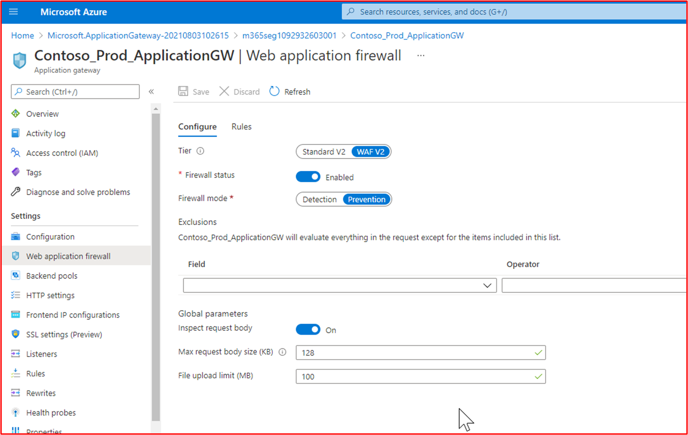

На приведенном ниже снимке экрана показана конфигурация интерфейсного IP-адреса

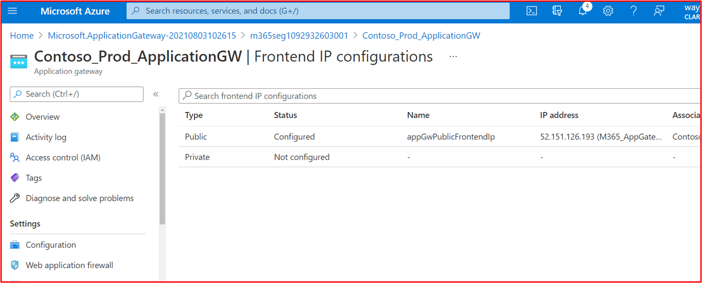

**Примечание:** Свидетельство должно демонстрировать все общедоступные IP-адреса, используемые средой для обеспечения того, чтобы все точки входящего трафика были охвачены, поэтому этот снимок экрана также включен.

На следующем снимке экрана показаны входящие веб-подключения, использующие этот WAF.

На следующем снимке экрана показано, что ContosoAppGWCoreRules\_\_ показывает, что это для api.contoso.com службы.

**Элемент управления No 27:** Предоставьте подтверждение того, что WAF поддерживает разгрузку SSL.

- Намерение. Возможность настройки WAF для поддержки разгрузки SSL важна, в противном случае WAF не сможет проверить трафик HTTPS. Так как эти среды должны поддерживать трафик HTTPS, это критически важная функция WAF, которая обеспечивает обнаружение и остановку вредоносных полезных данных в httpS-трафике.

- Пример рекомендаций по свидетельству. Предоставьте свидетельство конфигурации с помощью экспорта конфигурации или снимков экрана, на которых показано, что разгрузка SSL поддерживается и настраивается.

- Пример свидетельства. В Шлюз приложений Azure конфигурации разгрузки SSL прослушивателя SSL см. общие сведения о завершении TLS и сквозном [TLS](/azure/application-gateway/ssl-overview) с помощью Шлюз приложений документации Майкрософт. На следующем снимке экрана показан этот параметр, настроенный для рабочей Шлюз приложений Azure Contoso.

**Элемент управления No 28:** "Предоставьте демонстрацию свидетельства того, что WAF защищает от некоторых или всех следующих классов уязвимостей в соответствии с основным набором правил OWASP (3.0 или 3.1):
- проблемы с протоколом и кодированием,
- внедрение заголовков, отправка запросов и разделение ответов;
- атаки обхода файлов и путей;
- атаки с включением удаленных файлов (RFI);
- атаки удаленного выполнения кода,
- Атаки путем внедрения PHP,
- межсайтовых атак со скриптами,
- SQL атак путем внедрения кода,
- атаки по исправлению сеансов;

- Намерение. WaF необходимо настроить для идентификации полезных данных атаки для распространенных классов уязвимостей. Этот элемент управления предназначен для обеспечения достаточного обнаружения классов уязвимостей с помощью набора основных правил OWASP.

- Пример рекомендаций по свидетельству. Предоставьте свидетельство конфигурации с помощью экспорта конфигурации или снимки экрана демонстрируют, что большинство классов уязвимостей, определенных выше, охвачены сканированием.

- Пример свидетельства. На приведенном ниже снимке экрана показано, что политика WAF contoso Production Шлюз приложений Azure настроена для проверки на соответствие набору правил OWASP Core Версии 3.2.

### Элемент управления изменениями

Установленный и понятный процесс управления изменениями имеет важное значение для обеспечения того, чтобы все изменения проходит через структурированный процесс, который является повторяемым. Гарантируя, что все изменения будут проходить через структурированный процесс, организации могут обеспечить эффективное управление изменениями, проверку одноранговых элементов и надлежащее тестирование перед их отключением. Это не только помогает свести к минимуму риск сбоев системы, но и помогает свести к минимуму риск потенциальных инцидентов безопасности за счет внесения неправильных изменений.

**Элемент управления No 29:** Предоставьте документацию по политике, которая управляет процессами управления изменениями.

- Цель. Чтобы обеспечить безопасную среду и безопасное приложение, необходимо установить надежный процесс управления изменениями, чтобы обеспечить выполнение всех изменений инфраструктуры и кода с помощью строгого контроля и определенных процессов. Это гарантирует, что изменения задокументированы, учитываются последствия безопасности, что влияет на безопасность изменения и т. д. Цель состоит в том, чтобы задокументировать процесс управления изменениями, чтобы обеспечить безопасный и согласованный подход ко всем изменениям как в среде, так и в методиках разработки приложений.

- Примеры рекомендаций по свидетельствам. Задокументированные политики и процедуры управления изменениями должны совместно использоваться аналитиками сертификации.

- Пример свидетельства. Ниже показано начало примера политики управления изменениями. Укажите полные политики и процедуры в рамках оценки.

**Примечание:** На этом снимке экрана показан документ политики или процесса. Независимые поставщики программного обеспечения должны предоставить фактическую вспомогательную документацию по политике или процедуре, а не просто предоставить снимок экрана.

**Элемент управления No 30:** Предоставьте демонстрацию того, что среды разработки и тестирования обеспечивают разделение обязанностей с рабочей средой.

- Намерение. Большинство&#39;сред разработки и тестирования настроены не так, как рабочие среды, и поэтому менее безопасны. Кроме того, тестирование не должно выполняться в рабочей среде, так как это может привести к ошибкам безопасности или негативно сказаться на доставке услуг клиентам. Сохраняя отдельные среды, которые обеспечивают разделение обязанностей, организации могут обеспечить применение изменений к правильным средам, тем самым снижая риск ошибок путем реализации изменений в рабочих средах, когда они были предназначены для среды разработки и тестирования.

- Примеры рекомендаций по свидетельствам. Можно создать снимки экрана, демонстрирующие различные среды, используемые для сред разработки и тестирования, а также рабочих сред. Как правило, у вас будут разные люди или команды с доступом к каждой среде или если это невозможно, среды будут использовать разные службы авторизации, чтобы пользователи не могли по ошибке войти в неправильную среду для применения изменений.

- Пример свидетельства. На следующем снимке экрана показана подписка Azure для contoso&#39;среды TEST.

На следующем снимке экрана показана отдельная подписка Azure для contoso&#39;s &#39;PRODUCTION&#39; среде.

**Элемент управления No 31:** Предоставьте наглядное свидетельство того, что конфиденциальные рабочие данные не используются в средах разработки или тестирования.

- Намерение. Как уже говориллось выше, организации не будут реализовывать меры безопасности среды разработки и тестирования в той же реализации, что и рабочая среда. Таким образом, используя конфиденциальные рабочие данные в этих средах разработки и тестирования, вы увеличиваете риск компрометации и не должны использовать динамические или конфиденциальные данные в этих средах разработки и тестирования.

**Примечание:** Вы можете использовать динамические данные в средах разработки и тестирования, если разработка и тестирование включены в область оценки, чтобы можно было оценить безопасность по Microsoft 365 сертификации.

- Пример рекомендаций по свидетельству. Свидетельство можно предоставлять, используя снимки экрана выходных данных одного и того же SQL к рабочей базе данных (отладка любой конфиденциальной информации) и базе данных разработки и тестирования. Выходные данные тех же команд должны создавать разные наборы данных. Там, где хранятся файлы, при просмотре содержимого папок в обеих средах также должны отображаться различные наборы данных.

- Пример свидетельства: на следующем снимке экрана показаны первые 3 записи (для отправки свидетельства, укажите первые 20) из рабочей базы данных.

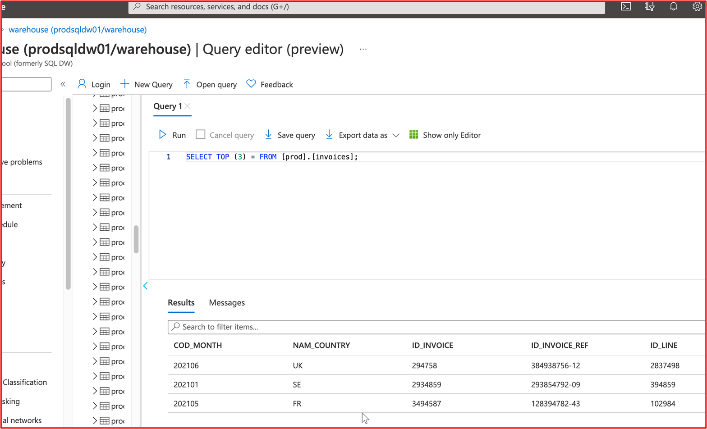

На следующем снимке экрана показан тот же запрос из базы данных разработки с разными записями.

Это показывает, что наборы данных отличаются.

**Элемент управления No 32:** Предоставьте демонстрацию свидетельства того, что задокументированные запросы на изменение содержат влияние изменений, сведения о процедурах резервного копирования и тестировании, которые необходимо выполнить.

- Намерение. Цель этого элемента управления — убедиться, что запрошенное изменение прошло. Необходимо учитывать и четко документировать влияние изменения на безопасность системы или среды. Все процедуры резервного копирования должны быть документированы, чтобы помочь в восстановлении, если что-то пошло не так, и наконец, необходимо продумать и задокументировать подробные сведения о тестировании, необходимые для проверки успешности изменения.

- Пример рекомендаций по свидетельству. Свидетельство можно предоставить, экспортив образец запросов на изменение, предоставив запросы на изменение документа или предоставив снимки экрана с запросами на изменение, на которых показаны эти три подробные сведения, хранящиеся в запросе на изменение.

- Пример свидетельства. На рисунке ниже показана новая уязвимость межсайтового скрипта (XSS) и документ для запроса на изменение.

В приведенных ниже билетах отображаются сведения, которые были заданы или добавлены в билет на пути к разрешению.

 

В двух приведенных ниже запросах показано влияние изменения на систему и любые процедуры резервного копирования, которые могут потребоваться в случае проблемы. Вы можете увидеть, как изменения и процедуры резервного копирования прошли процесс утверждения и были утверждены для тестирования.

В левой части экрана можно увидеть, что проверка изменений утверждена, а справа вы увидите, что изменения утверждены и протестированные.

В ходе процесса обратите внимание, что человек, выполняющий задание, человек, который сообщает о нем, и человек, утверждающий выполняемую работу, — это разные люди.

В приведенном выше запросе показано, что изменения утверждены для реализации в рабочей среде. В правом поле показано, что тест успешно выполнен и что изменения были реализованы в prod Environment.

**Элемент управления No 33:** Предоставьте демонстрацию свидетельства того, что запросы на изменение проходят процесс авторизации и выхода.

- Намерение. Необходимо реализовать процесс, который запрещает внесение изменений без надлежащей авторизации и отключения. Это изменение необходимо авторизовать перед реализацией, а после его завершения его необходимо отменить. Это гарантирует, что запросы на изменение были правильно просмотрена, а кто-то из сотрудников центра отключил это изменение.

- Пример рекомендаций по свидетельству. Свидетельство можно предоставить, экспортив образец запросов на изменение, предоставив запросы на изменение бумаги или предоставив снимки экрана с запросами на изменение, показывающими, что изменение авторизовано до реализации и что изменение было подписано после завершения.

- Пример свидетельства. На приведенном ниже снимке экрана показан пример билета Jira, показывающий, что изменение необходимо авторизовать перед реализацией и утверждением кем-то, кроме разработчика или запрашивателя. Вы увидите, что изменения здесь утверждены пользователем с полномочиями. Справа после завершения подписан DP.

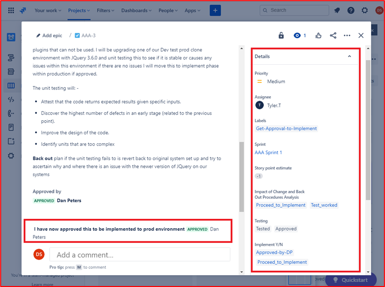

В приведенном ниже запросе вы увидите, что изменение было подписано после завершения и показывает, что задание завершено и закрыто.

### Безопасная разработка и развертывание программного обеспечения

Организации, участвующие в разработке программного обеспечения, часто сталкиваются с конкурирующими приоритетами между безопасностью и TTM (время выхода на рынок), однако реализация действий, связанных с безопасностью, на протяжении всего жизненного цикла разработки программного обеспечения (SDLC) может не только сэкономить деньги, но и сэкономить время. Если безопасность остается в качестве дополнительной, проблемы обычно определяются только на этапе тестирования (DSLC), что часто может быть более затратным и дорогостоящим решением. Цель этого раздела безопасности состоит в том, чтобы обеспечить безопасные методики разработки программного обеспечения, чтобы снизить риск возникновения ошибок в коде в разработанное программное обеспечение. Кроме того, в этом разделе приведены некоторые элементы управления, помогающие обеспечить безопасное развертывание программного обеспечения.

**Элемент управления No 34:** Предоставьте политики и процедуры, которые поддерживают безопасную разработку и развертывание программного обеспечения, включая рекомендации по безопасному написанию кода для распространенных классов уязвимостей, таких как OWASP Top 10 или SANS Top 25 CWE.

- Намерение. Организациям необходимо сделать все, что в их возможности, чтобы обеспечить безопасную разработку программного обеспечения и защиту от уязвимостей. Чтобы добиться этого, необходимо установить надежный жизненный цикл разработки безопасного программного обеспечения (SDLC) и рекомендации по безопасному написанию кода для продвижения методов безопасного кодирования и безопасной разработки на протяжении всего процесса разработки программного обеспечения. Цель состоит в том, чтобы уменьшить количество и серьезность уязвимостей в программном обеспечении.

- Примеры рекомендаций по свидетельствам. Предоставьте документированную документацию по SDLC и (или) поддержке, которая показывает, что используется безопасный жизненный цикл разработки и что всем разработчикам предоставляются рекомендации по обеспечению безопасного кодирования. Ознакомьтесь с [OWASP в SDLC](https://owasp.org/www-project-integration-standards/writeups/owasp_in_sdlc/) и моделью [зрелости OWASP Software Assurance](https://owaspsamm.org/model/) (SAMM).

- Пример свидетельства. Ниже приведено извлечение из contoso&#39;s Secure Software Development Procedure, в котором демонстрируются методики безопасной разработки и написания кода.

**Примечание:** На этих снимках экрана показан документ по безопасной разработке программного обеспечения. Независимые поставщики программного обеспечения должны предоставить фактическую вспомогательную документацию, а не просто предоставить снимок экрана.

**Элемент управления No 35:** Предоставьте наглядное свидетельство того, что изменения кода проходят проверку и авторизацию вторым рецензентом.

- Намерение. Цель этого элемента управления — выполнить проверку кода другим разработчиком, чтобы выявить ошибки в коде, которые могут привести к уязвимости в программном обеспечении. Необходимо установить авторизацию, чтобы обеспечить выполнение проверок кода, выполнение тестирования и т. д. до развертывания. Шаг авторизации может проверить, выполнены ли правильные процессы, которые лежат в основе SDLC, определенного выше.

- Пример рекомендаций по свидетельству. Предоставьте свидетельство того, что код проходит проверку однорангового узла и должен быть авторизован, прежде чем его можно будет применить к рабочей среде. Это свидетельство может быть через экспорт запросов на изменение, демонстрирующий, что проверки кода были выполнены и изменения авторизованны, или это может быть через программное обеспечение проверки кода, например Crucible ([https://www.atlassian.com/software/crucible](https://www.atlassian.com/software/crucible)).

- Пример свидетельства

Ниже приведен запрос, показывающий, что изменения кода проходят проверку и авторизацию кем-то, кроме исходного разработчика. Он показывает, что получатель запросит проверку кода и будет назначен другому пользователю для проверки кода.

На рисунке ниже показано, что проверка кода была назначена пользователю, отличному от исходного разработчика, как показано в выделенном разделе в правой части изображения ниже. Слева можно увидеть, что код был просмотрет и &#39;состояние проверки переданного кода&#39; рецензентом кода.

Теперь запрос должен быть одобрен руководителем, прежде чем изменения могут быть внесены в рабочие системы.

 На рисунке выше показано, что проверяемого кода было предоставлено утверждение для реализации в динамических рабочих системах.

 После внесения изменений в код окончательное задание отключается, как показано на рисунке выше.

Обратите внимание, что в процессе участвуют три человека: исходный разработчик кода, рецензент кода и руководитель для утверждения и выхода. Чтобы соответствовать критериям для этого элемента управления, вы ожидаете, что ваши билеты будут следовать этому процессу. Не менее трех человек, участвующих в процессе управления изменениями для проверки кода.

**Элемент управления No 36:** Предоставьте наглядное свидетельство того, что разработчики проходят ежегодное обучение безопасной разработке программного обеспечения.

- Намерение. Существуют рекомендации и методы программирования для всех языков программирования, чтобы обеспечить безопасную разработку кода. Существуют внешние учебные курсы, предназначенные для обучения разработчиков различным типам классов уязвимостей программного обеспечения и методам программирования, которые можно использовать для остановки внедрения этих уязвимостей в программное обеспечение. Цель этого элемента управления — обучить эти методы всем разработчикам и убедиться, что эти методы не забудется или новые методы будут изучаться на ежегодной основе.

- Пример рекомендаций по свидетельству. Предоставьте свидетельство с помощью сертификатов, если они выполняются внешней учебной компанией, или путем предоставления снимков экрана с обучающими diaries или другими артефактами, которые демонстрируют, что разработчики участвовали в обучении. Если это обучение выполняется через внутренние ресурсы, предоставьте также свидетельство обучающего материала.

- Пример свидетельства. Ниже приведено сообщение электронной почты с запросом на регистрацию сотрудников DevOps в OWASP Top Ten Training Annual Training

Ниже показано, что обучение было запрошено с бизнес-обоснованием и утверждением. За ним следуют снимки экрана, созданные на основе обучения, и запись о завершении, показывающая, что пользователь завершил ежегодное обучение.

**Элемент управления No 37:** Предоставьте наглядное свидетельство того, что репозитории кода защищены с помощью многофакторной проверки подлинности (MFA).

- Намерение. Если субъект угроз может получить доступ к базе кода&#39;программного обеспечения и изменить его, он может внести уязвимости, внутренние серверы или вредоносный код в базу кода и, следовательно, в приложение. Уже было несколько таких экземпляров, и, вероятно, наиболее общедоступной является атака программы-шантажиста NotPetya, которая, как сообщается, была заражена скомпрометированным обновлением налогового программного обеспечения для M.E.Doc (см. раздел "Что такое [NotPetya](https://www.itpro.co.uk/malware/34381/what-is-notpetya)").

- Пример рекомендаций по свидетельству. Предоставьте свидетельство с помощью снимков экрана из репозитория кода, на которых включена многофакторная проверка подлинности для всех пользователей.

- Пример свидетельства. На следующем снимке экрана показано, что многофакторная проверка подлинности включена для всех 8 пользователей GitLab.

**Элемент управления No 38:** Предоставьте демонстрацию свидетельства того, что для защиты репозиториев кода используются элементы управления доступом.

- Намерение. В начале предыдущего элемента управления необходимо реализовать элементы управления доступом, чтобы ограничить доступ только отдельными пользователями, работающими над определенными проектами. Ограничив доступ, вы ограничиваете риск несанкционированных изменений и тем самым вводите небезопасные изменения кода. Для защиты репозитория кода следует использовать наименее привилегированный подход.

- Пример рекомендаций по свидетельству. Предоставьте свидетельство с помощью снимков экрана из репозитория кода, доступ к которым предоставляется только нужным пользователям, включая различные привилегии.

- Пример свидетельства. На следующем снимке экрана показаны участники &quot;проекта Customers&quot; в GitLab, который является клиентского портала Contoso&quot;&quot;. Как видно на снимке экрана, пользователи имеют разные &quot;&quot; роли для ограничения доступа к проекту.

### Управление учетными записями

Методы безопасного управления учетными записями важны, так как учетные записи пользователей формируют основу для разрешения доступа к информационным системам, системным средам и данным. Учетные записи пользователей должны быть надлежащим образом защищены как компрометация учетных данных пользователя&#39;может не только закрепиться в среде и доступе к конфиденциальным данным, но и обеспечить административный контроль над всей средой или ключевыми системами, если&#39;учетные данные пользователя имеют права администратора.

**Элемент управления No 39:** Предоставьте документацию по политике, которая управляет методиками и процедурами управления учетными записями.

- Намерение. Учетные записи пользователей по-прежнему нацелены на субъекты угроз и часто являются источником компрометации данных. Настроив учетные записи с превышением разрешений, организации не только увеличивают пул привилегированных учетных записей &#39;&#39;, которые могут использоваться субъектом угроз для нарушения безопасности данных, но и могут повысить риск успешной эксплуатации уязвимости, для которой требуются определенные привилегии.

-  BeyondTrust &quot;&quot; создает отчет об уязвимостях Майкрософт каждый год, который анализирует уязвимости системы безопасности Майкрософт за предыдущий год и отображает проценты этих уязвимостей, которые зависят от учетной записи пользователя с правами администратора. &quot; В недавней записи блога new [Microsoft Vulnerabilities Report (Новый отчет об уязвимостях Майкрософт) выявит увеличение уязвимостей на 48 &amp;](https://www.beyondtrust.com/blog/entry/microsoft-vulnerabilities-report)&quot;% г. По мере их устранения с минимальными привилегиями, 90 % критических уязвимостей в Internet Explorer, 85 % критических уязвимостей в Microsoft Edge и 100 % критических уязвимостей в Microsoft Outlook были бы устранены путем удаления прав администратора. Чтобы обеспечить безопасное управление учетными записями, организациям необходимо обеспечить поддержку политик и процедур, которые обеспечивают рекомендации по обеспечению безопасности и применяются для устранения этих угроз.

- Примеры рекомендаций по свидетельству. Предоставьте документированные политики и процедуры, охватывающие методы управления учетными записями. Как минимум, рассматриваемые темы должны соответствовать элементам управления в Microsoft 365 сертификации.

- Пример свидетельства: на следующем снимке экрана показан пример политики управления учетными записями для Contoso.

**Примечание:** На этом снимке экрана показан документ политики или процесса. Независимые поставщики программного обеспечения должны предоставить фактическую вспомогательную документацию по политике или процедуре, а не просто предоставить снимок экрана.

**Элемент управления No. 40:** Предоставьте наглядное свидетельство того, что учетные данные по умолчанию либо отключены, удалены, либо изменены в компонентах системы с выборки.

- Намерение. Несмотря на то, что это становится все менее популярным, существуют все же экземпляры, в которых субъекты угроз могут использовать учетные данные пользователя по умолчанию и хорошо задокументированные учетные данные для компрометации компонентов рабочей системы. Популярным примером этого является Dell iDRAC (интегрированный контроллер удаленного доступа Dell). Эту систему можно использовать для удаленного управления сервером Dell Server, который может использоваться субъектом угроз для получения контроля над серверной&#39;операционной системой. Учетные данные по умолчанию root::calvin задокументированы и часто могут использоваться субъектами угроз для получения доступа к системам, используемым организациями. Цель этого элемента управления — убедиться, что эти учетные данные по умолчанию отключены или удалены.

- Примеры рекомендаций по свидетельству. Существует несколько способов сбора свидетельства для поддержки этого элемента управления. Снимки экрана настроенных пользователей во всех системных компонентах могут помочь, например снимки экрана файлов Linux /etc/shadow и /etc/passwd, чтобы продемонстрировать, отключены ли учетные записи. Обратите внимание, что файл /etc/shadow потребуется для демонстрации того, что учетные записи действительно отключены, отслеживая, что хэш пароля начинается с недопустимого символа, например &#39;!&#39;, указывающего, что пароль непригоден для использования. Советом является отключение только нескольких символов пароля и исправление остальных символов. Другими вариантами могут быть сеансы с демонстрацией экрана, в которых оценоктору удалось вручную опробовать учетные данные по умолчанию. Например, в приведенном выше обсуждении dell iDRAC оценатору необходимо попытаться выполнить проверку подлинности для всех интерфейсов Dell iDRAC с использованием учетных данных по умолчанию.

- Пример свидетельства. На следующем снимке &quot;экрана показаны учетные записи пользователей, настроенные для системного компонента в области ДЕЙСТВИЯ ИНСТРУКЦИИ ПО ИТ-SBU-WM&quot;. Отображаются несколько учетных записей по умолчанию. Администратор, DefaultAccount и гость, однако на следующих снимках экрана показано, что эти учетные записи отключены.

На следующем снимке экрана показано &quot;, что учетная запись администратора отключена в системном компоненте ВЛАДЕКА-SBU-WM&quot;.

На следующем снимке экрана показано &quot;, что гостевая учетная запись отключена в системном компоненте в области ДЕЙСТВИЯ ФУНКЦИИ ВЛАДЕКА-СБУ-WM&quot;.

На следующем снимке экрана показано, что defaultAccount &quot;отключена в системном компоненте в области ДОСТУПА КВМ .NET-SBU-WM&quot;.

**Элемент управления No. 41:** Предоставьте демонстрационное свидетельство того, что создание, изменение и удаление учетной записи проходит через установленный процесс утверждения.

- Намерение. Цель состоит в том, чтобы установить процесс, обеспечивающий утверждение всех действий по управлению учетными записями, гарантируя соблюдение принципов минимальных привилегий и правильность проверки и отслеживания действий по управлению учетными записями.

- Пример рекомендаций по свидетельству. Свидетельство обычно имеет вид запросов на изменение, запросы ITSM (управление ИТ-службами) или документы, показывающие, что запросы на создание, изменение или удаление учетных записей прошли процесс утверждения.

- Пример свидетельства. На приведенных ниже изображениях показано создание учетной записи для новой команды разработчиков DevOps, которая должна иметь параметр RBAC на основе разрешений рабочей среды без доступа к среде разработки и стандартного непривилегированных доступа ко всему остальному.

Создание учетной записи прошло через процесс утверждения и выход из системы после создания учетной записи и закрытия запроса.

**Элемент управления No. 42:** Предоставьте демонстрацию того, что выполняется процесс отключения или удаления учетных записей, не используемых в течение 3 месяцев.

- Намерение. Неактивные учетные записи иногда могут быть скомпрометированными либо потому, что они нацелены на атаки методом подбора, которые могут не помечаться, так как пользователь не будет пытаться войти в учетные записи, либо путем нарушения безопасности базы данных паролей, когда пароль пользователя&#39;был повторно использоваться и доступен в дампе имени пользователя или пароля в Интернете. Неиспользуемые учетные записи должны быть отключены или удалены для уменьшения уязвимой зоны, в которой субъект угроз должен выполнять действия по компрометации учетных записей. Эти учетные записи могут быть вызваны тем, что процесс отпусков не выполняется должным образом, сотрудник, выполняющий длительные сроки, или сотрудник, который в настоящее время не может выйти из семьи или в отпуск. Внедрив ежеквартально процесс идентификации этих учетных записей, организации могут свести к минимуму область атак.

- Пример рекомендаций по свидетельству. Свидетельство должно быть двухфакторным. Во-первых, снимок экрана или экспорт файла &quot;&quot; с последним входом всех учетных записей пользователей в среде в области действия. Это могут быть локальные учетные записи, а также учетные записи в централизованной службе каталогов, например AAD (Azure Active Directory). Это позволит продемонстрировать, что учетные записи старше 3 месяцев не включены. Во-вторую, свидетельство процесса ежеквартальной проверки, которое может быть свидетельством того, что задача выполняется в билетах ADO (Azure DevOps) или JIRA, или с помощью записей бумаги, которые должны быть подписаны.

- Пример свидетельства. На первом снимке экрана показаны выходные данные скрипта, который выполняется ежеквартально для просмотра последнего атрибута входа для пользователей в AAD.

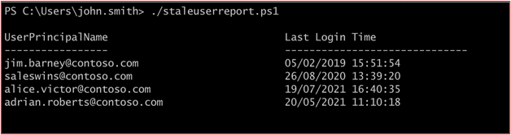

Как видно на приведенном выше снимке экрана, два пользователя показано, что они не вошли в систему в течение некоторого времени. На следующих двух снимках экрана показано, что эти два пользователя отключены.

**Элемент управления No. 43:** Предоставьте наглядное свидетельство о том, что применяется политика надежных паролей или другие подходящие меры для защиты учетных данных пользователя.  Ниже приведены минимальные рекомендации.
- Минимальная длина пароля 8 символов
- Пороговое значение блокировки учетной записи не более 10 попыток
- Журнал паролей не менее 5 паролей
- Принудительное применение надежного пароля

- Намерение. Как уже говориллось, учетные данные пользователя часто являются целью атаки субъектов угроз, пытаемых получить доступ к организации&#39;среде. Цель политики надежных паролей — попытаться заставить пользователей выбрать надежные пароли, чтобы снизить вероятность того, что субъекты угроз смогут применить их методом подбора. Цель добавления &quot;&quot; &quot; или других подходящих средств устранения рисков — распознать, что организации могут реализовать другие меры безопасности для защиты учетных данных пользователей на основе отраслевых проектов, таких как специальная публикация [NIST 800–63B](https://pages.nist.gov/800-63-3/sp800-63b.html)&quot;.

- Пример рекомендаций по свидетельству. Свидетельство для демонстрации политики надежных паролей может быть в виде снимка экрана организации групповая политика Object или Local Security Policy &quot;Account Policies à Password Policy&quot; and &quot;Account Policies à Account Lockout Policy&quot; settings. Свидетельство зависит от используемых технологий. Например, для Linux это может быть файл конфигурации /etc/pam.d/common-password, для BitBucket &quot;&quot; раздел "Политики проверки подлинности" на портале администрирования () и[https://support.atlassian.com/security-and-access-policies/docs/manage-your-password-policy/](https://support.atlassian.com/security-and-access-policies/docs/manage-your-password-policy/) т. д.

- Пример свидетельства. В &quot;&quot; &quot;приведенном ниже свидетельстве показана политика паролей, настроенная в локальной политике безопасности системного компонента ВМ-ИНСТРУКЦИЯ-SBU-WM&quot; в области действия.

На снимке экрана ниже показаны параметры блокировки учетной записи для брандмауэра WatchGuard.

Ниже приведен пример минимальной длины парольной фразы для брандмауэра WatchGaurd.

**Элемент управления No. 44:** Предоставьте наглядное свидетельство того, что уникальные учетные записи пользователей выданы всем пользователям.

- Намерение. Цель этого элемента управления — подотчетность. Выдав пользователям собственные уникальные учетные записи пользователей, пользователи будут выполнять действия, так как их действия можно отслеживать отдельному пользователю.

- Пример рекомендаций по свидетельству. Свидетельством могут быть снимки экрана, показывающие настроенные учетные записи пользователей в компонентах системы в области действия, которые могут включать серверы, репозитории кода, облачные платформы управления, Active Directory, брандмауэры и т. д.

- Пример свидетельства. На следующем снимке &quot;экрана показаны учетные записи пользователей, настроенные для системного компонента в области ДЕЙСТВИЯ ИНСТРУКЦИИ ПО ИТ-SBU-WM&quot;.

На следующем снимке экрана показано &quot;, что учетная запись администратора отключена в системном компоненте ВЛАДЕКА-SBU-WM&quot;.

На следующем снимке экрана показано &quot;, что гостевая учетная запись отключена в системном компоненте в области ДЕЙСТВИЯ ФУНКЦИИ ВЛАДЕКА-СБУ-WM&quot;.

На следующем снимке экрана показано, что defaultAccount &quot;отключена в системном компоненте в области ДОСТУПА КВМ .NET-SBU-WM&quot;.

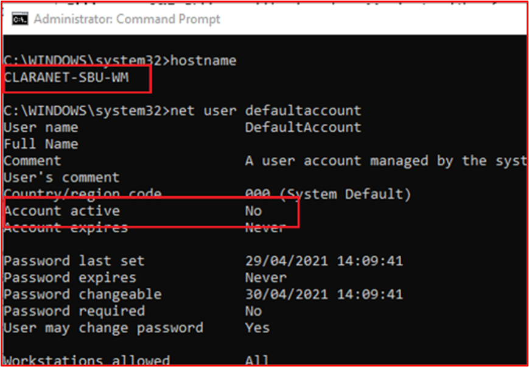

**Элемент управления No 45:** Предоставьте наглядное свидетельство того, что в среде применяются принципы наименьших привилегий.

- Намерение: пользователям должны быть предоставлены только привилегии, необходимые для выполнения их функции задания. Это необходимо для того, чтобы ограничить риск намеренного или непреднамеренного доступа к данным, которые ему&#39;или выполнению вредоносного действия. Следуя этому принципу, он также сокращает потенциальную поверхность атаки (например, привилегированные учетные записи), на которую может нацелить злоумышленник.

- Примеры рекомендаций по свидетельствам. Большинство организаций будут использовать группы для назначения привилегий на основе команд в организации. Свидетельством могут быть снимки экрана с различными привилегированными группами и только учетными записями пользователей из команд, для которых требуются эти привилегии. Обычно резервное копирование выполняется с помощью вспомогательных политик или процессов, определяющих каждую определенную группу с необходимыми привилегиями и бизнес-обоснованием, а также иерархией членов команды для проверки правильности настройки членства в группе.

- Например, в Azure группа владельцев должна быть очень ограниченной, поэтому она должна быть задокументирована и должна иметь ограниченное количество людей, назначенных этой группе. Другим примером может быть ограниченное число сотрудников с возможностью внесения изменений в код. Группа может быть настроена с этой привилегией с сотрудниками, которые считаются необходимыми для настройки этого разрешения. Это необходимо задокументировать, чтобы аналитик сертификации может перекрестно ссылаться на документ с настроенными группами и т. д.

- Пример свидетельства. На следующем снимке экрана показано, что среда настроена с группами, назначаемые в соответствии с функцией задания.

На следующем снимке экрана показано, что пользователи выделяются группам на основе их функции задания.

**Элемент управления No. 46:** Предоставьте наглядное свидетельство о том, что процесс выполняется для защиты или защиты учетных записей служб, и процесс выполняется.

- Намерение. Учетные записи служб часто будут нацелены на субъекты угроз, так как они часто настроены с повышенными привилегиями. Эти учетные записи могут не соответствовать стандартным политикам паролей, так как срок действия паролей учетной записи службы часто нарушает функциональные возможности. Таким образом, они могут быть настроены с помощью слабых паролей или паролей, которые повторно используются в организации. Еще одна потенциальная проблема, особенно в Windows среде, может быть в том, что операционная система кэширует хэш пароля. Это может быть большой проблемой в том случае, если учетная запись службы настроена в службе каталогов, так как эта учетная запись может использоваться для доступа в нескольких системах с настроенным уровнем привилегий или учетная запись службы является локальной. Вероятность того, что в нескольких системах в среде будет использоваться та же учетная запись или пароль. Описанные выше проблемы могут привести к том, что субъект угрозы получает доступ к дополнительным системам в среде и может повысить привилегии и (или) боковое смещение. Таким образом, цель состоит в том, чтобы обеспечить надлежащую защиту учетных записей служб, чтобы защитить их от перенаправления субъектом угроз, или путем ограничения риска в случае компрометации одной из этих учетных записей службы.

- Примеры рекомендаций по свидетельствам. В Интернете существует множество руководств по усилению защиты учетных записей служб. Свидетельство может быть в виде снимков экрана, демонстрирующих, как организация реализовала безопасную защиту учетной записи. Ниже приведено несколько примеров (ожидается, что будет использоваться несколько методов).
- Ограничение учетных записей набором компьютеров в Active Directory
- Настройка учетной записи таким образом, чтобы&#39;вход запрещен,
- Установка очень сложного пароля
- Для Active Directory включите учетную запись &quot;с учетной записью с учетной записью, которая не может быть делегирована флагом&quot; . Эти методы рассматриваются в &quot; следующей статье: сегментация и [общая служба Active Directory для среды данных владельцев карт](https://pciramblings.com/2019/12/13/segmentation-and-shared-active-directory-of-a-cardholder-data-environment/)&quot;.

- Пример свидетельства. Существует несколько способов усиления защиты учетной записи службы, которая будет зависеть от каждой отдельной среды. Механизмы, подходящие для вашей среды, которые используются, задокументированы в документе о политике или процедуре управления учетными записями, который поможет просмотреть это свидетельство. Ниже приведены некоторые из механизмов, которые могут быть использованы.

На следующем снимке экрана показано, &#39;&quot;\_учетная запись является конфиденциальной и делегирована&#39; в учетной записи службы Prod SQL Service Account&quot;.

На следующем снимке &quot;\_экрана показано, что учетная запись службы Prod SQL учетная&quot; запись службы заблокирована в SQL Server и может выполнять вход только на этот сервер.

На следующем снимке экрана показано&quot;\_, что учетная запись службы Prod SQL учетной&quot; записи службы разрешена только для входа в качестве службы.

**Элемент управления No 47:** Предоставьте наглядное свидетельство о том, что MFA настроена для всех подключений удаленного доступа и всех административных интерфейсов, не вложенных в консоль.

Термины, определенные как:
- **Удаленный** доступ — обычно это относится к технологиям, используемым для доступа к вспомогательной среде. Например, VPN IPSec удаленного доступа, SSL VPN или Jumpbox/Bastian Host.
- **Неконсолятивные** административные интерфейсы — обычно это относится к сетевым административным подключениям к системным компонентам. Это может быть удаленный рабочий стол, SSH или веб-интерфейс.

- Намерение. Цель этого элемента управления состоит в том, чтобы обеспечить меры по устранению рисков принудительным подбором привилегированных учетных записей и учетных записей с безопасным доступом к среде. Предоставляя многофакторную проверку подлинности (MFA), скомпрометированный пароль по-прежнему должен быть защищен от успешного входа, так как механизм MFA по-прежнему должен быть защищен. Это гарантирует, что все действия по доступу и администрированию выполняются только авторизованными и доверенными сотрудниками.

- Пример рекомендаций по свидетельству. Свидетельство должно показывать, что многофакторная проверка подлинности включена для всех технологий, которые соответствуют указанным выше категориям. Это может быть снимок экрана, показывающий, что многофакторная проверка подлинности включена на уровне системы. По системному уровню нам требуется свидетельство того, что он включен для всех пользователей, а не только пример учетной записи с включенной многофакторной проверкой подлинности. Если технология резервирована в решении MFA, нам нужны свидетельства, чтобы продемонстрировать, что она включена и используется. Это означает следующее: Если технология настроена для проверки подлинности Radius, которая указывает на поставщика MFA, необходимо также убедиться, что radius Server, на который он указывает, является решением MFA и что учетные записи настроены для его использования.

- Пример свидетельства 1. На следующих снимках экрана показаны области проверки подлинности, настроенные в Pulse Secure, которые используются для удаленного доступа в среду. Проверка подлинности отключается службой SaaS Duo для поддержки MFA.

На этом снимке &quot;экрана показано, что включен дополнительный сервер проверки подлинности, указывающий на Duo-LDAP&quot; для области проверки подлинности &#39;Duo — маршрут&#39; по умолчанию.

На последнем снимке экрана показана конфигурация сервера проверки подлинности Duo-LDAP, которая показывает, что это указывает на службу SaaS Duo для MFA.

Пример свидетельства 2. На следующих снимках экрана показано, что для всех пользователей Azure включена многофакторная проверка подлинности.

**Примечание:** Вам потребуется предоставить свидетельство для всех подключений, не подключенных к консоли, чтобы продемонстрировать, что для них включена многофакторная проверка подлинности. Например, если вы подключены по протоколу RDP или SSH к серверам или другим системным компонентам (например, брандмауэрам).

**Элемент управления No 48:** Предоставьте демонстрацию того, что надежное шифрование настроено для всех подключений удаленного доступа и всех неконсолейных административных интерфейсов, включая доступ к любым репозиториям кода и интерфейсам управления облаком.

Термины, определенные как:
- **Репозитории** кода — база кода приложения должна быть защищена от вредоносных изменений, которые могут привести к вредоносным программам в приложении. MFA необходимо настроить в репозитории кода.
- **Интерфейсы управления облачными** клиентами — где некоторые или все среды размещены в поставщике облачных служб (CSP), здесь содержится административный интерфейс для управления облаком.

- Намерение. Цель этого элемента управления — обеспечить надежную шифрование всего административного трафика для защиты от атак типа "злоумышленник в середине".

- Пример рекомендаций по свидетельству. Свидетельство может быть предоставлено снимками экрана с параметрами шифрования для технологий удаленного доступа, RDP, SSH и интерфейсов веб-администратора. Для интерфейсов веб-администратора можно использовать сканер Qualys SSL Labs (если он является общедоступным, то есть интерфейсы управления облаком, репозитории кода SaaS или VPN-подключения SSL).

- Пример свидетельства. В приведенном ниже свидетельстве показан уровень шифрования RDP &quot;в Webserver01&quot; , настроенный с &#39;высокого уровня&quot;. Как показано в тексте справки, для этого используется строгое 128-разрядное шифрование (что является наивысшим уровнем для microsoft Windows RDP.

В приведенном ниже свидетельстве также показано, что для безопасности транспорта RDP настроено использование TLS 1.0 &quot;в Webserver01&quot; (самый высокий уровень для Windows Server).

**Элемент управления No. 49:** Предоставьте наглядное свидетельство того, что MFA используется для защиты портала администрирования, который используется для управления всеми записями службы DNS и управления ими.

- Намерение. Если злоумышленник может получить доступ к общедоступным записям DNS, существует риск того, что он сможет изменить URL-адреса, используемые приложением, или если файл манифеста указывает на введение вредоносного кода или на перенаправление пользовательского трафика в конечную точку под управлением субъектов. Это может привести к потере данных пользователя или заражению вредоносных программ или программ-шантажистов в пользовательской базе приложения.

- Пример рекомендаций по свидетельству. Предоставьте свидетельство, которое демонстрирует, что общедоступные порталы администрирования DNS защищены MFA. Даже если общедоступная служба DNS размещается на серверах в среде в области действия (т. е. управления и управления организацией), может по-прежнему быть портал администрирования, где было зарегистрировано доменное имя, а записи DNS &#39;Управляемые&#39;, чтобы указать DNS-серверы для собственной инфраструктуры. В этом случае MFA следует включить в административном интерфейсе регистратора доменов, если записи DNS доменов можно изменить. Должен появиться снимок экрана, показывающий, что административный интерфейс включен для MFA на уровне системы (то есть всех привилегированных учетных записей).

- Пример свидетельства. На следующем снимке экрана показано, contoso.com DNS управляется в Microsoft Azure корпорации Contoso.

**Примечание:** IP-адреса являются частными адресами RFC 1918 и не являются общедоступными. Это предназначено только для демонстрации.

На следующих снимках экрана показано, что для всех пользователей Azure включена многофакторная проверка подлинности.

### Обнаружение и предотвращение вторжений (необязательно)

Системы обнаружения и предотвращения вторжений (IDPS) на шлюзе могут обеспечить дополнительный уровень защиты от множества интернет-угроз и внутренних угроз. Эти системы помогают предотвратить успешное выполнение этих угроз и могут предоставлять важные возможности оповещений для оповещения организаций о попытках взлома, позволяющих организациям реализовать дополнительные защитные стратегии для дальнейшей защиты среды от этих активных угроз.

**Этот раздел предназначен для дополнительного кредита и поэтому является необязательным. Это не является требованием, но если вы завершите оценку, вы увидите более полное представление о вашей среде, а также об элементах управления и стандартах, которые вы настроите.**

**Элемент управления No 50:** Предоставьте демонстрационное свидетельство того, что системы обнаружения и предотвращения вторжений (IDPS) развернуты на периметре сред в области действия.

- Намерение. Хотя некоторые источники описывают внутренние угрозы как превышающее угрозы внешних субъектов угроз, внутренние угрозы также включают в себя неосторожность, а человеческие ошибки увеличиваются в процентах в год. Цель установки IDPS на периметре сред в области действия состоит в том, что внешние угрозы часто можно обнаружить с помощью механизмов IDPS из-за характера и методов, используемых этими типами угроз.

- Пример рекомендаций по свидетельству. Необходимо указать свидетельство, которое показывает, что IDPS установлен по периметру. Это может быть непосредственно в брандмауэре при запуске брандмауэра NextGen или датчики IDPS развертывания, настроенные на портах зеркального коммутатора, чтобы убедиться, что развернутые датчики видят весь трафик. Если используются датчики IDPS, может потребоваться предоставить дополнительные свидетельства, чтобы продемонстрировать, что датчики могут видеть все потоки внешнего трафика.

- Пример свидетельства. На приведенном ниже снимке экрана показано, что функция IDPS включена в брандмауэре WatchGuard.

На следующем снимке экрана показано, что IDPS включен во всех правилах в брандмауэре WatchGuard&#39;конфигурации.

**Элемент управления No 51:** Предоставьте наглядное свидетельство того, что подписи IDPS хранятся в текущем виде (в течение 24 часов).

- Намерение. Существует несколько режимов работы для IDPS. Чаще всего подписи используются для идентификации трафика атаки. По мере развития атак и обнаружения новых уязвимостей важно, чтобы подписи IDPS были актуальны для обеспечения достаточной защиты. Цель этого элемента управления — обеспечить обслуживание IDPS.

- Пример рекомендаций по свидетельству. Скорее всего, свидетельство будет отображаться на снимке экрана, на котором показано, что IDPS настроен на обновление подписей по крайней мере ежедневно и показывает последнее обновление.

- Пример свидетельства. Хотя на этом снимке экрана&#39;не показано, что подписи IDPS были обновлены за последние 24 часа, он показывает, что установлена последняя версия, которая была создана неделю _назад (свидетельство_, собранное 18__th _мая_). В сочетании с приведенным ниже снимком экрана показано, что подписи будут актуальны в течение 24-часового периода.

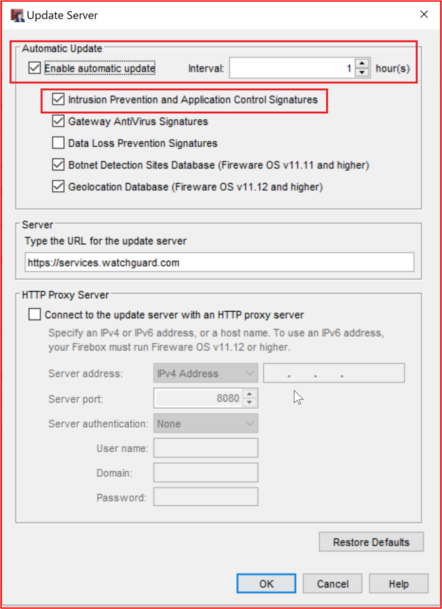

**Элемент управления No 52:** Предоставьте демонстрацию подтверждения того, что IDPS настроен для поддержки проверки TLS всего входящего веб-трафика.

- Намерение. Так как IDPS использует сигнатуры, он должен иметь возможность проверять все потоки трафика, чтобы определить трафик атаки. Трафик TLS шифруется, поэтому IDPS не сможет правильно проверить трафик. Это крайне важно для трафика HTTPS, так как существует множество угроз, которые являются общими для веб-служб. Цель этого элемента управления — убедиться, что зашифрованные потоки трафика также могут проверяться для IDPS.

- Пример рекомендаций по свидетельству. Свидетельство должно быть предоставлено с помощью снимков экрана, демонстрирующих, что зашифрованный трафик TLS также проверяется решением IDPS.

- Пример свидетельства: на этом снимке экрана показаны правила HTTPS в брандмауэре

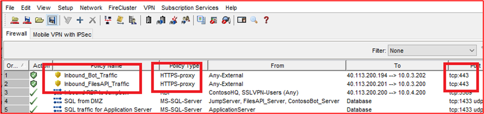

На следующем снимке экрана показано, что для этих правил включен протокол IDPS.

На следующем снимке экрана &quot;&quot; показано, как действие прокси-сервера применяется к правилу &#39;InboundBotTraffic\_\_&#39;, которое используется для включения проверки содержимого.

На следующем снимке экрана показано, что проверка содержимого включена.

**Элемент управления No 53:** Предоставьте наглядное свидетельство о том, что IDPS настроен для мониторинга всех потоков входящего трафика.

- Намерение. Как уже говориллось, важно, чтобы все входящие потоки трафика отслеживались службами IDPS для определения любой формы трафика атаки.

- Пример рекомендаций по свидетельству. Необходимо получить свидетельство с помощью снимков экрана, чтобы продемонстрировать, что отслеживаются все потоки входящего трафика. Это может быть брандмауэр NextGen, показывающий, что все правила входящего трафика включены для IDPS, или с помощью датчиков IDPS и демонстрации того, что весь трафик настроен для доступа к датчику IDPS.

- Пример свидетельства. На этом снимке экрана показано, что протокол IDPS настроен для всех правил (политик&#39;брандмауэра WatchGuard.

**Элемент управления No 54:** Предоставьте наглядное свидетельство того, что IDPS настроен для мониторинга всех потоков исходящего трафика.

- Намерение. Как уже говориллось, важно, чтобы все исходящие потоки трафика отслеживались службами IDPS, чтобы определить любую форму трафика атаки. Некоторые системы IDPS также могут выявлять потенциальные внутренние нарушения путем мониторинга всего исходящего трафика. Это можно сделать, определив трафик, предназначенный для &#39;и управления&#39; конечных точек.

- Пример рекомендаций по свидетельству. Необходимо получить свидетельство с помощью снимков экрана, чтобы продемонстрировать, что отслеживаются все потоки исходящего трафика. Это может быть брандмауэр NextGen, показывающий, что все правила исходящего трафика включены для IDPS, или с помощью датчиков IDPS и демонстрации того, что весь трафик настроен для доступа к датчику IDPS.

- Пример свидетельства. На этом снимке экрана показано, что протокол IDPS настроен для всех правил (политик&#39;брандмауэра WatchGuard.

- Пример свидетельства 2. Azure предлагает IDPS через сторонние приложения. В приведенном ниже примере запись пакетов Netwatcher используется для записи пакетов и используется вместе с Suricata, Open-Source IDS.

Объединяя сбор пакетов, предоставляемых Наблюдатель за сетями и средствами IDS с открытым кодом, такими как Suricata, вы можете выполнять обнаружение сетевых вторжений для широкого спектра угроз. На рисунке ниже показан интерфейс Suricata.

Сигнатуры используются для активации оповещений, которые можно легко установить и обновить. На рисунке ниже показан моментальный снимок некоторых сигнатур.

На рисунке ниже показано, как отслеживать IDPS, настроенное для Программного обеспечения Netwatcher и Suricata сторонних производителей, с помощью Sentinel SIEM/SOAR.

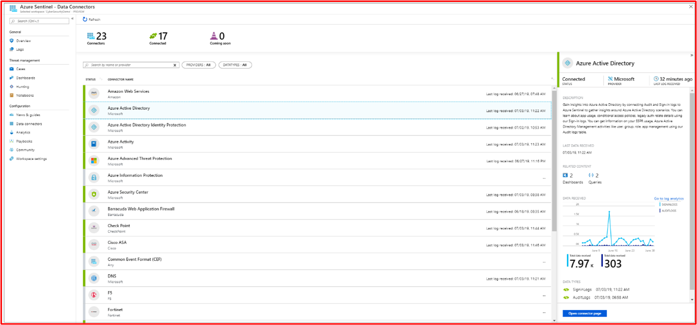

- Пример свидетельства 3. На рисунке ниже показано, как добавить сигнатуру переопределения или правило обхода для обнаружения вторжений с помощью CLI

На рисунке ниже показано, как получить список всех конфигураций обнаружения вторжений с помощью интерфейса командной строки

- Пример свидетельства 4. Azure недавно начала предлагать IDPS с именем Брандмауэр Azure Premium, что позволит настроить TLS, Аналитику угроз, IDPS с помощью политик, однако обратите внимание, что вам по-прежнему потребуется использовать Front Door или шлюз приложений для разгрузки SSL входящего трафика в Брандмауэр Azure Premium  не поддерживает IDPS для входящих SSL-подключений.

В приведенном ниже примере параметры уровня "Премиум" по умолчанию использовались для настройки правил политики и проверки TLS, режима IDPS, аналитики угроз и защиты виртуальной сети.

### Ведение журнала событий безопасности

Ведение журнала событий безопасности является неотъемлемой частью программы&#39;безопасности организации. Достаточное ведение журнала событий безопасности, связанных с настроенными процессами генерации оповещений и проверки, помогает организациям выявлять бреши или попытки нарушения безопасности, которые могут использоваться организацией для улучшения стратегий безопасности и защиты. Кроме того, достаточное ведение журнала будет очень важно для возможностей реагирования на инциденты в организациях, которые могут использоваться для других действий, таких как возможность точно определить, что и кто&#39;данных был скомпрометирован, период компрометации, предоставить подробные аналитические отчеты для правительственных учреждений и т. д.

**Элемент управления No 55:** Предоставьте документацию по политикам, чтобы получить рекомендации и процедуры, управляющие ведением журнала событий безопасности.

- Намерение. Ведение журнала событий безопасности является важной функцией любой организации,&#39;программы безопасности. Политики и процедуры должны быть реализованы, чтобы обеспечить четкость и согласованность, чтобы гарантировать, что организации реализуют элементы управления ведением журнала в соответствие с рекомендациями поставщика и отрасли. Это поможет обеспечить использование соответствующих и подробных журналов, которые не только полезны для выявления потенциальных или фактических событий безопасности, но и могут помочь действию реагирования на инциденты определить степень нарушения безопасности.

- Примеры рекомендаций по свидетельствам. Предоставьте организациям документированные документы о политиках и процедурах, охватывающие рекомендации по ведении журнала событий безопасности.

- Пример свидетельства. Ниже приведено извлечение из политики или процедуры ведения журнала.

**Примечание:** На этом снимке экрана показан документ политики или процесса. Независимые поставщики программного обеспечения должны предоставить фактическую вспомогательную документацию по политике или процедуре, а не просто предоставить снимок экрана.

**Элемент управления No 56:** Предоставьте демонстрацию свидетельства, показывающая, что ведение журнала событий безопасности настроено во всех примерах системных компонентов для регистрации следующих событий:
- Доступ пользователей к системным компонентам и приложению
- Все действия, выполняемые пользователем с высоким уровнем привилегий
- Недопустимые попытки логического доступа
- Создание или изменение привилегированной учетной записи
- Незаконное изменение журнала событий
- Отключение средств безопасности, таких как защита от вредоносных программ или ведение журнала событий
- Ведение журнала защиты от вредоносных программ, таких как обновления, обнаружение вредоносных программ и сбои сканирования
- События IDPS и WAF, если настроены

- Намерение. Чтобы выявить попытки и фактические нарушения безопасности, важно, чтобы все системы, в которых состоит среда, собирали соответствующие журналы событий безопасности. Цель этого элемента управления — обеспечить отслеживание правильных типов событий безопасности, которые затем могут перенаправлены в процессы проверки и оповещений для выявления этих событий и реагирования на них.

- Примеры рекомендаций по свидетельству. Свидетельство с помощью снимков экрана или параметров конфигурации должно быть предоставлено на всех примерах устройств и любых системных компонентах релевантности, чтобы продемонстрировать, как настроено ведение журнала для обеспечения гарантии того, что эти типы событий безопасности регистрируются.

- Пример свидетельства 1. На следующем снимке &quot;экрана показаны параметры конфигурации с одного из примеров устройств с именем VICTIM1-WINDOWS&quot;. Параметры отображают различные параметры аудита, включенные в локальной политике безопасности &#39; Локальные политики  Параметры политики аудита&#39;.

На следующем снимке экрана показано &quot;событие, когда пользователь очищает журнал событий с одного из примеров устройств с именем VICTIM1-WINDOWS&quot;.

На последнем снимке экрана показано, как сообщение журнала отображается в решении централизованного ведения журнала.

**Примечание**. Снимки экрана требуются во всех примерах системных компонентов И **ДОЛЖНЫ**  быть свидетельством всех событий безопасности, описанных выше.

**Элемент управления No 57:** Предоставьте демонстрацию свидетельства того, что зарегистрированные события безопасности содержат следующие минимальные сведения:
- Пользователь
- Тип события
- дата и время;
- Индикаторы успешности или сбоя
- Метка, идентифицирующее затронутую систему

- Намерение. Зарегистрированные события безопасности должны предоставлять достаточно информации, чтобы определить, был ли трафик атаки успешным, к какой информации был выполнен доступ, на какой уровень, кто несет ответственность, откуда он поступил и т. д.

- Пример рекомендаций по свидетельству. Свидетельство должно показывать примеры журналов из всех системных компонентов, показывающих эти типы событий безопасности. Журналы должны содержать все перечисленные выше сведения.

- Пример свидетельства. На следующем снимке &quot;экрана показаны сведения из событий безопасности в Windows Просмотр событий из системного компонента SEGSVR02&quot; в области.

**Примечание**. Снимки экрана необходимы для всех компонентов системы с выборки и **должны** быть свидетельством всех событий безопасности, описанных в элементе управления выше. Скорее всего, свидетельство, собранное для указанного выше элемента управления, также будет удовлетворять этому элементу управления, предоставив соответствующие сведения о ведении журнала.

**Элемент управления No 58:** Предоставьте наглядное свидетельство того, что все образцы системных компонентов синхронизируются по времени с одинаковыми первичными и вторичными серверами.

- Намерение. Критически важным компонентом ведения журнала является обеспечение синхронизации системных часов в журналах во всех системах. Это важно, если требуется исследование для отслеживания компрометации и (или) нарушения безопасности данных. Отслеживание событий в различных системах может стать практически невозможным, если журналы имеют разную степень меток времени, так как важные журналы могут быть пропущены и их будет трудно отслеживать.

- Пример рекомендаций по свидетельству. В идеале следует поддерживать топологию синхронизации времени, которая показывает, как время синхронизируется между активами. Затем свидетельство можно получить с помощью снимков экрана параметров синхронизации времени в образцах системных компонентов. Это должно показать, что вся синхронизация времени выполняется с тем же основным сервером (или, если на месте) сервером-получателем.

- Пример свидетельства. На этой схеме показана используемая топология синхронизации времени.

На следующем снимке экрана показан WatchGuard, настроенный в качестве NTP-сервера, и указатель на time.windows.com,&#39;источник времени.

&quot;На последнем снимке экрана показан системный компонент области, в котором ДЛЯ ПАРАМЕТРА NTP настроен компонент ВТБ&quot;, указывающий на основной сервер, который является брандмауэром WatchGuard (10.0.1.1).

**Элемент управления No 59:** Предоставьте демонстрацию, если используются общедоступные системы, в которых журналы событий безопасности отправляются в централизованное решение для ведения журнала, не в пределах сети периметра.

- Намерение. Цель этого элемента управления — обеспечить логическое или физическое разделение между периметром и конечной точкой ведения журнала. Так как сеть периметра является общедоступной, она подвержена внешним субъектам угроз и, следовательно, подвержена большему риску, чем другие компоненты в среде. Если компонент сети периметра скомпрометирован, необходимо поддерживать целостность данных ведения журнала, чтобы не только запретить субъекту угроз несанкционированное изменение журналов, чтобы скрыть компрометацию, но и помочь в любых расследованиях, которые могут потребоваться. За счет ведения журнала в системах за пределами сети периметра элементы управления безопасностью, используемые для ограничения трафика из сети периметра к этим системам безопасности, должны помочь защитить их от вредоносных действий и попыток незаконного изменения.

- Пример рекомендаций по свидетельству. Свидетельство должно быть предоставлено с помощью снимков экрана или параметров конфигурации, демонстрирующих, что журналы настроены на немедленное (или близкое к немедленному) отправке в централизованное решение ведения журнала, которое находится за пределами сети периметра. Нам требуется практически немедленная доставка журналов, так как чем больше времени требуется для доставки журналов в централизованное решение для ведения журнала, тем больше времени субъекту обработки придется подделыть локальные журналы перед отправкой.

- Пример свидетельства. Системы периметра Contoso используют NXLog для доставки файлов журналов. На следующем снимке экрана показана &#39;nxlog&#39; &quot;на jumpbox DMZ DESKTOP-7S65PN&quot; , который используется для управления всеми серверами сети периметра.

На следующем снимке экрана показано извлечение из файла nxlog.conf, показывающее, что назначением является внутренний сборщик журналов в подсети приложения 10.0.1.250, который используется для отправки в ДискОвое хранилище.

В следующем URL-адресе для NXLog ([https://nxlog.co/documentation/nxlog-user-guide/modes.html](https://nxlog.co/documentation/nxlog-user-guide/modes.html)) показано, что доставка журналов выполняется в режиме реального времени с помощью следующего извлечения:

**Элемент управления No. 60:** Предоставьте свидетельство, которое позволяет показать, что централизованное решение для ведения журнала защищено от несанкционированного незаконного изменения данных журнала.

- Намерение. Хотя между устройствами ведения журнала и централизованным решением ведения журнала часто выполняется логическое или физическое разделение, по-прежнему существует риск того, что кто-то может попытаться изменить журналы, чтобы скрыть свои действия. Цель этого элемента управления — обеспечить соответствующие механизмы авторизации, чтобы ограничить количество пользователей, которые могут выполнять административные действия с централизованным решением ведения журнала.

- Пример рекомендаций по свидетельству. Обычно свидетельством являются снимки экрана, показывающие конфигурацию авторизации и проверки подлинности централизованного решения для ведения журнала, демонстрирующие, что пользователи ограничены тем, которые необходимы для их роли или функции задания.

- Пример свидетельства. SoC, переданный компанией Contoso, использует в качестве централизованных средств SIEM Службу Хранилища Данных Azure. В 2018 году Приложение AtT приобрело Приложение Azure&amp; Для windows 2018 и теперь входит в usM Anywhere. На следующей веб-странице ([https://cybersecurity.att.com/documentation/usm-anywhere/deployment-guide/admin/usm-anywhere-data-security.htm](https://cybersecurity.att.com/documentation/usm-anywhere/deployment-guide/admin/usm-anywhere-data-security.htm)) описывается, как USM Anywhere защищает данные от несанкционированного незаконного изменения. По следующей ссылке ([https://cybersecurity.att.com/documentation/usm-appliance/raw-logs/raw-log-management.htm](https://cybersecurity.att.com/documentation/usm-appliance/raw-logs/raw-log-management.htm)) показано, как продукт USM Anywhere также обеспечивает целостность архивных журналов.

**Примечание:** Если SIEM является внутренним, необходимо предоставить свидетельство, чтобы продемонстрировать, что доступ к данным ведения журнала ограничен определенным числом пользователей в зависимости от их необходимости в задании и что сама платформа защищена от незаконного изменения (большинство решений будут создавать это в функциональные возможности решения для ведения журнала).

**Элемент управления No 61:** Предоставьте не менее 30 дней данных журнала событий безопасности, при этом журналы событий безопасности сохраняются в течение 90 дней.

- Намерение. Иногда существует разница во времени между компрометацией или событием безопасности и идентифицируемой организацией. Цель этого контроля — убедиться, что организация имеет доступ к историческим данным о событиях, чтобы помочь в реагировании на инциденты и любых расследованиях, которые могут потребоваться.

- Пример рекомендаций по свидетельству. Свидетельство обычно представляет собой отображение централизованного решения для ведения журнала&#39;параметров конфигурации, показывающих, как долго хранятся данные. Данные журнала событий безопасности за 30 дней должны быть немедленно доступны в решении, однако при архивации данных это необходимо для демонстрации доступности 90 дней. Это может быть путем отображения архивных папок с датами экспортированных данных.

- Пример свидетельства 1. На следующих снимках экрана показано, что журналы на 30 дней доступны в Приложении Azure.

**Примечание**. Так как это общедоступный документ, серийный номер брандмауэра был изменен, однако мы не будем&#39;независимых поставщиков программного обеспечения для поддержки всех измененных снимков экрана, если он не содержит личные сведения.

На следующем снимке экрана показано, что журналы доступны с помощью извлечения журнала за 5 месяцев.

**Примечание**. Так как это общедоступный документ, общедоступные IP-адреса были изменены, однако мы не будем&#39;независимых поставщиков программного обеспечения для поддержки всех измененных снимков экрана, если он не содержит личные сведения.

- Пример свидетельства 2. На следующем снимке экрана показано, что события журнала хранятся в течение 30 дней, доступных в режиме реального времени, и 90 дней в холодном хранилище в Azure.

### Проверка (данные журнала событий безопасности)

Просмотр журналов безопасности — важная функция, помогая организациям выявлять события безопасности, которые могут свидетельствовать о нарушении безопасности или действиях рекогносцировки, которые могут означать, что что-то будет. Это можно сделать либо с помощью ручного процесса на ежедневной основе, либо с помощью решения SIEM (управление информационной безопасностью и событиями безопасности), которое помогает анализировать журналы аудита, искать корреляции и аномалии, которые можно пометить для проверки вручную.

**Элемент управления No. 62:** Предоставьте документацию по политике, которая управляет методиками и процедурами проверки журналов.

- Намерение. &quot; Отчет IBM с названием Cost [of a data breach Report 2020](https://www.ibm.com/security/digital-assets/cost-data-breach-report/#/)&quot; (Затраты на отчет о нарушении безопасности данных) указывает, что среднее время обнаружения и хранения бреши в данных может занять 280 дней. Это больше, когда нарушением является злоумышленник, который сообщается как 315 дней. Так как средняя стоимость бреши в данных, как сообщается, находится в миллионах долларов, крайне важно, чтобы этот жизненный цикл нарушения безопасности данных был сокращен, чтобы не только свести к минимуму период раскрытия данных, но и сократить временные рамки, за которые субъект угрозы должен получить данные из среды. Уменьшая это окно, организации могут снизить общую стоимость нарушения безопасности данных.

- Реализуя надежный процесс проверки и оповещений, организации гораздо быстрее могут выявлять бреши в системе безопасности данных, чтобы свести к минимуму их влияние на организацию. Кроме того, надежный процесс может помочь выявить попытки нарушения безопасности, позволяя организациям защищать механизмы защиты для устранения этой повышенной угрозы, чтобы еще больше снизить вероятность компрометации в рамках кампании атаки.

- Примеры рекомендаций по свидетельствам. Предоставьте организациям документированные документы о политиках и процедурах, охватывающие рекомендации по проверке журналов.

- Пример свидетельства. Ниже приведено извлечение из политики или процедуры проверки журнала.

**Примечание:** На этом снимке экрана показан документ политики или процесса. Независимые поставщики программного обеспечения должны предоставить фактическую вспомогательную документацию по политике или процедуре, а не просто предоставить снимок экрана.

**Элемент управления No. 63:** Предоставьте проверяемое свидетельство того, что журналы ежедневно проверяются человеком или автоматизированным инструментарием для выявления потенциальных событий безопасности.

- Намерение. Цель этого элемента управления — обеспечить выполнение ежедневных проверок журналов. Это важно для выявления любых аномалий, которые могут быть не распознаются скриптами или запросами оповещений, настроенными для предоставления оповещений о событиях безопасности.

- Пример рекомендаций по свидетельству. Свидетельство обычно предоставляется на снимке экрана или на снимке экрана, демонстрируя, что выполняются проверки журналов. Это может быть форма, которая выполняется каждый день, или с помощью JIRA или DevOps запроса с соответствующими комментариями, которые показывают, что это выполняется ежедневно. Например, еженедельный билет JIRA &quot;может быть создан ежедневной проверкой журнала W/C 26 июня 2021&quot; г., каждый день кто-то публикует результаты ежедневной проверки журнала. Если помечены какие-либо аномалии, это можно задокументировать в этом же билете, чтобы продемонстрировать следующий элемент управления в одном JIRA.

- Если используются автоматизированные инструменты, можно предоставить снимок экрана, чтобы продемонстрировать настроенную автоматизацию и предоставить дополнительные свидетельства, чтобы показать, что автоматизация запущена и кто-то просматривает автоматические выходные данные.

- Пример свидетельства. Компания Contoso использует сторонний поставщик SOC , Cyber Security, для корреляции журналов и проверок. Поставщик SOC, который предоставляет автоматизированный анализ журналов для аномальных журналов и событий цепочки, которые могут выделить потенциальное событие безопасности, используется поставщиком Службы soC. На следующих трех снимках экрана показаны правила корреляции в Приложении Azure.

На первом снимке экрана показано, где пользователь был добавлен в группу &#39;администраторов&#39; домена.

На следующем снимке экрана показано, где после нескольких неудачных попыток входа в систему следует успешное имя входа, которое может выделить успешную атаку методом подбора.

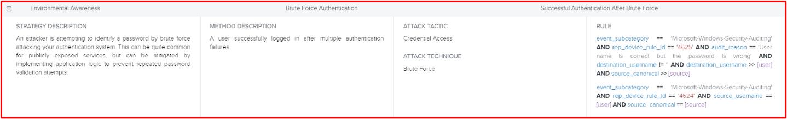

На последнем снимке экрана показано, где произошло изменение политики паролей, чтобы срок действия паролей учетных записей&#39;истек.

На следующем снимке экрана показано, что запрос автоматически создается в средстве SOC&#39;ServiceNow, что активирует приведенное выше правило.

**Элемент управления No. 64:** Предоставьте доказывающее, что потенциальные события безопасности и аномалии исследуются и устраняются.

- Намерение. Цель состоит в том, чтобы все аномалии, выявленные в процессе ежедневной проверки журнала, были исследованы, а также было выполнено соответствующее исправление или действие. Обычно для этого требуется рассмотрение, чтобы определить, требуются ли действия для аномалий, а затем может потребоваться вызвать процесс реагирования на инциденты.

- Пример рекомендаций по свидетельству. Свидетельство должно быть предоставлено с помощью снимка экрана, на котором показано, что отслеживаются аномалии, обнаруженные в ходе ежедневной проверки журнала. Как уже говориллось выше, это может быть через билеты JIRA, показывающие аномалию, а затем подробное описание действий, выполненных после этого. Это может привести к появлению определенного запроса JIRA для отслеживания всех выполняемых действий или просто задокументировать его в ежедневном запросе на проверку журнала. Если требуется действие по реагированию на инциденты, оно должно быть задокументировано как часть процесса реагирования на инциденты, и для демонстрации этого должны быть предоставлены свидетельства.

- Пример свидетельства. На следующем снимке экрана показано, что в ServiceNow отслеживается оповещение системы безопасности с помощью SOC Cyber Security MDR (Управляемое обнаружение и реагирование).

На следующем снимке экрана показано подтверждение того, что это было разрешено Дэвидом Хэштоном @Contoso с помощью обновления на портале клиента ServiceNow.

### Оповещение о событиях безопасности

Критические события безопасности необходимо немедленно изучить, чтобы свести к минимуму влияние на данные и рабочую среду. Оповещение помогает немедленно выявлять потенциальные нарушения безопасности для сотрудников, чтобы обеспечить оперативное реагирование, чтобы организация как можно быстрее содержала событие безопасности. Обеспечивая эффективную работу оповещений, организации могут свести к минимуму влияние бреши в системе безопасности, тем самым уменьшая вероятность серьезного нарушения, которое может повредить фирменную символику организации и нанести финансовые убытки за счет штрафов и репутации.

**Элемент управления No 65:** Предоставьте документацию по политике, которая управляет методиками и процедурами оповещений о событиях безопасности.

- Намерение. Оповещения следует использовать для ключевых событий безопасности, которые требуют немедленного реагирования от организации, так как существует вероятность того, что событие свидетельствует о нарушении среды и (или) нарушении данных. Чтобы обеспечить согласованность и повторяемую обработку оповещений, следует задокументировать надежный процесс вокруг процесса генерации оповещений. Мы надеемся, что это поможет сократить сроки &quot;жизненного цикла нарушения безопасности&quot; данных.

- Примеры рекомендаций по свидетельствам. Предоставьте организациям документированные документы о политиках и процедурах, охватывающие рекомендации по оповещениям о событиях безопасности.

- Пример свидетельства. Ниже приведено извлечение из политики или процедуры генерации оповещений о событиях безопасности. Предоставьте полные документы о политике и процедурах для поддержки оценки.

**Примечание:** На этом снимке экрана показан документ политики или процесса. Независимые поставщики программного обеспечения должны предоставить фактическую вспомогательную документацию по политике или процедуре, а не просто предоставить снимок экрана.

**Элемент управления No. 66:** Предоставьте доказывающее, что оповещения активируются для немедленного рассмотрения следующих типов событий безопасности:
- Создание или изменение привилегированной учетной записи
- События вирусов или вредоносных программ
- Незаконное изменение журнала событий
- События IDPS или WAF, если они настроены

- Намерение. Выше приведен список некоторых типов событий безопасности, которые могут указывать на событие безопасности, которое может указывать на нарушение безопасности среды и (или) нарушение безопасности данных.

- Пример рекомендаций по свидетельству. Свидетельство должно быть предоставлено с помощью снимков экрана конфигурации оповещений **и** свидетельства полученных оповещений. На снимках экрана конфигурации должна отображаться логика, которая активирует оповещения, и способ отправки оповещений. Оповещения можно отправлять по SMS, электронной почте, Teams каналам, каналам Slack и т. д.

- Пример свидетельства. Компания Contoso использует сторонний SOC, предоставляемый [Cyber Security в Веб-сети](https://www.claranet.co.uk/services/cybersecurity/managed-detection-and-response). В следующем примере показано, что оповещение в Приложении SimonVault, используемое SOC, настроено для отправки оповещений члену команды SOC Dan Turner в Приложении Cyber Security в Сети.

На следующем снимке экрана показано оповещение, полученное Пользователем Dan.

**Элемент управления No. 67:** Предоставьте свидетельство, показывающее, что сотрудники всегда доступны в течение всего дня и каждый день для реагирования на оповещения системы безопасности.

- Намерение. Важно как можно скорее рассмотреть оповещения системы безопасности, чтобы ограничить уязвимость к среде и (или) данным. Сотрудники всегда должны быть доступны для реагирования на оповещения и предоставления критически важных работ по анализу, если обнаружено нарушение. Чем быстрее начнется этот процесс, тем быстрее будет содержаться инцидент безопасности для защиты данных или ограничения влияния бреши.

- Пример рекомендаций по свидетельству. Необходимо указать свидетельство, демонстрирующее, что сотрудники могут реагировать на оповещения системы безопасности 24 часа в день. Это может быть с помощью вызова rota.

- Пример свидетельства. На следующем снимке экрана показано, как вызвать rota для Contoso за декабрь 2020 г. Команда SoC Cyber Security в Компьютерной сети Понет будет оповещена членам команды contoso по вызову.

### Управление рисками информационной безопасности

Управление рисками информационной безопасности — это важное действие, которое все организации должны выполнять по крайней мере раз в год. Организации должны понимать свои угрозы и риски, чтобы эффективно устранять эти угрозы. Без эффективного управления рисками организации могут реализовать рекомендации по обеспечению безопасности в областях, которые они считают важными, и, следовательно, вкладывать ресурсы, время и деньги в эти области, когда другие угрозы гораздо более вероятны и поэтому должны быть устранены. Эффективное управление рисками поможет организациям сосредоточиться на рисках, которые представляют большую угрозу для бизнеса. Это следует выполнять ежегодно, так как среда безопасности постоянно меняется, и поэтому угрозы и риски могут меняться сверхурочные. Хороший пример этого можно увидеть в COVID-19, где было значительно увеличено число фишинговых атак и массовое (и быстрое) развертывание удаленной работы для сотен или тысяч сотрудников.

**Элемент управления No 68:** Предоставьте демонстрацию свидетельства того, что установлен формальный процесс управления рисками информационной безопасности.

- Намерение. Как мы уже говорило выше, надежный процесс управления рисками информационной безопасности важен, чтобы помочь организациям эффективно управлять рисками. Это поможет организациям спланировать эффективное устранение угроз для среды.

**Важно, чтобы оценка рисков включает риски информационной безопасности, а не только общие &quot;бизнес-риски&quot; .**

- Пример рекомендаций по свидетельству. Необходимо указать формально документированный процесс управления оценкой рисков.

- Пример свидетельства: следующее свидетельство является снимком экрана, частью&#39;оценки рисков Компании Contoso.
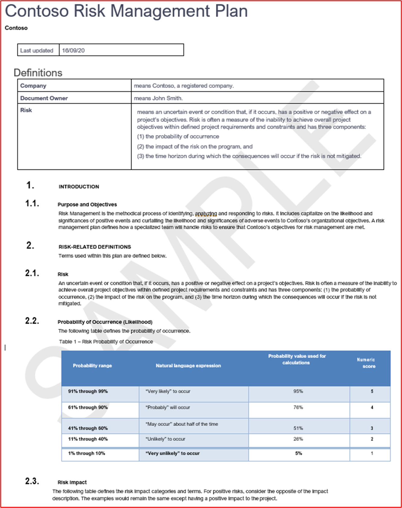

**Примечание:** На этом снимке экрана показан документ политики или процесса. Независимые поставщики программного обеспечения должны предоставить фактическую вспомогательную документацию по политике или процедуре, а не просто предоставить снимок экрана.

**Элемент управления No 69:** Предоставьте доказывающее, что формальная оценка рисков выполняется как минимум раз в год.

- Намерение. Угрозы безопасности постоянно меняются в зависимости от изменений среды, изменений предлагаемых служб, внешних факторов влияния, развития ландшафта угроз безопасности и т. д. Организации должны проходить этот процесс по крайней мере раз в год. Рекомендуется также выполнять этот процесс при значительных изменениях, так как угрозы могут изменяться.

- Пример рекомендаций по свидетельству. Свидетельство может быть путем отслеживания версий или дат. Должно быть предоставлено свидетельство, которое показывает выходные данные оценки рисков информационной безопасности и **не** даты самого процесса оценки рисков информационной безопасности.

- Пример свидетельства. На этом снимке экрана показано, что собрание по оценке рисков запланировано на каждые шесть месяцев.

На этих двух снимках экрана показаны минуты собрания из двух собраний по оценке рисков.

**Элемент управления No 70:** Предоставьте доказывающее, что оценка рисков информационной безопасности включает в себя угрозы, уязвимости или эквивалент.

- Намерение. Оценки рисков информационной безопасности должны выполняться в отношении угроз, связанных с средой и данными, а также от возможных уязвимостей, которые могут возникнуть. Это поможет организациям определить множество угроз и уязвимостей, которые могут представлять значительный риск.

- Примеры рекомендаций по свидетельству. Свидетельство должно быть предоставлено не только уже предоставленным процессом оценки рисков информационной безопасности, но и выходом оценки рисков (с помощью регистра рисков или плана обработки рисков), который должен включать риски и уязвимости.

- Пример свидетельства. На следующем снимке экрана показан регистр рисков, демонстрирующий включение угроз и уязвимостей.

**Примечание:** Вместо снимка экрана должна быть предоставлена полная документация по оценке рисков.

**Элемент управления No 71:** Предоставьте доказывающее, что оценка рисков информационной безопасности включает в себя влияние, матрицу рисков вероятности или эквивалент.

- Намерение. Оценки рисков информационной безопасности должны документировать оценки влияния и вероятности. Эти матрицы обычно используются для определения значения риска, которое может использоваться организацией для определения приоритетов обработки рисков, чтобы уменьшить значение риска.

- Примеры рекомендаций по свидетельству. Свидетельство должно быть предоставлено не только уже предоставленным процессом оценки рисков информационной безопасности, но и выходом оценки рисков (с помощью регистра риска или плана обработки рисков), который должен включать оценки влияния и вероятности.

- Пример свидетельства. На следующем снимке экрана показан регистр риска, демонстрирующий влияние и вероятность.

**Примечание:** Вместо снимка экрана assessment_ _document__ation полный список рисков.

**Элемент управления No 72:** Предоставьте доказывающее, что оценка рисков информационной безопасности включает в себя регистр рисков и план обработки.

- Намерение. Организациям необходимо эффективно управлять рисками. Это необходимо правильно отслеживать, чтобы предоставить запись об одном из четырех применяемых методов обработки рисков. Ниже перечислены методы обработки рисков.

- **Избегайте/завершите** работу: бизнес может определить, что стоимость работы с риском превышает доход, созданный службой. Таким образом, бизнес может прекратить выполнение службы.
- **Передача и совместное** использование. Бизнес может передать риск стороннему поставщику, переместив обработку на стороннюю.
- **Принятие, допустимое или удержание** : бизнес может решить, что риск приемлем. Это во многом зависит от рисков для бизнеса и может различаться в зависимости от организации.
- **Обработка, устранение и изменение** . Бизнес решает реализовать средства управления устранением рисков, чтобы снизить риск до приемлемого уровня.

- Цель этого контроля — получить уверенность в том, что организация выполняет оценку рисков и работает с этим соответствующим образом.

- Пример рекомендаций по свидетельству. План обработки рисков или регистр риска (или что-то эквивалентное) должны быть предоставлены, чтобы продемонстрировать, что процесс оценки рисков выполняется правильно.

- Пример свидетельства. Ниже приведен регистр рисков для Contoso.

**Примечание:** Вместо снимка экрана должна быть предоставлена полная документация по оценке рисков.

На следующем снимке экрана показан план обработки рисков.

### Реагирование на инциденты безопасности

Реагирование на инциденты безопасности важно для всех организаций, так как это может сократить время, затраченное организацией на инцидент безопасности, и ограничить уровень уязвимости организации к краже данных. Разработка комплексного и подробного плана реагирования на инциденты безопасности позволяет значительно сократить время идентификации до времени хранения.

В отчете IBM с &quot; названием [Cost of a data breach Report 2020](https://www.ibm.com/security/digital-assets/cost-data-breach-report/#/)&quot; (Затраты на нарушение безопасности данных) показано, что в среднем время, затраченное на нарушение безопасности, — 73 дня. Кроме того, тот же отчет определяет наиболее крупную экономию затрат для организаций, которые сталкиваются с нарушением безопасности, была подготовлена к реагированию на инциденты, обеспечивая среднюю экономию затрат на 2 000 000 долл. США.

Организации должны выполнять рекомендации по обеспечению соответствия требованиям безопасности с помощью стандартных отраслевых платформ, таких как ISO 27001, NIST, SOC 2, PCI DSS и т. д.

**Элемент управления No 73:** Укажите план реагирования на инциденты безопасности (IRP).

- Намерение. Как уже говориллось, цель этого элемента управления — требовать официально задокументированный план реагирования на инциденты. Это поможет более эффективно управлять реагированием на инциденты безопасности, что в конечном итоге может ограничить риск потери данных в организациях и снизить затраты на компрометацию.

- Пример рекомендаций по свидетельству. Укажите полную версию плана или процедуры реагирования на инциденты. Это должен быть документированный процесс обмена данными, который рассматривается в следующем элементе управления.

- Пример свидетельства. На приведенном ниже снимке экрана показано начало плана реагирования на инциденты&#39;Contoso. В рамках отправки свидетельства необходимо предоставить весь план реагирования на инциденты.

**Примечание:** На этом снимке экрана показан документ политики или процесса. Независимые поставщики программного обеспечения должны предоставить фактическую вспомогательную документацию по политике или процедуре, а не просто предоставить снимок экрана.

**Элемент управления No 74:** Предоставьте доказывающее, что IRP безопасности включает задокументированный процесс обмена данными, чтобы обеспечить получение во времени уведомлений ключевым заинтересованным лицам, таким как торговые марки платежей и клиенты, органы управления, надзорные органы, директоры и клиенты.

- Намерение. Организации могут иметь обязательства по уведомлению о нарушении в зависимости от страны или страны, в которых они работают (например, Общего регламента по защите данных; GDPR) или на основе предлагаемых функциональных возможностей (например, PCI DSS при обработке платежных данных). Неполная обработка уведомлений может иметь серьезные последствия, поэтому для обеспечения выполнения обязательств по уведомлению планы реагирования на инциденты должны включать в себя обмен данными, включая обмен данными со всеми заинтересованными лицами, процессы связи с мультимедиа, а также пользователей, которые могут и не могут говорить с мультимедиа.

- Пример рекомендаций по свидетельству. Предоставьте полную версию плана или процедуры реагирования на инциденты, которая должна включать раздел, охватывающий процесс обмена данными.

- Пример свидетельства. На следующем снимке экрана показано извлечение из плана реагирования на инциденты, показывающее процесс связи.

**Элемент управления No 75:** Предоставьте доказывающее, что все участники группы реагирования на инциденты завершили ежегодное обучение или упражнение по таблице.

- Намерение. Как уже говорилось ранее, чем дольше организация будет содержать компрометацию, тем выше риск кражи данных, что может привести к большему объему извлеченных данных и общей стоимости компрометации. Важно, чтобы группы реагирования&#39;организации были оснащены для своевременного реагирования на инциденты безопасности. Регулярное обучение и выполнение табличных упражнений позволяет команде быстро и эффективно обрабатывать инциденты безопасности.

- Мы рекомендуем выполнить как внутреннее обучение реагированию на инциденты для группы реагирования  на инциденты, так и выполнить регулярные табличные упражнения, которые должны быть связана с оценкой рисков информационной безопасности, чтобы определить инциденты безопасности, которые, скорее всего, произойти. Таким образом, команда будет знать, какие действия необходимо выполнить для быстрого хранения и изучения наиболее вероятных инцидентов безопасности.

- Пример рекомендаций по свидетельству. Необходимо указать свидетельство, демонстрирующее, что обучение было выполнено с помощью предоставления общего доступа к обучающему содержимому, и записи, показывающие, кто принял участие (который должен включать в себя всю группу реагирования на инциденты). Кроме того, также можно использовать записи, показывающие, что выполнено упражнение tabletop. Все это должно быть выполнено в течение 12-го часа после отправки свидетельства.

- Пример свидетельства. Компания Contoso выполняла табличное упражнение по реагированию на инциденты с помощью внешней компании по обеспечению безопасности с именем Cyber Security в Сети. Ниже приведен пример отчета, созданного в рамках этого раздела.

**Примечание:** Необходимо предоставить общий доступ к полному отчету. Это упражнение также может быть выполнено внутри организации, так как Microsoft 365 не требуется выполнять это требование сторонней компанией.

**Элемент управления No 76:** Предоставьте проверяемое свидетельство, чтобы показать, что IRP безопасности обновляется на основе полученных уроков или организационных изменений.

- Намерение. Со временем план реагирования на инциденты (IRP) должен развиваться на основе изменений организации или на основе уроков, полученных при выполнении IRP. Изменения в операционной среде могут потребовать внесения изменений в IRP по мере изменения угроз или изменения нормативных требований. Кроме того, по мере выполнения упражнений tabletop и фактических ответов на инциденты безопасности часто можно определить области IRP, которые можно улучшить. Это необходимо включить в план, и цель этого элемента управления — убедиться, что этот процесс включен в IRP.

- Примеры рекомендаций по свидетельству. Это часто демонстрируется путем просмотра результатов инцидентов безопасности или упражнений с таблицей, в которых полученные уроки были выявлены и приведены в обновлении IRP. IRP должен вести журнал изменений, который также должен ссылаться на изменения, реализованные на основе полученных уроков или организационных изменений.

- Пример свидетельства: следующие снимки экрана предоставлены IRP, который содержит раздел об обновлении IRP на основе полученных уроков и (или) изменений организации.

В журнале изменений IRP показано, что обновление выполняется на сервере упражнения tabletop, выполненного в июле 2021 г.

## Домен безопасности: безопасность и конфиденциальность обработки данных

Этот домен безопасности включен, чтобы обеспечить надлежащую защиту всех данных, потребляемых из M365, как при передаче, так и при хранении. Этот домен также гарантирует, что независимый поставщик программного обеспечения (ISV) будет обеспечивать соблюдение требований конфиденциальности потребителей (субъектов данных) в соответствии с Общим регламентом по защите данных (GDPR), который касается конфиденциальности граждан ЕС.

### Передаваемые данные

Из-за требований к подключению приложений и надстроек, разработанных M365, обмен данными будет происходить через общедоступные сети, а также Через Интернет. По этой причине передаваемые данные должны быть надежно защищены. В этом разделе рассматривается защита обмена данными через Интернет.

**Элемент управления No 1:** Предоставьте демонстрацию подтверждения того, что конфигурация TLS соответствует требованиям к шифрованию в требованиях к конфигурации профиля [TLS](../docs/certification-submission-guide.md#appendix-a) или превышает их.

- Намерение. Цель этого элемента управления — обеспечить безопасную передачу данных M365, используемых вашей организацией. Конфигурация профиля TLS определяет особые требования TLS, чтобы обеспечить безопасность трафика от атак типа "злоумышленник в середине".

- Пример рекомендаций по свидетельству. Самый простой способ убедиться в этом — запустить средство тестирования [Qualys SSL Server](https://www.ssllabs.com/ssltest/) для  всех веб-прослушивателей, включая все, которые выполняются на нестандартных портах.

- Не забудьте включить флажок &quot;"Не показывать&quot; результаты на досках", который останавливает добавление URL-адреса на веб-сайт.

- Вы также можете предоставить свидетельство для демонстрации отдельных проверок в требованиях к конфигурации профиля TLS. Можно использовать параметры конфигурации, а также скрипты и программные средства, чтобы предоставить свидетельство некоторых определенных параметров, т. е. отключено сжатие TLS.

- Пример свидетельства. На приведенном ниже снимке экрана показаны результаты для [www.clara.net:443](http://www.clara.net:443/) веб-прослушивателя.

**Примечание**. Аналитики сертификации проверят все выходные данные, чтобы убедиться, что все требования к конфигурации профиля TLS выполнены (предоставьте снимки экрана с полными выходами сканирования). Depending_ _на _what_ предоставлены доказательства, аналитики могут запустить собственную проверку Qualys.

- Пример свидетельства 2. На следующем снимке экрана показано, что В хранилище настроен протокол TLS 1.2.

**Примечание:** Этот снимок экрана не сможет удовлетворить это требование.

- Пример свидетельства 3. На следующих снимках экрана показано, что протокол TLS версии 1.3 включен только на сервере.

В этом примере разделы реестра используются для отключения или включения протокола путем изменения значений следующим образом:

Двоичный код: 0 — off 1 — on

Шестнадцатеричное: 0x00000000 - off 0xffffffff - on

**Примечание** . Не используйте эту методологию, если вы не понимаете ее, так как мы (Майкрософт) не несете ответственности за использование или выполнение этого примера или какие-либо последствия его использования могут повлиять на ваши системы. Здесь мы просто иллюстрируем другой способ показать, включен или отключен TLS.

**Примечание**. Эти снимки экрана не смогут удовлетворить это требование.

**Элемент управления No 2.** Предоставьте демонстрационное свидетельство того, что сжатие TLS отключено во всех общедоступных службах, обрабатывающих веб-запросы.

- Намерение. Существует определенная уязвимость TLS ( CRIME ([CVE-2012-4929](https://nvd.nist.gov/vuln/detail/CVE-2012-4929)), которая влияет на сжатие TLS. По этой причине отраслевые рекомендации предназначены для отключения этой функции.

- Примеры рекомендаций по свидетельству. Это может быть свидетельством с помощью средства Qualys SSL Labs.

- Пример свидетельства. На следующем снимке экрана показано это с помощью средства Qualys SSL Labs.

**Элемент управления No 3:** Предоставьте демонстрацию подтверждения того, что протокол TLS http strict transport security включен и настроен >= 15552000 на всех сайтах.

- Намерение. Http Strict Transport Security (HSTS) — это механизм безопасности, предназначенный для защиты веб-сайтов от атак типа "злоумышленник в середине", принудительного подключения TLS с помощью поля заголовка ответа HTTPS с &quot;именем Strict-Transport-Security&quot;.

- Примеры рекомендаций по свидетельству. Это может быть свидетельством с помощью средства Qualys SSL Labs или других средств и надстроек веб-браузера.

- Пример свидетельства. На следующем снимке экрана показана надстройка веб-браузера с именем &#39;HTTP Header Spy&#39; для [веб-www.microsoft.com](https://www.microsoft.com/) веб-сайта.

### Неактивные данные

Когда данные, потребляемые с Microsoft 365 платформы, хранятся в независимых поставщиков программного обеспечения, данные должны быть надежно защищены. В этом разделе описываются требования к защите данных, хранящихся в базах данных и хранилищах файлов.

**Элемент управления No 4.** Предоставьте демонстрацию того, что неактивные данные шифруются встроенными требованиями к профилю шифрования, используя алгоритмы шифрования, такие как AES, Экземпляры, TDES и 128-разрядные и 256-разрядные ключи шифрования.

- Намерение. Некоторые старые алгоритмы шифрования, как известно, содержат некоторые уязвимости шифрования, что повышает вероятность того, что субъект угроз сможет расшифровать данные без знания ключа. По этой причине цель этого элемента управления — обеспечить использование только принятых в отрасли алгоритмов шифрования для защиты хранимых данных M365.

- Пример рекомендаций по свидетельству. Свидетельство можно получить с помощью снимков экрана, показывающих шифрование, используемое для защиты данных M365 в базах данных и других расположениях хранения. Свидетельство должно демонстрировать, что конфигурация шифрования соответствует требованиям конфигурации профиля шифрования Microsoft 365 сертификации.

- Пример свидетельства. На следующем снимке экрана показано, что TDE (прозрачное шифрование данных) включено в базе данных Contoso. На втором снимке экрана показана страница документации Майкрософт &#39;прозрачное шифрование данных для [База данных SQL, Управляемый экземпляр SQL и Azure Synapse Analytics](/azure/azure-sql/database/transparent-data-encryption-tde-overview?view=sql-server-ver15&amp;tabs=azure-portal)&#39;, на которой показано, что для Azure TDE используется шифрование AES 256.

- Пример свидетельства 2. На следующем снимке экрана служба хранилища Azure с шифрованием больших двоичных объектов и файлов. На следующем снимке экрана &quot; показана страница документации Майкрософт [служба хранилища Azure](/azure/storage/common/storage-service-encryption)&quot; шифрования неактивных данных, на которой показано, что служба хранилища Azure AES-256 для шифрования.

**Элемент управления No 5.** Предоставьте демонстрационное свидетельство того, что хэш-функция или проверка подлинности сообщений (HMAC-SHA1) используется только для защиты неактивных данных во встроенном режиме с помощью требований к профилю шифрования.

- Намерение. Как и в случае с алгоритмами шифрования, некоторые хэш-функции и алгоритмы проверки подлинности сообщений основаны на алгоритмах с криптографическими уязвимостями. Цель этого элемента управления — обеспечить защиту данных M365 с помощью надежных хэш-функций, если хэширование используется в качестве механизма защиты данных. Если это не используется средой или приложением, необходимо указать свидетельство, которое может это сделать.

- Пример рекомендаций по свидетельству. Свидетельство может быть в виде снимков экрана, на которых показаны фрагменты кода, в котором работает функция хэширования.

- Пример свидетельства. Contoso использует функции хэширования в своем приложении. На приведенном ниже снимке экрана показано, что SHA256 используется как часть функции хэширования.

**Элемент управления No 6:** Укажите инвентаризацию всех хранимых данных, включая расположение хранилища и шифрование, используемую для защиты данных.

- Намерение. Для правильной защиты данных организациям необходимо знать, какие данные используются средой или системами и где хранятся данные. После того как это будет полностью понято и задокументировано, организации смогут не только реализовать надлежащую защиту данных, но и консолидировать данные там, где они находятся, чтобы эффективнее реализовать защиту. Кроме того, при консолидации данных в как можно меньшее количество мест гораздо проще реализовать соответствующий RBAC (управление доступом на основе ролей), чтобы ограничить доступ как можно меньшему объему сотрудников.

- Пример рекомендаций по свидетельству. Свидетельство должно быть предоставлено документом или экспортом из внутренней системы, т. е. SharePoint или Confluence, с подробным описанием всех потребляемых данных, всех расположений хранения и реализуемого уровня шифрования.

- Пример свидетельства. На следующем снимке экрана показан пример того, как может выглядеть документ с типами данных.

### Хранение и реализация данных

Если независимые поставщики программного обеспечения используют и хранят данные M365, это может быть под угрозой компрометации данных, если субъект угроз скомпрометирует среду независимых поставщиков программного обеспечения. Чтобы свести к минимуму этот риск, &quot;&quot; организации должны хранить только данные, необходимые для служб доставки, а не данные, которые могут использоваться в будущем. Кроме того, данные должны храниться только до тех пор, пока это необходимо для предоставления служб, для которой были записаны данные. Хранение данных должно быть определено и взаимодействовать с пользователями. После превышения заданного периода хранения данные необходимо безопасно удалить, чтобы данные не могли быть восстановлены или восстановлены.

**Элемент управления No 7:** Предоставьте демонстрацию свидетельства того, что утвержденный и задокументированный период хранения данных официально установлен.

- Намерение. Документированная и отслеживаемая политика хранения важна не только для выполнения некоторых юридических обязательств, например законодательства о конфиденциальности данных, например, общего регламента по защите данных (GDPR ЕС) и Закона о защите данных (UK DPA 2018), но и для ограничения рисков организаций. Понимая требования к данным в организациях и время, необходимое бизнесу для выполнения своих функций, организации могут обеспечить правильное удаление данных по истечении срока их полезности. Уменьшая объем хранимых данных, организации сокращают объем данных, которые будут предоставляться в случае компрометации данных. Это ограничит общее влияние.

- &quot;&quot;Часто организации будут хранить данные просто потому,&#39;на случай, если организации не&#39;данные для выполнения своей службы или бизнес-функции, данные не должны храниться, так как это увеличивает риски для организаций без необходимости.

- Пример рекомендаций по свидетельствам. Предоставьте полную политику хранения данных, которая четко описывает, как долго должны храниться данные (должны охватывать все типы данных), чтобы бизнес-функции могли выполняться.

- Пример свидетельства. На снимке экрана ниже показана&#39;хранения данных Contoso.

**Примечание:** На этом снимке экрана показан документ политики или процесса. Независимые поставщики программного обеспечения должны предоставить фактическую вспомогательную документацию по политике или процедуре, а не просто предоставить снимок экрана.

**Элемент управления No 8:** Предоставьте демонстрацию свидетельства того, что сохраненные данные соответствуют определенному периоду хранения.

- Намерение. Цель этого элемента управления — просто проверить, выполняются ли определенные периоды хранения данных. Как уже говориллось, организации могут иметь юридические обязательства по соответствию этому, но также за счет хранения необходимых данных и при необходимости помогает снизить риск для организации в случае нарушения безопасности данных.

- Пример рекомендаций по свидетельству. Предоставьте снимок экрана (или с помощью screenshare), показывающий, что хранимые данные (во всех различных расположениях данных, т. е. базах данных, общих папках, архивах и т. д.)&#39;не превышают определенную политику хранения данных. Примерами могут быть снимки экрана записей базы данных с полем даты, поиск которых выполняется в наиболее старом порядке записи, и (или) расположения хранилища файлов с метками времени, которые находятся в пределах срока хранения.

**Примечание:** На снимке экрана необходимо отобразить все личные или конфиденциальные данные клиента.

- Пример свидетельства: в следующем SQL показан запрос, показывающий содержимое таблицы базы данных, упорядоченное в порядке возрастания в поле &#39;DATETRANSACTION\_&#39;, чтобы отобразить самые старые записи в базе данных. Это должны быть данные за два месяца,&#39;не превышает определенный период хранения.

**Примечание:** Это тестовая база данных, поэтому в&#39;не существует большого объема исторических данных.

**Элемент управления No 9:** Предоставьте демонстрацию свидетельства того, что процессы выполняются для безопасного удаления данных по истечении срока хранения.

- Намерение. Цель этого элемента управления — убедиться, что механизм, используемый для удаления данных, превышающее срок хранения, делает это безопасно. Удаленные данные иногда можно восстановить; Таким образом, процесс удаления должен быть достаточно надежным, чтобы гарантировать, что данные не могут быть восстановлены после удаления.

- Пример рекомендаций по свидетельству. Если процесс удаления выполняется программным способом, предоставьте снимок экрана сценария, который используется для этого. Если он&#39;по расписанию, предоставьте снимок экрана, показывающий расписание. Например, скрипт для удаления файлов в общей папке может быть настроен как задание CRON, снимок экрана: задание CRON, показывающее расписание и выполняемый сценарий, и предоставьте скрипт, показывающий используемую команду.

- Пример свидетельства 1. Это простой сценарий, который можно использовать для удаления всех записей данных, хранимые на основе даты -WHERE DateAdd — –30 дней, который очищает все сохраненные записи старше 30 дней после выбранной даты хранения данных. Обратите внимание, что нам потребуется скрипт, а также свидетельство выполнения задания и результатов.

- Пример свидетельства 2. Приведенный ниже пример взят из плана хранения данных Contoso из элемента управления 7. Здесь показаны процедуры, используемые для уничтожения данных.

**Примечание:** На этом снимке экрана показан документ политики или процесса. Независимые поставщики программного обеспечения должны предоставить фактическую вспомогательную документацию по политике или процедуре, а не просто предоставить снимок экрана.

- Пример свидетельства 3. В этом примере был создан модуль Runbook и соответствующее расписание в Azure для безопасного удаления записей с датой окончания, созданной через 30 дней после истечения срока действия политики хранения записей данных. Это задание будет выполняться каждый месяц в последний день месяца.

В приведенном ниже окне показано, что модуль Runbook был изменен для поиска записей и содержит команды удаления, которые не отображаются, как сценарий. Обратите внимание, что полный URL-адрес и имя пользователя должны быть в представлении для этих снимков экрана, и независимые поставщики программного обеспечения&#39;должны будут отображать снимок экрана перед числом записей удаления и снимок экрана после числа записей удаления. Эти снимки экрана являются исключительно примерами различных способов, с которыми можно это сделать.

### Управление доступом к данным

Для доступа к данным требуется не более нескольких человек, чтобы снизить вероятность вредоносного или случайного компрометации данных. Доступ к данным и ключам шифрования должен быть ограничен пользователями с допустимой бизнес-необходимостью в доступе для выполнения их работы. Это должно быть хорошо задокументировано, и необходимо реализовать хорошо заданный процесс запроса доступа. Доступ к данным и ключам шифрования должен соответствовать принципу минимальных привилегий.

**Элемент управления No 10:** Предоставьте список всех лиц с доступом к данным или ключам шифрования, включая бизнес-обоснование.

- Намерение. Организации должны ограничить доступ к данным и ключам шифрования как можно меньшему объему сотрудников. Цель этого контроля — обеспечить доступ сотрудников к данным и (или) ключам шифрования только сотрудникам с четкой бизнес-необходимостью в этом доступе.

- Примеры рекомендаций по свидетельству. Документация или снимки экрана внутренних систем, которые документирует всех сотрудников с доступом к данным и (или) ключам шифрования, а также бизнес-обоснование того, почему эти пользователи имеют доступ, должны быть предоставлены. Этот список будет использоваться аналитиком сертификации для выборки пользователей для следующих элементов управления.

- Пример свидетельства. В следующем документе показан документированный список пользователей с доступом к данным и бизнес-обоснование.

**Элемент управления No 11:** Предоставьте демонстрационное свидетельство того, что выборка лиц, имеющих доступ к данным или ключам шифрования, была официально утверждена и подробно описывает привилегии, необходимые для их функции задания.

- Намерение. Процесс предоставления доступа к данным и (или) ключам шифрования должен включать утверждение, гарантирующее, что отдельные&#39;доступа требуются для их функции задания. Это гарантирует, что сотрудникам без истинной причины доступа&#39;не будет предоставлен ненужный доступ.

- Пример рекомендаций по свидетельству. Как правило, свидетельство, предоставленное для предыдущего элемента управления, может помочь в поддержке этого элемента управления. Если нет&#39;официального утверждения предоставленной документации, то свидетельство может состоять из запроса на изменение, которое будет вызвано и утверждено для доступа в средстве, например Azure DevOps или Jira.

- Пример свидетельства. В этом наборе изображений показаны билеты Jira Tickets, созданные и утвержденные для приведенного выше списка в элементе управления 10 для предоставления или запрета доступа к конфиденциальным данным и (или) ключам шифрования.

На этом изображении показано, что в Jira создан запрос на получение утверждения Sam Daily для ключей шифрования в серверной среде системы. Это делается в качестве следующего шага для управления 10 выше, где была выполнена авторизация.

Это показывает, что запрос на предоставление доступа Sam Daily был утвержден Пользователем Джоном Смитом из управления, что можно увидеть в элементе управления 10. (Обратите внимание, что утверждение должно поступать от пользователя с достаточными полномочиями для разрешения запроса на изменение. Он не может быть другим разработчиком).

В приведенном выше рабочем процессе в Jira для этого процесса обратите внимание, что ничего не может быть добавлено как Done, если он не прошел процесс утверждения, который является автоматизированным, поэтому не может быть передан.

На Project, приведенной выше, показано, что для Sam Daily&#39;доступ к ключам шифрования. Под невыполненной работой&#39;утверждения запроса Sam Daily и лицо, которому назначено выполнить работу.

Чтобы соответствовать требованиям этого элемента управления, необходимо отобразить все эти снимки экрана или аналогичные снимки экрана с объяснением того, что вы соответствуете требованию элемента управления.

- Пример свидетельства 2. В приведенном ниже примере для пользователя запрашиваются разрешения на доступ администратора и полный доступ к рабочей базе данных. Запрос отправлен на утверждение, как видно справа от изображения, и он утвержден, как показано слева.

Выше вы увидите, что доступ утвержден и подписан как выполнен.

**Элемент управления No 12:** Предоставьте наглядное свидетельство того, что выборки лиц, имеющих доступ к данным или ключам шифрования, имеют только привилегии, включенные в утверждение.

- Намерение. Цель этого элемента управления — убедиться, что доступ к данным и (или) ключу шифрования настроен в соответствии с задокументированными данными.

- Пример рекомендаций по свидетельству. Свидетельство можно предоставить с помощью снимка экрана, на котором показаны права доступа к данным и (или) ключам шифрования, предоставленные для выборки лиц. Свидетельство должно охватывать все расположения данных.

- Пример свидетельства. &quot;На этом снимке экрана показаны разрешения, предоставленные пользователю Джону&quot; Смиту, на которые будет перекрестно ссылаться запрос на утверждение этого же пользователя в соответствии с свидетельством для предыдущего элемента управления.

**Элемент управления No 13:** Укажите список всех сторонних поставщиков, которым предоставлен общий доступ к данным клиента.

- Намерение. Если для хранения или обработки данных M365 используются сторонние стороны, эти сущности могут представлять значительный риск. Организациям следует разработать хороший процесс тщательного анализа и управления со стороны сторонних производителей, чтобы обеспечить безопасное хранение и обработку данных этими третьими сторонами, а также обеспечить соблюдение любых юридических обязательств, которые они могут иметь, например обработчик данных в соответствии с GDPR.

- Организации должны вести список всех третьих сторон, с которыми они совместно используют данные с некоторыми или всеми следующими:

- какие службы предоставляются,
- какие данные совместно используются;
- почему данные совместно используются,
- ключевые контактные данные (т. е. основной контакт, контакт с уведомлением о нарушении безопасности, DPO и т. д.);
- продление или истечение срока действия контракта;
- обязательства по юридическим и нормативным требованиям (например, GDPR, HIPPA, PCI DSS, FedRamp и т. д.);

- Пример рекомендаций по свидетельствам. Предоставьте документацию, в которой подробно описаны **все сторонние** стороны, которым предоставлен общий доступ к данным M365.

**Примечание:** Если сторонние стороны не используются, это должно быть подтверждено в письменном виде (по электронной почте) членом команды высшего руководства.

- Пример свидетельства 1

- Пример свидетельства 2. На этом снимке экрана показан пример сообщения электронной почты члена команды высшего руководства, подтверждая, что для обработки данных M365 не используются сторонние стороны.

**Элемент управления No 14:** Предоставьте демонстрационное свидетельство того, что все сторонние стороны, использующие данные клиента, имеют соглашения об общем доступе.

- Намерение. Если данные M365 совместно используются третьими лицами, важно, чтобы данные обрабатывались надлежащим образом и безопасно. Соглашения об общем доступе к данным должны быть на месте, чтобы обеспечить обработку данных третьими сторонами только по мере необходимости и что они понимают свои обязательства по обеспечению безопасности. Безопасность организаций так же надежна, как и самый слабый канал. Цель этого элемента управления — убедиться, что сторонние стороны не становятся слабой связью организации.

- Примеры рекомендаций по свидетельствам. Совместное использование соглашений об общем доступе к данным, которые выполняются с третьими сторонами.

- Пример свидетельства. На следующем снимке экрана показан упрощенный пример соглашения об общем доступе к данным.

**Примечание:** Полное соглашение должно быть общим, а не снимком экрана.

### GDPR

Большинство организаций будут обрабатывать данные, которые потенциально могут быть&#39;данных (субъектов данных). При обработке **данных любого** субъекта данных организациям необходимо соблюдать Общий регламент по защите данных (GDPR). Это относится как к контроллерам данных (вы непосредственно записываете указанные данные), так и к обработчикам данных (эти данные обрабатываются от имени контроллера данных). Хотя этот раздел&#39;не охватывает весь регламент, он охватывает некоторые ключевые элементы GDPR, чтобы получить некоторые гарантии того, что организация серьезно относится к GDPR.

**Элемент управления No 15:** Предоставьте документированный процесс запроса на доступ субъекта (SAR) и предоставьте свидетельство, демонстрирующее, что субъекты данных могут создавать saR.

- Намерение. GDPR включает определенные обязательства, которые должны выполняться организациями, обрабатывая субъекты данных&#39; данных. Обязательства для организаций по управлению запросами на доступ субъектов (SAR) включены в статью 12, которая в соответствии со статьей 12.3 предоставляет контроллеру данных один месяц получения sar для ответа на запрос. При необходимости расширение может быть разрешено еще на два месяца. Даже если ваша организация выступает в качестве обработчика данных, это по-прежнему потребуется, чтобы помочь клиентам (контроллеру данных) выполнить свои обязательства по saR.

- Пример рекомендаций по свидетельству. Предоставьте документированный процесс обработки SAR.

- Пример свидетельства. В следующем примере показан документированный процесс обработки SAR.

**Примечание:** На этом снимке экрана показан документ политики или процесса. Независимые поставщики программного обеспечения должны предоставить фактическую вспомогательную документацию по политике или процедуре, а не просто предоставить снимок экрана.

**Элемент управления No 16:** Предоставьте демонстрацию свидетельства того, что вы можете определить все расположения данных субъектов данных при реагировании на САР.

- Намерение. Цель этого элемента управления — убедиться, что в организации имеется надежный механизм идентификации всех субъектов данных&#39; данных. Это может быть ручной процесс, так как все хранилище данных хорошо задокументировано, или можно использовать другие инструменты, чтобы убедиться, что все данные находятся в рамках процесса SAR.

- Примеры рекомендаций по свидетельству. Свидетельство может быть предоставлено путем получения списка всех расположений данных и задокументированного процесса поиска данных во всех расположениях данных. Это включает в себя все необходимые команды для поиска данных, то есть, если SQL расположения включены, то будут подробно описаны конкретные инструкции SQL, чтобы обеспечить правильное обнаружение данных.

- Пример свидетельства. На следующем снимке экрана показан фрагмент из приведенного выше&#39;SAR, в котором показано, как будут найдены данные.

На четырех изображениях ниже показано, как расположения данных независимых поставщиков программного обеспечения, в которых запрашивается, а затем служба хранилища explorer, используемый для детализации файлов или больших двоичных объектов, которые необходимо удалить из хранилища для соответствия запросу SAR.

Этот запрос подтверждает используемую учетную запись хранения. Вы можете запрашивать и удалять хранилище, большие двоичные объекты и (или) файлы с помощью Resource Graph Explorer (Kusto) или PowerShell (см. ниже).

На приведенном выше рисунке показаны данные, найденные в контейнере больших двоичных объектов для клиента, которые необходимо удалить, а ниже — действие по удалите или обратимо удалите сведения в BLOB-объекте.

**Элемент управления No 17:** Укажите ссылку на уведомление о конфиденциальности, которое должно содержать все необходимые элементы следующим образом:

- Сведения о компаниях (имя, адрес и т. д.).
- Сведения о типах обрабатываемых персональных данных.
- Сведения о законности обработки персональных данных.
- Сведения о субъекте&#39;правах:
  - - Право на информирование,
  - - Право доступа субъекта данных,
  - - Право на удаление,
  - - Право на ограничение обработки,
  - - Право на переносимость данных,
  - - Справа к объекту,
  - - Права относительно автоматического принятия решений, включая профилирование.
- Сведения о том, как долго будут храниться персональные данные.

- Намерение. Статья 13 GDPR содержит определенные сведения, которые должны быть предоставлены субъектам данных во время получения персональных данных. Цель этого контроля — убедиться, что уведомление о конфиденциальности данных организаций предоставляет субъектам данных некоторые ключевые сведения, включенные в статью 13.

- Примеры рекомендаций по свидетельству. Обычно это предоставляется путем предоставления уведомления о конфиденциальности данных. Аналитики сертификации проверят это, чтобы убедиться, что вся информация, предоставленная в элементе управления, включена в уведомление о конфиденциальности данных.

- Пример свидетельства

На изображениях, приведенных выше и рядом с уведомлением о конфиденциальности, показан пример политики конфиденциальности в Интернете, включаемой в статью 13 GDPR.

Ниже приведена политика защиты данных, которую можно использовать в сочетании с уведомлением о конфиденциальности, показанным ранее.

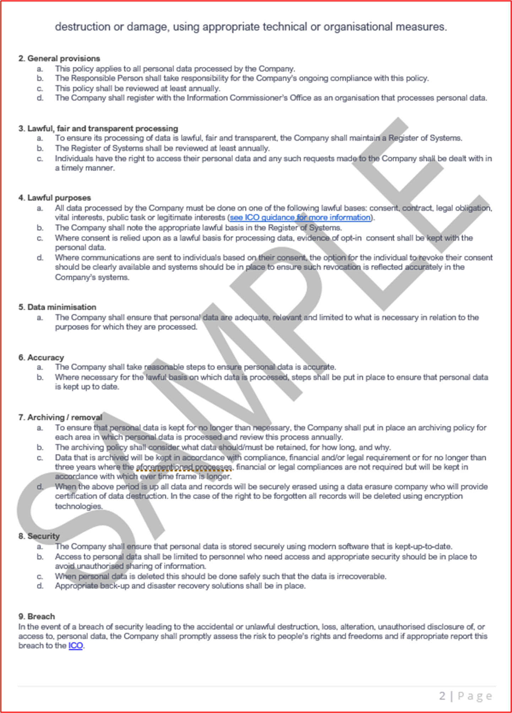

На приведенном выше изображении Azure показано, как Azure настроена для соответствия требованиям GDPR для данных, хранящихся во внутренней среде. Политика (которую можно создать или создать из _Azure Blueprints_) позволяет независимому поставщику программного обеспечения обеспечить правильное хранение данных клиентских&#39;и доступность их только по метрикам набора и оповещениям, чтобы обеспечить соответствие требованиям и отображать несоответствующие данные или доступ пользователей на панели мониторинга диспетчера соответствия требованиям.

Книги

Лендох Д. (2018) Blue Team Handbook: Incident Response Edition: Сокращенное поле руководства для средства реагирования на инциденты кибербезопасности. 2-й выпуск, Publisher: CreateSpace Independent Publishing Platform.

Ссылки

- Отчеты о киберпреступении о мошенничестве с действиями доступны по адресу: [https://www.actionfraud.police.uk/](https://www.actionfraud.police.uk/) (доступ к нему 21.08.08.2011).
- ЕС. (2021) Контрольный список GDPR для контроллеров данных доступен по адресу: [https://gdpr.eu/checklist/](https://gdpr.eu/checklist/) (доступ к 02.01.2011).
- Microsoft. (2018) Ведение журнала событий (Windows Installer) доступно по адресу: docs.microsoft.com/en-us/windows/win32/msi/event-logging (доступ: 12.02.20).
- Положительные технологии. (2020) Подход к безопасной разработке программного обеспечения доступен по адресу: [https://www.ptsecurity.com/ww-en/analytics/knowledge-base/how-to-approach-secure-software-development/](https://www.ptsecurity.com/ww-en/analytics/knowledge-base/how-to-approach-secure-software-development/)(Доступ: 12.02.20.
- Нормативный акт (ЕС) 2016/679 Европейского Союза и Совета Ес от 27 апреля 2016 г. о защите физического лица в отношении обработки персональных данных и свободного перемещения таких данных, и директива 95/46/EC (Общий регламент по защите данных) (текст с релевантностью EEA) (2016) доступна по адресу: [https://www.legislation.gov.uk/eur/2016/679/contents](https://www.legislation.gov.uk/eur/2016/679/contents) (доступ: 11.01.2021).
- Метрики безопасности. (2020) Руководство по метрикам безопасности для соответствия требованиям PCI DSS. Доступно по адресу: [https://info.securitymetrics.com/pci-guide-2020](https://info.securitymetrics.com/pci-guide-2020)(доступ: 06.01.21).
- Рейтинг рисков OWASP Для Пользователя J. Доступен по адресу: [https://owasp.org/www-community/OWASP\_Risk\_Rating\_Methodology](https://owasp.org/www-community/OWASP_Risk_Rating_Methodology) (Доступ: 12.08.20).
- Qualys. (2014) SSL Labs: New Grades for Trust (T) and Mismatch (M) Issues Available at: [https://blog.qualys.com/product-tech/2014/06/17/ssl-labs-new-grades-for-trust-t-and-mismatch-m-issues](https://blog.qualys.com/product-tech/2014/06/17/ssl-labs-new-grades-for-trust-t-and-mismatch-m-issues) (Accessed: 29/01/21).
- NIST SP800-61r2: руководство по обработке инцидентов безопасности компьютера доступно по адресу:[https://csrc.nist.gov/publications/detail/sp/800-61/rev-2/final](https://csrc.nist.gov/publications/detail/sp/800-61/rev-2/final) (доступ к нему 24.01.21).

**Изображения, сделанные из документов Майкрософт**

- [https://www.sans.org/information-security-policy/](https://www.sans.org/information-security-policy/)(Доступ к нему 21.02.2018)
- [https://docs.microsoft.com/cloud-app-security/anomaly-detection-policy](/cloud-app-security/anomaly-detection-policy)(Доступ к нему 21.02.2016).
- [https://docs.microsoft.com/azure/azure-monitor/alerts/alerts-overview](/azure/azure-monitor/alerts/alerts-overview) (Доступ к нему 21.02.2017).
- [https://docs.microsoft.com/cloud-app-security/anomaly-detection-policy](/cloud-app-security/anomaly-detection-policy) (Доступ к нему 22.02.21).
- [https://docs.microsoft.com/azure/security-center/security-center-managing-and-responding-alerts](/azure/security-center/security-center-managing-and-responding-alerts) (Доступ к нему 24.02.21).
- [https://docs.microsoft.com/azure/security-center/security-center-managing-and-responding-alerts](/azure/security-center/security-center-managing-and-responding-alerts) (Доступ к нему 24.02.21).
- [https://microsoft.github.io/AzureTipsAndTricks/blog/tip272.html](https://microsoft.github.io/AzureTipsAndTricks/blog/tip272.html)
- [https://docs.microsoft.com/azure/information-protection/what-is-information-protection](/azure/information-protection/what-is-information-protection)
- [https://docs.microsoft.com/azure/azure-sql/database/transparent-data-encryption-tde-overview?tabs=azure-portal](/azure/azure-sql/database/transparent-data-encryption-tde-overview?tabs=azure-portal)
- [https://docs.microsoft.com/azure/governance/policy/assign-policy-portal](/azure/governance/policy/assign-policy-portal)
- [https://docs.microsoft.com/azure/azure-sql/database/threat-detection-configure](/azure/azure-sql/database/threat-detection-configure)
