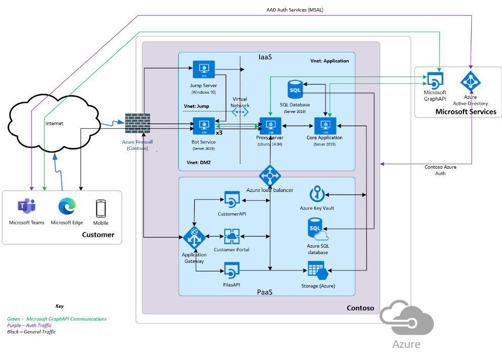

# Microsoft 365 сертификации — руководство по первоначальной отправке документов

Начальная отправка документа является частью этапа предварительной оценки сертификации. Предоставленная информация предоставит аналитикам сертификации фон, необходимый для определения элементов управления и системных компонентов, которые будут в области оценки. Этот документ предназначен только в качестве примера того, что ожидается от первоначальной отправки документа. Предоставляемая документация зависит от архитектуры, реализации и управления решением.

## Какая среда размещения или модель службы используются для запуска приложения?
- Инфраструктура как услуга (IaaS) — это модель облачной службы, в которой поставщик облачных служб размещает компоненты инфраструктуры, но независимые поставщики программного обеспечения по-прежнему отвечают за развертывание компонентов и управление ими по отдельности, такие как Виртуальные машины/Операционные системы, хранилища данных и сетевые компоненты. Например, виртуальная машина Azure и диски Azure служба хранилища.
- Платформа как услуга (PaaS) — это модель облачной службы, в которой компоненты инфраструктуры управляются поставщиком облачных служб. Независимые поставщики программного обеспечения отвечают только за развертывание собственных приложений и служб. Примерами этого являются приложение Azure Services, Функции Azure и Azure CDN.
- Размещение независимых поставщиков программного обеспечения в этом контексте означает, что поставщик облачных служб не используется. Независимый поставщик программного обеспечения физически управляет собственными серверами, дисками и сетями независимо от локальной среды.
- Гибридная среда в этом контексте означает, что используется одна из указанных выше моделей. Например, некоторые независимые поставщики программного обеспечения могут использовать сочетание служб IaaS и служб PaaS для поддержки своего приложения, или у них могут быть некоторые локальные компоненты isV Hosted, а другие передаются поставщику облачных служб. Если вы используете одну из дополнительных моделей служб, выберите гибридную.

## Отчет о тестах на проникновение

Включите полный отчет о тестировании на проникновение, указав даты его завершения за последние 12 месяцев. 
-   Этот отчет должен быть создан на основе ручного тестирования на проникновение. Он не может быть выходом средства автоматического сканирования и тестирования.
-   Этот отчет должен включать среду, которая поддерживает развертывание приложения или добавления, а также любую дополнительную среду, которая поддерживает работу приложения или надстроек.

## Инвентаризация системных компонентов

Актуальный обзор всех системных компонентов, используемых вспомогательной инфраструктурой. Он будет использоваться для помощи в выборке при выполнении этапа оценки. Если ваша среда включает PaaS, было бы полезно предоставить подробные сведения о всех используемых службах PaaS.

**Примечание:** IaaS/PaaS не будет иметь оборудования, которое будет находится под управлением независимых поставщиков программного обеспечения.  В этом случае укажите список или снимок экрана всех виртуалных ресурсов.

**Пример:**

|Имя ресурса|Тип ресурса|Описание|Производитель|Модель|
|---|---|---|---|---|
|D212|Windows компьютера|Виртуальная машина|Н/Д|Недоступно|
|LT101|Laptop (Ноутбук)|Рабочая станция|Microsoft|Surface 3|
|C2938|Параметр|Параметр|Н/Д|Недоступно|
|LXM2|Компьютер Linux|Тестовый компьютер|Н/Д|Недоступно|

## Инвентаризация программного обеспечения

Актуальный перечень всех ресурсов программного обеспечения, включая все программное обеспечение, используемого в среде в области действия, а также версии.

**Пример:**

|Программное обеспечение|Publisher|Версия|Назначение|
|---|---|---|---|
|Windows Server|Microsoft 2016 |Сборка 14393|Операционная система сервера для рабочей среды|
|Linux Ubuntu|Недоступно|16.04 (Xenial)|Операционная система сервера, используемая в сети периметра.|
|Esxi|Vmware|6.5.0 (сборка 13004031)|Используется для поддержки виртуальных серверов.|
|Mysql (Windows)|Недоступно|8.0.2.1|Сервер базы данных для хранения журнала чата.|
|Tomcat|Apache|7.0.92|Портал клиента.|
|Службы IIS|Microsoft|10.0|Поддерживает интерфейсы API.|

## Зависимости сторонних производителей

Документация со списком всех зависимостей, используемых приложением или надстройке с текущими работающими версиями.

**Пример:**

|Веб-зависимости|Текущая используемая версия|
|----|----|
|Jquery|3.5.1|
|React|16.13.1|
|Bootstrap|4.5.2|
|Express|4.17.1|
|Angular|10.0.14|
|AngularJS|1.8.0|

## Общедоступные IP-адреса

Подробное описание всех общедоступных IP-адресов и URL-адресов, используемых вспомогательной инфраструктурой. К ним должен относится полный диапазон маршрутизируемых IP-адресов, выделенный для среды, если не реализована надлежащая сегментация для разделения используемого диапазона (потребуется соответствующее свидетельство сегментации).

**Пример:**

|URL-адреса|IP-адрес|
|-|-|
|https://portal.contoso.com |40.113.200.201 |
|https://filesapi.contoso.com|40.113.200.201|
|https://customerapi.contoso.com|40.113.200.202|
|https://bot.contoso.com|40.113.200.202|
|Н/А (сервер переходов)|40.113.200.200|

## Конечные точки ресурсов

API Name Endpoint Address Contoso Customer API https://customerapi.contoso.com Contoso Служба Bot https://bot.contoso.com Contoso Files APIhttps://filesapi.contoso.com

Полный список всех конечных точек API, используемых приложением, включая внутренне разработанные и внешние конечные точки ресурсов. Чтобы понять область среды, укажите расположения конечных точек API в среде.

**Пример:**

|Имя API|  Адрес конечной точки|
|-|-|
|API клиента Contoso|  https://customerapi.contoso.com|
|Contoso Служба Bot|   https://bot.contoso.com|
|API файлов Contoso| https://filesapi.contoso.com|
|Microsoft Graph| https://graph.microsoft.com/v1.0/|

## Схема архитектуры

Схема логической архитектуры, представляющая общий обзор вспомогательной инфраструктуры приложения или надстройки. Это должны быть все среды размещения и вспомогательная инфраструктура, поддерживающие приложение или надстройку. На этой схеме ДОЛЖНЫ быть показаны все различные вспомогательные системные компоненты в среде, чтобы помочь аналитикам сертификации понять системы в области и определить выборку. Укажите, какой тип среды размещения используется. IsV Hosted, IaaS, PaaS или Hybrid. Если используется PaaS, укажите различные службы PaaS, которые используются для предоставления вспомогательных служб в среде.

## Поток данных схемы

Flow схемы со следующими сведениями:
-   Данные передаются в приложение или надстройку и из нее (включая данные клиента).
-   Потоки данных в вспомогательной инфраструктуре (если применимо)
-   Схемы, на которых показано, где и какие данные хранятся, как данные передаются внешним третьим лицам (включая сведения о третьих лицах) и как данные защищаются при передаче через открытые или общедоступные сети и неактивные данные.

