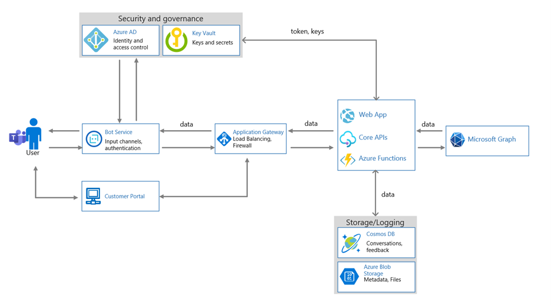

# Microsoft 365 Ceritification — руководство по первоначальной отправке документов

Первоначальная отправка документа является частью этапа предварительной оценки сертификации. Представленная информация даст аналитикам сертификации фон, необходимый для определения элементов управления и системных компонентов для оценки. Этот документ предназначен для использования только в качестве примера того, что ожидается от первоначальной отправки документа. Предоставляемая документация будет отличаться в зависимости от того, как ваше решение будет архитектором, реализовано и управляется.

## Отчет о тесте на проникновение

Включайте полный отчет о тестировании на проникновение с данными о том, что он был завершен в течение последних 12 месяцев. 
-   Этот отчет должен быть подготовлен из ручного тестирования на проникновение, он не может быть выходом автоматизированного средства сканирования и тестирования.
-   Этот отчет должен включать среду, которая поддерживает развертывание приложения/добавления, а также любую дополнительную среду, которая поддерживает работу приложений и надстройок.

## Инвентаризация программного обеспечения

Обновление инвентаризации программного обеспечения, которое включает все программное обеспечение, используемого в среде в области, а также версии.

**Пример:**

|Программное обеспечение|  Publisher|  Версия|     Назначение|
|-|-|-|-|
|Windows Server|    Microsoft 2016 | Сборка 14393| Операционная система сервера для производственной среды|.
|Linux Ubuntu|  Н/д|    16.04 (Xenial)| Операционная система сервера, используемая в dmZ.|
|ESXi|  VMWare| 6.5.0 (Сборка 13004031)| Используется для поддержки виртуальных серверов.|
|Mysql (Windows)|   Н/д|    8.0.2.1|    Сервер базы данных для хранения истории чата.|
|Tomcat|        Apache| 7.0.92| Клиентский портал.|
|Службы IIS|   Microsoft|  10.0|   Поддерживает API.|

## Инвентаризация оборудования

Последние инвентаризации оборудования, используемые вспомогательной инфраструктурой. Это будет использоваться для использования выборки при выполнении этапа оценки. Если в вашей среде содержится PaaS, было бы полезно предоставить подробные подробные информацию о всех потребляемых службах PaaS.

**Примечание:** У IaaS/PaaS не будет оборудования, которое было бы под контролем isVs.  

**Пример:**

|Имя актива|    Тип активов| Описание|    Производитель|   Модель|
|-|-|-|-|-|
|D212|  Windows  Машина|   Виртуальная машина|    Н/Д| Н/Д|
|LT101| Laptop (Ноутбук)| Рабочая станция|    Microsoft|  Surface 3|
|C2938| Параметр| Параметр|Н/Д|Н/Д|     
|LXM2|  Linux Machine|  Тестовая машина|Н/Д|Н/Д|       

## Веб-зависимости

Документация с перечислением всех зависимостей, используемых приложением и надстройки с текущими запущенными версиями.

**Пример:**

|Веб-зависимости|  Текущая версия в использовании|
|-|-|
|JQuery|    3.5.1|
|React| 16.13.1|
|Bootstrap| 4.5.2|
|Express|   4.17.1|
|Angular|   10.0.14|
|AngularJS| 1.8.0|

## Общедоступные IP-адреса

Детализация всех общедоступных IP-адресов и URL-адресов, используемых вспомогательной инфраструктурой. Это должно включать полный диапазон IP-адресов, выделенных для среды, если не будет реализована адекватная сегментация для разделения используемого диапазона (потребуются достаточные доказательства сегментации).

**Пример:**

|URL-адреса|  IP-адрес|
|-|-|
|https://portal.contoso.com |40.113.200.201 |
|https://filesapi.contoso.com|  40.113.200.201|
|https://customerapi.contoso.com|   40.113.200.202|
|https://bot.contoso.com|   40.113.200.202|
|N/A (Jump Server)| 40.113.200.200|

## Конечные точки ресурса

API Name Endpoint Address Contoso Customer API    https://customerapi.contoso.com Contoso Bot Service https://bot.contoso.com Contoso Files API   https://filesapi.contoso.com

Полный список всех конечных точек API, используемых вашим приложением, включая внутренние и внешние конечные точки ресурсов. Чтобы помочь понять область среды, уделите расположение конечной точки API в среде.

**Пример:**

|Имя API|  Адрес конечной точки|
|-|-|
|API клиента Contoso|  https://customerapi.contoso.com|
|Служба ботов Contoso|   https://bot.contoso.com|
|Contoso Files API| https://filesapi.contoso.com|
|Microsoft Graph| https://graph.microsoft.com/v1.0/|

## Архитектурная схема

Логическая схема архитектуры, представляющая высококачественный обзор вспомогательной инфраструктуры приложения и надстройки. Это должно включать все среды размещения и вспомогательную инфраструктуру, поддерживающие приложение и надстройки. Эта схема должна изобразить все различные вспомогательные компоненты системы в среде, чтобы помочь аналитикам по сертификации понять системы в области и помочь определить выборку. Указать, какой тип среды размещения используется; IsV hosted, IaaS, PaaS или Hybrid. В тех случаях, когда используется PaaS, указать различные службы PaaS, которые используются для предоставления вспомогательных служб в среде.

## Диаграмма Flow данных

Flow схемы с подробным изве-
-   Потоки данных в приложение и надстройки (включая данные клиентов) и из него.
-   Потоки данных в вспомогательной инфраструктуре (где это применимо)
-   Схемы, на которых освещаются, где и какие данные хранятся, как передаются данные внешним третьим лицам (в том числе сведения о том, какие третьи стороны) и как данные защищены при транзите через открытые/общедоступные сети и в покое.

