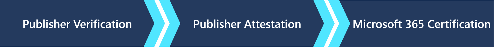

# Соответствие требованиям для приложений Microsoft 365

Программа соответствия требованиям для приложений Microsoft 365 представляет собой трехуровневый подход к безопасности и обеспечению соответствия требованиям. Каждый уровень построен на основе следующего, вместе предлагая программу из нескольких шагов, которая обеспечивает пользователям необходимую уверенность при использовании приложений в экосистеме Microsoft 365. В настоящее время все уровни в программе являются добровольными и их прохождение осуществляется по усмотрению разработчиков приложений. 

Наша программная цель: мы стремимся, чтобы клиенты Майкрософт полностью доверяли приложениям, на которых основана работа их организаций.

   

## Проверка издателя

[Проверка издателя](https://docs.microsoft.com/azure/active-directory/develop/publisher-verification-overview) помогает администраторам и пользователям убедиться в подлинности разработчиков приложений, интегрированных с платформой удостоверений Майкрософт. Если приложение помечено как проверенное издателем, это означает, что издатель подтвердил свою личность с помощью учетной записи Microsoft Partner Network, прошедшей полную проверку и связанной с регистрацией приложения.
Проверка издателя применяется к приложениям, которые отвечают следующим условиям:  
- Использование OAuth 2.0 и OpenID Connect для входа пользователей и запросов доступа к данным с помощью API на стороне службы, таких как Microsoft Graph. 
- Регистрация в Azure AD в качестве мульти-клиента.  

> [!IMPORTANT]
> Проверка издателя не мешает разработчику приложений начать или завершить аттестацию издателя или сертификацию Microsoft 365. Если приложению не нужна проверка, ее можно пропустить и сразу начать аттестацию.

## Аттестация издателя

[Аттестация издателя](https://docs.microsoft.com/microsoft-365-app-certification/docs/enterprise-app-attestation-guide) — средство для разработчиков, которое позволяет опубликовать общие сведения о службе приложения, сведения об обработке данных, а также о безопасности и соответствии требованиям. Это снижает необходимость в непосредственной работе ИТ-администраторов с издателями приложений. Все сведения, необходимые для принятия обоснованных решений, для всех приложений, прошедших проверку издателя, можно найти в одном месте и в единообразном формате. Цель — упростить и ускорить процесс внедрения приложений, а также убедить клиентов, что приложения, которые они используют в своих клиентах, соответствуют стандартам организации.

Аттестация издателя применяется к приложениям, которые интегрируются со следующими платформами Майкрософт:
-   Teams
-   Word
-   Excel
-   PowerPoint 
-   Outlook
- SharePoint
- Project
- OneNote
- Веб-приложения

> [!IMPORTANT]
> Корпорация Майкрософт не проверяет предоставленные сведения. Разработчик единолично заявляет о достоверности, точности и целостности документов аттестации и соответствующих данных о производительности приложения. 

## Сертификация Microsoft 365
[Сертификация Microsoft 365](https://docs.microsoft.com/microsoft-365-app-certification/docs/enterprise-app-certification-guide) обеспечивает организациям уверенность в надлежащей защите данных и конфиденциальности при использовании приложений Microsoft Teams. Сертификация подтверждает, что решение приложения совместимо с технологиями Майкрософт, соответствует рекомендованным методикам безопасности облачных приложений и поддерживается корпорацией Майкрософт. В ходе сертификации разработчики приложений работают со сторонним оценщиком для проверки стандартов безопасности и соответствия требованиям организации. Сертификация Microsoft 365 применяется к тем же приложениям, которые относятся к аттестации издателя. 

