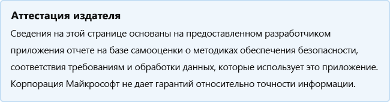

# StarLeafStarLeaf

Последнее обновление разработчика: 24 августа 2020 г.Last updated by the developer on: August 24, 2020

* <a href="https://teams.microsoft.com/l/app/220b3db0-e3be-40df-8148-f0e0c33a986a" target="_blank">Просмотр в Teams магазине</a><a href="https://teams.microsoft.com/l/app/220b3db0-e3be-40df-8148-f0e0c33a986a" target="_blank">View in Teams store</a>
* <a href="https://appsource.microsoft.com/product/office/WA200000185" target="_blank">Просмотр в AppSource</a><a href="https://appsource.microsoft.com/product/office/WA200000185" target="_blank">View in AppSource</a>

::: zone pivot="general"

### Общие сведенияGeneral information

Сведения, предоставляемые StarLeaf Корпорации Майкрософт:Information provided by StarLeaf to Microsoft:

| **Information****Information** | **Отклик****Response** |
|:----------------|:-------------|
| Имя приложенияApp name | StarLeafStarLeaf |
| IDID | WA200000185WA200000185 |
| ВозможностиCapabilities | Бот, расширение для обмена сообщениямиBot, Messaging Extension |
| Office 365 поддерживаемые клиентыOffice 365 clients supported | Microsoft TeamsMicrosoft Teams |
| Имя компании-партнераPartner company name | StarLeafStarLeaf |
| URL-адрес веб-сайта-партнераURL of partner website | [https://www.starleaf.com](https://www.starleaf.com) |
| URL-адрес политики конфиденциальностиURL of Privacy Policy | [ https://support.starleaf.com/legal-information/starleaf-pri...https://support.starleaf.com/legal-information/starleaf-pri...](https://support.starleaf.com/legal-information/starleaf-privacy-notice/) |
| URL-адрес терминов использованияURL of Terms of Use | [ https://support.starleaf.com/legal-information/starleaf-clo...https://support.starleaf.com/legal-information/starleaf-clo...](https://support.starleaf.com/legal-information/starleaf-cloud-services-customer-terms-of-use/) |

 [!INCLUDE [Corrections or suggestions contact information](../includes/corrections-or-suggestions.md)]

::: zone-end

::: zone pivot="data"

### Обработка данных приложениемHow the app handles data

Эта информация была предоставлена StarLeaf о том, как это приложение собирает и хранит организационные данные и управление, которое будет иметь ваша организация над данными, которые собирает приложение.This information has been provided by StarLeaf about how this app collects and stores organizational data and the control that your organization will have over the data the app collects.

#### Доступ к данным с помощью Microsoft GraphData access using Microsoft Graph

Список всех [разрешений Graph Майкрософт,](https://docs.microsoft.com/graph/permissions-reference) которые требуется этому приложению.List any [Microsoft Graph permissions](https://docs.microsoft.com/graph/permissions-reference) this app requires.

>| **Permission****Permission**  | **Тип разрешения (Делегированная/применение)****Type of permission (Delegated/Application)** | **Собираются ли данные? Обоснование для его сбора?****Is data collected? Justification for collecting it?** | **Хранятся ли данные? Обоснование его хранения?****Is data stored? Justification for storing it?** | **Azure AD App ID****Azure AD App ID** |
>|:----------------|:--------------------|:---------------------------------------------------|:--------------------------|:--------------------------|
>| Calendars.ReadWriteCalendars.ReadWrite | приложениеapplication | мы храним iCalUId собраний, времени и даты собрания, адреса электронной почты участников и одноценное расширенное свойство, которое мы читаем и пишем на собрании с помощью пользовательского интерфейса Office.js свойств.we store the iCalUId of meetings, time/date of the meeting, attendee email addresses, and a Single-Value-Extended-Property that we read and write on the meeting using the Office.js custom properties interface. ICalUId используется для сопоставления собрания в календаре&#8217;outlook с видеосъемки в нашей службе.The iCalUId is used to correlate the meeting in a user&#8217;s outlook calendar with the video meeting on our service. Время и дата и участники используются для предоставления видеосъемки в нужное время нужным людям в нашей службе.The time/date and attendees are used to provide a video meeting at the right time to the right people on our service. SVEP используется для с помощью надстройки O365, чтобы предоставить пользователям интерфейс для набора сведений о видеосъемке в нашей службе, например записи.SVEP are used to with our O365 addin to provide an interface for users to set details about the video meeting on our service such as recording. | используется для подписки на уведомления веб-пользователя, чтобы отслеживать изменения пользователей в событиях в календарях и обновлять нашу службу, чтобы сохранить ее в соответствии.used to subscribe to webhook notifications to track user changes to events in their calendars and update our service to keep it consistent. Он также используется для создания событий в календаре, когда пользователь взаимодействует с нашим приложением Teams и запланировать собрание в нашей службе.It is also used to create events in their calendar when a user interacts with our Teams app and schedules a meeting on our service. | 6e86b349-768f-4953-ac2e-fb03f92db4be6e86b349-768f-4953-ac2e-fb03f92db4be |
>| User.ReadUser.Read | приложениеapplication | мы храним маркер обновления oauth, чтобы иметь возможность входа.we store the oauth refresh token to be able to login. Мы храним id профилей пользователей, чтобы иметь возможность сравнить с будущими попытками OAuth от этого пользователя и убедиться, что&#8217;не хранить их данные дважды.We store the users profile id to be able to compare with future OAuth attempts from that user and ensure we don&#8217;t store their details twice.  | позволяет пользователям войти в приложение и позволяет нашему приложению получить&#8217;адрес электронной почты для сопоставления входа с учетной записью в нашей службе.allow users to sign into the app and allows our app to get the user&#8217;s email address to correlate their login with an account on our service.  | 6e86b349-768f-4953-ac2e-fb03f92db4be6e86b349-768f-4953-ac2e-fb03f92db4be |

#### Не-службы Майкрософт используетсяNon-Microsoft services used

Если приложение передает или делится организационными данными с не-службой Майкрософт, укай список службы, не microsoft, которую использует приложение, какие данные передаются, и включай обоснование необходимости передачи этой информации приложением.If the app transfers or shares organizational data with non-Microsoft service, list the non-Microsoft service the app uses, what data is transferred, and include a justification for why the app needs to transfer this information.

>| **Все не службы Майкрософт OII передаются****All non-Microsoft services OII is transferred to** |  **Какие OII передаются?****What OII is transferred?** | **Обоснование переноса OII?****Justification for transferring OII?** |
>|:-------------------|:--------------------------|:--------------------------|
>| Если возникают проблемы с технической поддержкой, то организационные данные могут быть переданы в SalesForce для управления случаями.If technical support issues arise then organisational data may be transferred to SalesForce for case management. Если пользователь использует функцию набора PSTN, вызов будет поступать через Twilio, Plivo или Voxbone.If the user makes use of the PSTN dial-in feature then the call will flow through Twilio, Plivo or Voxbone |  | Н/ДN/A |

#### Доступ к данным с помощью ботовData access via bots

Если это приложение содержит бот или расширение обмена сообщениями, оно может получить доступ к идентифицируемым данным конечного пользователя (EUII): реестр (имя, фамилия, имя отображения, адрес электронной почты) любого члена группы или чата, в который он добавлен.If this app contains a bot or a messaging extension, it can access end-user identifiable information (EUII): the roster (first name, last name, display name, email address) of any team member in a team or chat it's added to. Использует ли это приложение эту возможность?Does this app make use of this capability?

>| **Обоснование доступа к EUII?****Justification for accessing EUII?**  | **Хранится ли EUII в базе данных (s)?****Is EUII stored in database(s)?** | **Обоснование хранения EUII?****Justification for storing EUII?** |
>|:--------------------------------|:---------------------|:--------------------------|
>| Бот получает доступ к реестру группы, чтобы заказать собрание от имени пользователя или хоста, который бронирует собрание через бота.The bot accesses the roster of the team in order to book a meeting on behalf of the user/host who books the meeting through the bot. Это позволяет StarLeaf обеспечить бесшовное присоединение с одной кнопкой, чтобы присоединиться к собраниям.This allows StarLeaf to provide a seamless joining experience with one button to join meetings. | Имя, фамилия, адрес электронной почты.First name, last name, email address. Это позволяет боту StarLeaf заказать собрание от имени пользователя или хоста, который взаимодействовал с ботом, и пригласить других членов команды на собрание.This allows the StarLeaf bot to book a meeting on behalf of the user/host who has interacted with the bot, and invite the other members of the team to the meeting. |  |

#### Данные телеметрииTelemetry data

В телеметрии или журналах этого приложения отображаются какие-либо идентифицируемые организационные сведения (OII) или данные, идентифицируемые конечным пользователем (EUII) ?Does any organizational identifiable information (OII) or end-user identifiable information (EUII) appear in this application's telemetry or logs? Если да, опишите, какие данные хранятся и какие политики хранения и удаления?If yes, describe what data is stored and what are the retention and removal policies?

>Да.Yes. Журналы включают имена пользователей, IP-адреса, записи с подробными сведениями о вызове, сведения о качестве подключения (потеря пакета, битрат), тип устройства, ход вызова.Logs include usernames, IP addresses, call-detail-records, information about connection quality (packet loss, bitrate), device type, call progress. Эта информация доступна группе технической поддержки и старшим разработчикам для диагностики проблем с обслуживанием.The information is available to the technical support team and senior developers for diagnosing service issues. Данные анонимизируются через 90 дней.The data is anonymised after 90 days. Элементы управления для защиты этих данных проверяются в рамках сертификации ISO/IEC 27001.Controls to protect this data are audited under our ISO/IEC 27001 certification.

#### Организационные элементы управления данными, хранимые партнеромOrganizational controls for data stored by partner

Описание того, как администраторы организации могут управлять своими сведениями в партнерских системах? например, удаление, хранение, аудит, архивация, политика конечных пользователей и т. д.Describe how organization's administrators can control their information in partner systems? e.g. deletion, retention, auditing, archiving, end-user policy, etc.

>Данные хранятся на собственных серверах журнала StarLeaf&#8217;в центре обработки данных, в котором&#8217;учетная запись пользователя, и хранятся в одном или нескольких центрах обработки данных в одной юрисдикции.The data is stored on StarLeaf&#8217;s own log servers in the data centre in which the user&#8217;s account is located, and backed up to one or more data centres within the same jurisdiction. Доступ к данным используется индивидуальной учетной записью пользователя с использованием паролей для каждого пользователя, которые проверены на прочность.Access to the data is by individual user account using per-user passwords which are strength-checked. Учетные записи пользователей&#8217;службы автоматически проверяются в hr-системах и корпоративных группах Active Directory, чтобы предупредить группу безопасности и соответствия требованиям при обнаружении аномалий.StarLeaf&#8217;s service user accounts are audited automatically against the HR systems and the corporate Active Directory groups to alert the Security and Compliance team if anomalies are found.

#### Обзор сведений об организацииHuman review of organizational information

Участвуют ли люди в просмотре или анализе любых данных, идентифицируемых в организации (OII), собираемых или хранимых этим приложением?Are humans involved in reviewing or analyzing any organizational identifiable information (OII) data that is collected or stored by this app?

>ДаYes

[!INCLUDE [Corrections or suggestions contact information](../includes/corrections-or-suggestions.md)]

::: zone-end

::: zone pivot="mcas"

Сведения из [Microsoft Cloud App Security](https://www.microsoft.com/enterprise-mobility-security/cloud-app-security) ниже.Information from the [Microsoft Cloud App Security](https://www.microsoft.com/enterprise-mobility-security/cloud-app-security) catalog appears below.

<iframe height='1020' title='Microsoft Cloud App Security СведенияMicrosoft Cloud App Security Information' src='https://appmcasinfoprod.azurewebsites.net/#/dashboard/35997' frameborder='no' style='width: 100%;'></iframe>

<a href="https://appmcasinfoprod.azurewebsites.net/#/dashboard/35997" target="_blank">Просмотр на новой вкладке</a>

<a href="https://appmcasinfoprod.azurewebsites.net/#/dashboard/35997" target="_blank">View in a new tab</a>

[!INCLUDE [Corrections or suggestions contact information](../includes/corrections-or-suggestions.md)]

::: zone-end

