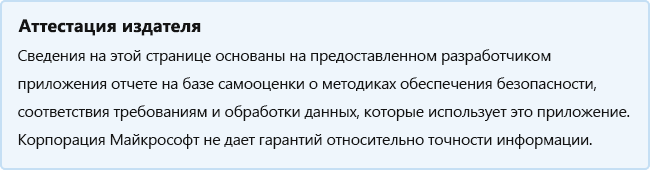

# Zoho Desk

Последнее обновление разработчика: 16 декабря 2019 г.

* <a href="https://teams.microsoft.com/l/app/091ec948-c0ee-4d56-aa9e-51c3d8316a9c" target="_blank">Просмотр в Teams магазине</a>
* <a href="https://appsource.microsoft.com/product/office/WA104382044" target="_blank">Просмотр в AppSource</a>

::: zone pivot="general"

### Общие сведения

Сведения, предоставляемые корпорацией Zoho Private Limited корпорации Майкрософт:

| **Information** | **Отклик** |
|:----------------|:-------------|
| Название приложения | Zoho Desk |
| ID | WA104382044 |
| Office 365 поддерживаемые клиенты | Microsoft Teams |
| Имя компании-партнера | Zoho Corporation Private Limited |
| URL-адрес веб-сайта-партнера | [https://www.zoho.com/desk](https://www.zoho.com/desk) |
| URL-адрес страницы Teams приложения | [https://help.zoho.com/portal/kb/zoho-desk](https://help.zoho.com/portal/kb/zoho-desk) |
| URL-адрес политики конфиденциальности | [https://www.zoho.com/privacy.html](https://www.zoho.com/privacy.html) |
| URL-адрес терминов использования | [https://www.zoho.com/terms.html](https://www.zoho.com/terms.html) |

 [!INCLUDE [Corrections or suggestions contact information](../includes/corrections-or-suggestions.md)]

::: zone-end

::: zone pivot="data"

### Обработка данных приложением

Эта информация предоставлена корпорацией Zoho Private Limited о том, как это приложение собирает и хранит организационные данные, а также управление, которое будет иметь ваша организация над данными, которые собирает приложение.

#### Доступ к данным с помощью Microsoft Graph

Список всех [разрешений Graph Майкрософт](https://docs.microsoft.com/graph/permissions-reference), которые требуется этому приложению.

>| **Разрешение**  | **Тип разрешения (Делегированная/ приложение)** | **Собираются ли данные? Обоснование для его сбора?** | **Хранятся ли данные? Обоснование его хранения?** | **Azure AD App ID** |
>|:----------------|:------------------------------------------------|:--------------------------------------------------------|:--------------------------------------------------|:--------------------|
>| Files.Read | делегирована |  | Чтение файлов пользователей. |  |
>| Files.Read.All | делегирована |  | Ознакомьтесь со всеми файлами, к которые пользователь может получить доступ. |  |
>| User.Read | делегирована |  | Вход и чтение профиля пользователя. |  |
>| User.ReadBasic.All | делегирована |  | Ознакомьтесь с основными профилями всех пользователей. |  |
>| email | делегирована |  | Просмотр адреса электронной почты пользователя. |  |
>| offline_access | делегирована |  | Поддержив доступ к данным, к ним вы получили доступ. |  |
>| profile | делегирована |  | Просмотр основного профиля пользователя. |  |

#### Не-службы Майкрософт используется

Если приложение передает или делится организационными данными с не-службой Майкрософт, укай список службы, не microsoft, которую использует приложение, какие данные передаются, и включай обоснование необходимости передачи этой информации приложением.

>Не службы Майкрософт не используются.

#### Доступ к данным с помощью ботов

Если это приложение содержит бот или расширение обмена сообщениями, оно может получить доступ к идентифицируемым данным конечного пользователя (EUII): реестр (имя, фамилия, имя отображения, адрес электронной почты) любого члена группы или чата, в который он добавлен. Использует ли это приложение эту возможность?

>Доступ к EUII не имеется.

#### Данные телеметрии

В телеметрии или журналах этого приложения отображаются какие-либо идентифицируемые организационные сведения (OII) или данные, идентифицируемые конечным пользователем (EUII) ? Если да, опишите, какие данные хранятся и какие политики хранения и удаления?

>Нет

#### Организационные элементы управления данными, хранимые партнером

Описание того, как администраторы организации могут управлять своими сведениями в партнерских системах? например, удаление, хранение, аудит, архивация, политика конечных пользователей и т. д.

>1) В пользовательском интерфейсе существует возможность удаления сущностями, администраторы и агенты в столе Zoho, удаляя параметры, могут выполнить это. 2. У нас также есть варианты экспорта, с помощью которых администратор может экспортировать и достигать их целей.  3. Мы поддерживаем аудит в задней части, по запросу клиента эта информация может быть предоставлена.

[!INCLUDE [Corrections or suggestions contact information](../includes/corrections-or-suggestions.md)]

::: zone-end

::: zone pivot="mcas"

Сведения из [Microsoft Cloud App Security](https://www.microsoft.com/enterprise-mobility-security/cloud-app-security) ниже.

<iframe height='1020' title='Microsoft Cloud App Security информация' src='https://appmcasinfoprod.azurewebsites.net/#/dashboard/28308' frameborder='no' style='width: 100%;'></iframe>

<a href="https://appmcasinfoprod.azurewebsites.net/#/dashboard/28308" target="_blank">Просмотр на новой вкладке</a>

[!INCLUDE [Corrections or suggestions contact information](../includes/corrections-or-suggestions.md)]

::: zone-end

